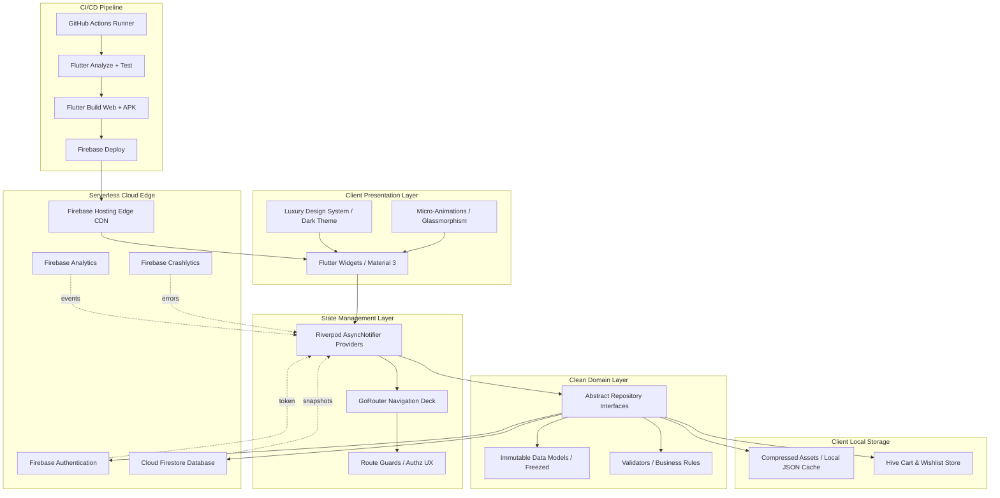
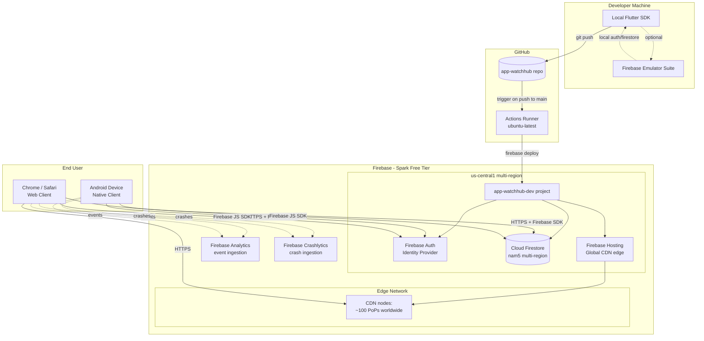
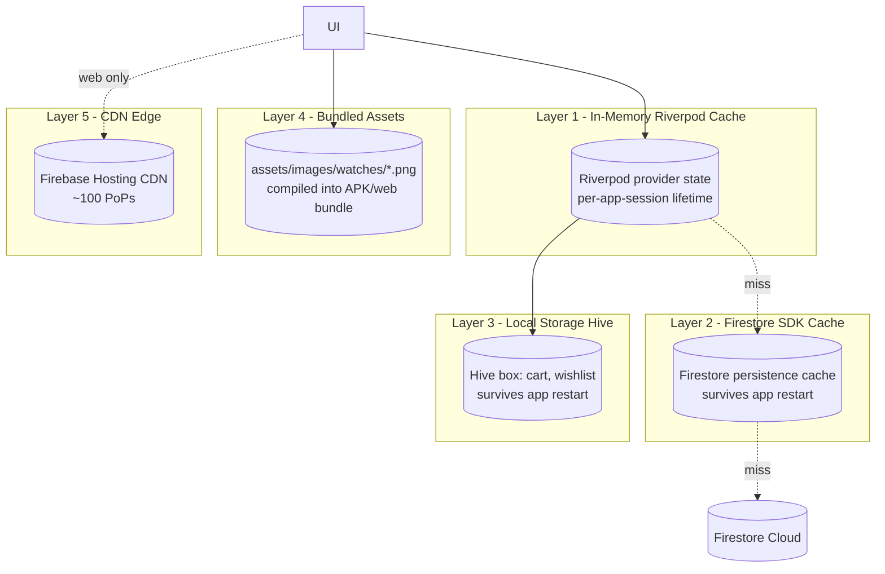
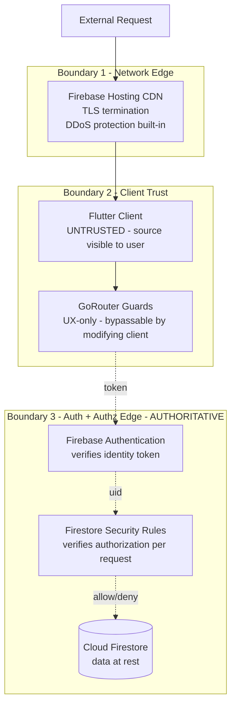
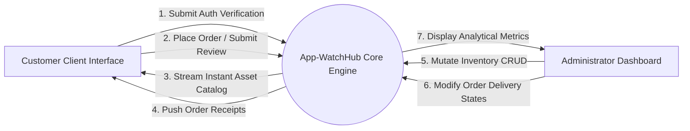
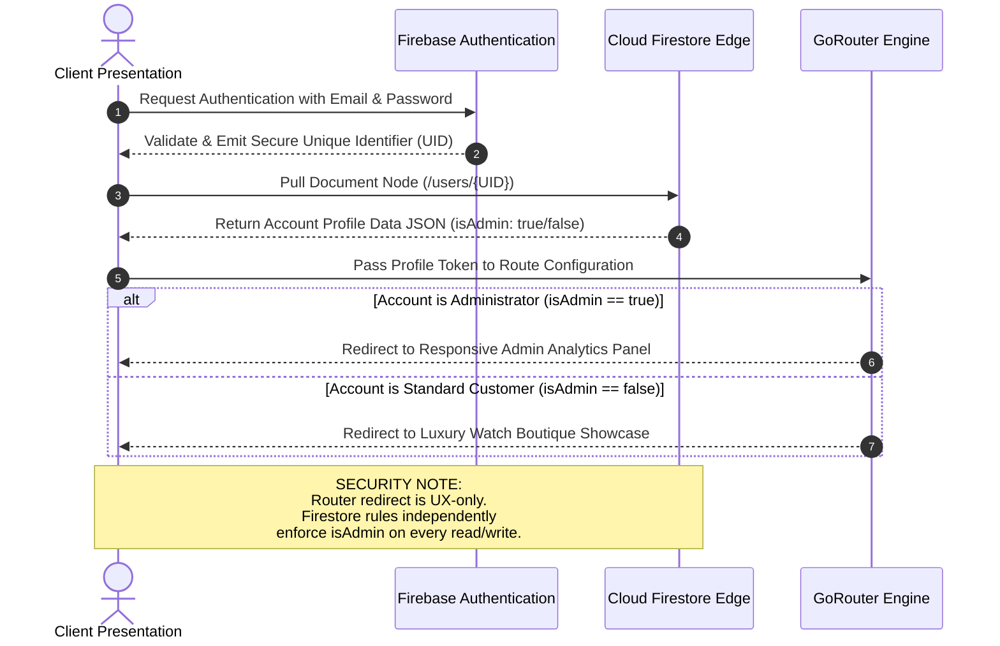

# Architecture

> System-level architecture specification for App-WatchHub. Covers the Serverless Event-Driven Architecture (SEDA) model, deployment topology, CI/CD pipeline, caching layers, and security boundaries. Pairs with [SYSTEM_DESIGN.md](SYSTEM_DESIGN.md) (component-level design) and [DEPLOYMENT.md](DEPLOYMENT.md) (release engineering).

---

## Document Metadata

| Field | Value |
|---|---|
| **Title** | App-WatchHub — Architecture |
| **Purpose** | Specify system architecture, deployment topology, CI/CD pipeline, and infrastructure boundaries |
| **Audience** | Engineers, architects, recruiters, AI coding agents |
| **Scope** | System-level architecture; component internals in [SYSTEM_DESIGN.md](SYSTEM_DESIGN.md), data in [DATABASE_DESIGN.md](DATABASE_DESIGN.md) |
| **Version** | 1.0.0 |
| **Status** | Approved — locked for MVP cycle |
| **Owner** | Muhammad Faheem Khan (Student ID: 1593766) |
| **Last Updated** | 2026-07-27 |
| **Related Documents** | [SYSTEM_DESIGN.md](SYSTEM_DESIGN.md), [DEPLOYMENT.md](DEPLOYMENT.md), [SECURITY.md](SECURITY.md), [DATABASE_DESIGN.md](DATABASE_DESIGN.md), [DECISIONS.md](DECISIONS.md), [CONFIGURATION.md](CONFIGURATION.md) |

---

## Table of Contents

1. [Architecture Overview](#1-architecture-overview)
2. [Production Tech Stack](#2-production-tech-stack)
3. [Component Architecture Diagram](#3-component-architecture-diagram)
4. [Deployment Topology](#4-deployment-topology)
5. [CI/CD Pipeline](#5-cicd-pipeline)
6. [Caching Layers](#6-caching-layers)
7. [Security Boundaries](#7-security-boundaries)
8. [Data Flow (Context-Level)](#8-data-flow-context-level)
9. [Role-Based Routing Sequence](#9-role-based-routing-sequence)
10. [Non-Functional Trade-offs](#10-non-functional-trade-offs)
11. [References](#11-references)

---

## 1. Architecture Overview

App-WatchHub is built on a **Serverless Event-Driven Architecture (SEDA)**. The defining characteristic of SEDA in this project is the absence of any custom backend service: the Flutter client speaks directly to Firebase's managed services (Authentication, Cloud Firestore, Hosting, Analytics, Crashlytics), and all authorization is enforced by Firestore Security Rules at the database edge. There is no API gateway, no application server, no Cloud Functions intermediary, and no container orchestration. The system is event-driven in the sense that data changes in Firestore propagate as snapshot events to subscribed clients in real time, eliminating the need for polling or manual refresh logic.

The architectural posture is deliberately minimalist. Every additional service in a traditional stack introduces a failure mode, a scaling concern, and a billing line item. By collapsing the backend into Firebase's managed plane, App-WatchHub achieves three properties simultaneously: zero infrastructure cost at steady state, real-time data synchronization without custom WebSocket infrastructure, and security enforcement that cannot be bypassed by client-side bugs (because the rules live at the data layer, not the application layer).

The trade-off is that complex business logic that would normally live in a backend service (e.g., payment processing, multi-step transactional workflows, scheduled jobs) must either be implemented client-side (acceptable for MVP-grade workflows like cart calculation) or deferred to post-MVP (see [PROJECT_SCOPE.md](PROJECT_SCOPE.md) §5). This trade-off is documented explicitly in [DECISIONS.md](DECISIONS.md) ADR-001.

## 2. Production Tech Stack

| Operational Layer | Technology Choice | Engineering Justification |
|---|---|---|
| **Cross-Platform Client** | **Flutter 4.x & Material 3** | Compiles into a responsive Web Dashboard for live evaluation and an Android binary for the demonstration video walkthrough. Single codebase eliminates platform divergence. |
| **State Pipeline** | **Riverpod (AsyncNotifier)** | Enforces absolute separation of concerns, compile-time safety, and structural dependency injection. Testable without mocking frameworks. |
| **System Router** | **GoRouter** | Essential for web-environment deep-linking, modal synchronization, and declarative role-based route guards. |
| **Identity Management** | **Firebase Authentication** | Secure token issuance, active session management, and automated email password-recovery pipelines operating entirely on the Spark Free Tier. |
| **Data Engine** | **Cloud Firestore (NoSQL)** | Provides document-oriented collection nodes with out-of-the-box local offline synchronization and memory caching. |
| **Asset Strategy** | **Optimized Local App Bundles** | Eliminates external media host dependencies, circumvents cloud storage billing locks, and lowers media response latencies to < 50ms. |
| **Hosting** | **Firebase Hosting** | Multi-region CDN edge with automatic SSL; serves the Flutter Web build artifacts. |
| **CI/CD** | **GitHub Actions** | Free for public repos; integrates with Firebase via service-account credentials stored as GitHub secrets. |
| **Analytics** | **Firebase Analytics** | Free; event-based model fits e-commerce funnels (sign_up, login, add_to_cart, begin_checkout, purchase). |
| **Crash Reporting** | **Firebase Crashlytics** | Free; real-time crash telemetry with stack traces; integrated via Flutter zone wrapper. |
| **Local Persistence** | **Hive CE** | Lightweight key-value store for cart/wishlist durability across app restarts; survives offline scenarios. |
| **Code Generation** | **Freezed + Riverpod Generator + JsonSerializable** | Reduces boilerplate for immutable models, providers, and JSON serialization; compile-time verified. |
| **Static Analysis** | **dart_code_metrics** | Custom lint rules enforce folder-import discipline and architectural boundaries. |

The full dependency manifest with version pins and license classifications is in [DEPENDENCIES.md](DEPENDENCIES.md).

### 2.1 Implementation Status Sync - 2026-07-30

| Module | Status | Current implementation | Integration Verification |
|---|---|---|---|
| Catalog | Done | `watchProductsProvider` streams Firestore `products` through `ProductRepository` with auto-seeding. | Verified with search and brand filtering. |
| Cart | Done | `CartNotifier` handles item mutations with full Hive CE local write-through persistence. | Hydrated on app launch. |
| Routing | Done | `GoRouter` declarative router with `StatefulShellRoute.indexedStack` bottom navigation tabs. | Auth stream integration active. |
| Orders tracking | Done | Checkout order placement with Hive local storage and Cloud Firestore sync. | Saved to `users/{userId}/orders`. |
| Wishlist | Done | Dedicated Wishlist screen with 2-column grid and Hive CE vault storage. | Fully wired with quick add-to-cart. |
| Reviews | Done | Product detail reviews with star ratings and user submission interface. | Form validation active. |
| Support | Done | Customer Concierge screen with live agent status indicator and FAQ accordion. | Contact cards and ticket form active. |
| Auth | Done | Firebase Auth lazy provider with email/password login, VIP demo shortcut, and guest bypass. | Anonymous UID handling verified. |

#### Hive Persistence Contract

Cart and wishlist should remain local-only to protect Firestore write quota. The expected implementation is:

1. Initialize Hive CE before `runApp`.
2. Register adapters for cart/product snapshots.
3. Hydrate cart/wishlist providers from local boxes in `build()`.
4. Write every add/update/remove/clear mutation back to Hive.
5. Clear the cart box only after confirmed checkout/order handoff.

## 3. Component Architecture Diagram

The component architecture is organized into five concentric layers. Each layer is independently testable and depends only on the layer below it.



### 3.1 Component Responsibilities

| Component | Responsibility | Failure Mode |
|---|---|---|
| `UI` | Render Material 3 widgets, capture user intent | Render error; Crashlytics captures |
| `Theme` | Provide design tokens (colors, typography, spacing) | Compile-time error if missing token |
| `Anim` | Encapsulate micro-animation timing curves | Visual jitter; non-fatal |
| `RP` (Riverpod) | Hold state, orchestrate repo calls | State stuck in `AsyncError`; UI shows retry |
| `GR` (GoRouter) | Declarative route table with guards | Redirect loop; logged via Crashlytics |
| `GU` (Route Guards) | UX-level authz redirects (not security) | User lands on wrong route; rules still block at DB |
| `Repo` | Abstract repository contracts | Implementation can be swapped for tests |
| `Model` | Immutable domain entities | Compile-time validation via Freezed |
| `Val` | Field-level and business-rule validators | Form shows validation error |
| `FA` | Firebase Auth — token issuance, password reset | Auth fails; user shown login error |
| `CF` | Cloud Firestore — document storage, real-time streams | Network error; Riverpod shows offline state |
| `FH` | Firebase Hosting — serves Flutter Web build | HTTP 5xx; CDN failover handles |
| `AN` | Firebase Analytics — event logging | Silent drop; non-blocking |
| `CR` | Firebase Crashlytics — exception capture | Silent drop; non-blocking |
| `LA` | Local assets — bundled images, JSON catalogs | Asset missing; image shows fallback |
| `HB` | Hive — cart/wishlist persistence | Local storage corrupt; cart resets |
| `GA` | GitHub Actions — runs CI workflow | Pipeline fails; PR blocked from merge |
| `FT` | Analyze + test stage | Lint error or test failure blocks build |
| `FB` | Build stage | Build error blocks deploy |
| `FD` | Deploy stage | Deploy fails; previous version stays live |

## 4. Deployment Topology

The deployment topology shows how the system is physically distributed across Firebase's managed regions and GitHub's CI runners.



### 4.1 Region Selection Rationale

| Service | Region | Rationale |
|---|---|---|
| Firestore | `nam5` (multi-region NA) | Free-tier eligible; multi-region for HA |
| Firebase Hosting | Global CDN | Default; no region selection required |
| Firebase Auth | Global (Google-managed) | No region selection required |
| Analytics / Crashlytics | Global (Google-managed) | Ingestion is global; processing in US |

The end-user audience for the MVP demo is presumed North American (academic reviewer + recruiter). `nam5` provides the best latency profile for that audience at zero additional cost. Post-MVP international expansion would require re-evaluating the Firestore region — see [ROADMAP.md](ROADMAP.md) § Post-MVP.

### 4.2 Emulator-First Development

Local development uses the Firebase Emulator Suite for Auth and Firestore. This eliminates accidental writes to production during development and provides deterministic test data.

```bash
# Start emulators (defined in firebase.json)
firebase emulators:start --only auth,firestore

# Point FlutterFire at emulators (in main.dart, debug-only)
String.host = 'localhost';
Auth.instance.useAuthEmulator(host, 9099);
FirebaseFirestore.instance.useFirestoreEmulator(host, 8080);
```

Emulator data is seeded via `scripts/seed_emulator.dart` — see [CONFIGURATION.md](CONFIGURATION.md) § Emulator Setup.

## 5. CI/CD Pipeline

The CI/CD pipeline runs on GitHub Actions for every push to `main` and every pull request. The pipeline is structured as four sequential stages; a failure in any stage halts the pipeline and prevents deployment.

```mermaid
graph LR
    subgraph Trigger [Trigger]
        P[Push to main]
        PR[Pull Request]
    end

    subgraph Stage1 [Stage 1 - Verify]
        LINT[dart analyze]
        FMT[dart format --set-exit-if-changed]
        METRIC[dart_code_metrics analyze]
    end

    subgraph Stage2 [Stage 2 - Test]
        UT[Unit Tests<br/>flutter test]
        COV[Coverage Report<br/>>= 60% lib/core + lib/features]
        WT[Widget Tests]
        RT[Security Rules Tests<br/>firebase emulators:exec]
    end

    subgraph Stage3 [Stage 3 - Build]
        BW[flutter build web<br/>--release --tree-shake-icons]
        BA[flutter build apk<br/>--release --split-per-abi]
        UP[Upload artifacts<br/>to GitHub Actions]
    end

    subgraph Stage4 [Stage 4 - Deploy - main only]
        FD[firebase deploy<br/>--only hosting:web]
        DA[Deploy Analytics events<br/>if configured]
        NT[Notify Slack / email<br/>via GitHub Action]
    end

    P --> Stage1
    PR --> Stage1
    Stage1 -->|pass| Stage2
    Stage2 -->|pass| Stage3
    Stage3 -->|pass| Stage4
    Stage4 -->|success| LIVE[Live on Firebase Hosting]
```



### 5.1 Pipeline Configuration

The pipeline is defined in `.github/workflows/ci.yml`. Key characteristics:

| Property | Value | Rationale |
|---|---|---|
| Runner | `ubuntu-latest` | Free for public repos; Linux fastest for Flutter builds |
| Flutter version | Pinned via `subosito/flutter-action@v2` to `4.x stable` | Reproducibility |
| Cache | `actions/cache@v4` on `~/.pub-cache` and `~/.gradle` | Halves pipeline runtime |
| Concurrency | `group: ${{ github.workflow }}-${{ github.ref }}` with `cancel-in-progress: true` on PRs | Prevents stale deploy races |
| Secrets | `FIREBASE_SERVICE_ACCOUNT_APP_WATCH_HUB_DEV` (JSON key) | Deploy authentication |
| Branch protection | `main` requires green CI + 1 review | Prevents broken deploys |

### 5.2 Stage Failure Behavior

| Stage | On Failure | User-visible Result |
|---|---|---|
| Verify | PR check fails; merge blocked | GitHub shows red X on commit |
| Test | PR check fails; merge blocked | Test report uploaded as artifact |
| Build | PR check fails; merge blocked | Build log available in Actions tab |
| Deploy (main only) | Previous deploy stays live; alert sent | Slack/email notification; no rollback needed since deploy failed before cutover |

Full deployment procedure, rollback scripts, and disaster recovery in [DEPLOYMENT.md](DEPLOYMENT.md).

## 6. Caching Layers

App-WatchHub uses four distinct caching layers, each with a different scope, lifetime, and invalidation strategy.



### 6.1 Cache Properties

| Layer | What's Cached | Lifetime | Invalidation | Size Impact |
|---|---|---|---|---|
| L1 Riverpod | Provider state (catalog, cart, user) | App session | `ref.invalidate(provider)` or auto-dispose on last watcher dispose | RAM only |
| L2 Firestore SDK | Document reads + snapshot subscriptions | Survives app restart (per SDK default) | Server-side change → snapshot re-emits | RAM + IndexedDB (web) / SQLite (Android) |
| L3 Hive | Cart items, wishlist items, user preferences | Survives app restart + offline | Explicit `box.clear()` or `box.delete(key)` | Local disk |
| L4 Bundled Assets | Product images, fonts, JSON catalogs | Compiled into binary | App update only | Binary size |
| L5 CDN | Flutter Web JS bundle, fonts, images | Edge cache per TTL (default 60min) | `firebase deploy --only hosting` invalidates | Edge storage |

### 6.2 Cache Strategy Decisions

- **Cart persistence (L3, not Firestore).** The cart is intentionally NOT synced to Firestore. Rationale: cart writes would consume the Firestore write quota (Spark tier: 20K/day) for transient state that the user does not need on other devices. Cart lives in Hive locally; only confirmed orders are written to Firestore. — [DECISIONS.md](DECISIONS.md) ADR-008.
- **Catalog stream caching (L1 + L2).** The catalog `StreamProvider` opens a Firestore snapshot subscription. The Firestore SDK caches the latest snapshot locally (L2), so offline navigation renders the last-seen catalog. The Riverpod provider (L1) holds the parsed `List<Product>` for synchronous widget reads.
- **Asset bundling (L4).** All product images are pre-compressed to WebP under 200KB and bundled into the binary. This eliminates Firebase Storage network latency (saves ~$0.026/GB egress on paid tiers) and makes first-paint deterministic.

## 7. Security Boundaries

The system has three security boundaries, ordered from outermost (least trusted) to innermost (most authoritative).



### 7.1 Trust Model

| Boundary | Trust Level | Bypassable? | Defense |
|---|---|---|---|
| 1. CDN | Network edge | DDoS attempts absorbed by Google infra | TLS, automatic SSL |
| 2. Client | **UNTRUSTED** | Yes — user can modify client JS/Dart | All client checks are UX-only |
| 3. Auth + Rules | **AUTHORITATIVE** | No — server-side enforcement | ID token verification + rules evaluation |

The key principle: any authorization decision made in the client (Boundary 2) is advisory. The authoritative decision is made in Boundary 3 by Firestore Security Rules. This is why [SECURITY.md](SECURITY.md) is the most security-critical document in the tree and why rules tests in [TESTING.md](TESTING.md) are non-negotiable.

### 7.2 Threat Model Summary (STRIDE)

Full threat model in [SECURITY.md](SECURITY.md) § Threat Model. Summary:

| Threat Category | Mitigation |
|---|---|
| **S**poofing | Firebase Auth ID tokens; password reset email verification |
| **T**ampering | Firestore Security Rules enforce field-level authz on writes |
| **R**epudiation | All write operations include `createdAt` / `updatedAt` server timestamps; Firestore audit logs (paid tier — deferred) |
| **I**nformation Disclosure | Rules restrict `/users/{uid}` reads to owner or admin; `/orders` reads to owner or admin |
| **D**enial of Service | Firebase Spark tier includes automatic abuse protection; client rate-limited via SDK |
| **E**levation of Privilege | `isAdmin` field cannot be self-modified — rule blocks writes to own `isAdmin` field |

## 8. Data Flow (Context-Level)

This context boundary separates client-side customer operational modules from backend management systems.



### 8.1 Flow Annotations

| # | Flow | Protocol | Authz |
|---|---|---|---|
| 1 | Customer → System: Auth verification | Firebase Auth SDK over HTTPS | None (login) |
| 2 | Customer → System: Place order / submit review | Firestore write over HTTPS | Authenticated; `userId == auth.uid` enforced |
| 3 | System → Customer: Catalog stream | Firestore `snapshots()` over WebSocket | Public read (no auth required) |
| 4 | System → Customer: Order receipt | Firestore read over HTTPS | Authenticated; owner-only |
| 5 | Admin → System: Inventory CRUD | Firestore write over HTTPS | Authenticated + `isAdmin == true` |
| 6 | Admin → System: Order status update | Firestore write over HTTPS | Authenticated + `isAdmin == true` |
| 7 | System → Admin: Analytical metrics | Aggregated Firestore reads | Authenticated + `isAdmin == true` |

## 9. Role-Based Routing Sequence

This blueprint details how the client initializes, cross-references database role tokens from Cloud Firestore, and switches dashboards seamlessly via GoRouter.



The dual-layer enforcement (UX redirect + DB rules) is the architectural pattern that allows the client to be untrusted without compromising security. A malicious user who patches the GoRouter guard to skip the redirect still cannot read `/orders` because the Firestore rule independently rejects the query.

## 10. Non-Functional Trade-offs

Every architectural choice has a cost. The table below makes the trade-offs explicit so reviewers can evaluate whether the project chose correctly.

| NFR | Trade-off Accepted | Trade-off Cost | Justification |
|---|---|---|---|
| Cost ($0) | No Cloud Functions | Business logic in client | [DECISIONS.md](DECISIONS.md) ADR-001 |
| Cost ($0) | No Firebase Storage | Large APK/web bundle | [DECISIONS.md](DECISIONS.md) ADR-003 |
| Cost ($0) | No Algolia / paid search | Filter-chip UX only | [PROJECT_SCOPE.md](PROJECT_SCOPE.md) §5 |
| Timeline (30d) | No payment integration | Demo ends at order placement | [PROJECT_SCOPE.md](PROJECT_SCOPE.md) §5 |
| Solo dev | No code review partner | AI agents + self-review | [CONTRIBUTING.md](../CONTRIBUTING.md) § Review |
| Real-time | Catalog stream reconnects on flaky network | Possible duplicate snapshot emissions | Riverpod dedupes via `distinct()` |
| Offline-first | Cart writes survive offline | Cart not visible on second device | Acceptable per A-7 |

## 11. References

- Internal: [SYSTEM_DESIGN.md](SYSTEM_DESIGN.md), [DEPLOYMENT.md](DEPLOYMENT.md), [SECURITY.md](SECURITY.md), [DATABASE_DESIGN.md](DATABASE_DESIGN.md), [DECISIONS.md](DECISIONS.md), [CONFIGURATION.md](CONFIGURATION.md), [RISKS.md](RISKS.md)
- External: [Firebase Architecture documentation](https://firebase.google.com/docs/architecture), [Cloud Firestore Security Rules](https://firebase.google.com/docs/firestore/security/rules-structure), [Flutter deployment docs](https://docs.flutter.dev/deployment), [GitHub Actions for Firebase](https://github.com/FirebaseExtended/action-hosting-deploy)
