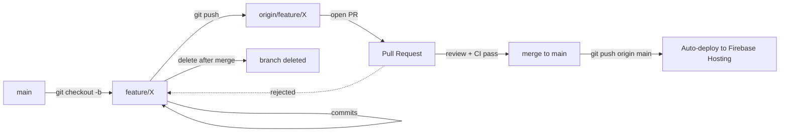

# Contributing

> How to contribute to App-WatchHub. Covers branch model, commit conventions, PR template, and the code review checklist. All contributors — including the solo author operating in self-review mode — must follow this guide.

---

## Document Metadata

| Field | Value |
|---|---|
| **Title** | App-WatchHub — Contributing |
| **Purpose** | Define branch model, commit convention, PR template, and review checklist |
| **Audience** | All contributors (including solo author in self-review mode) and AI coding agents |
| **Scope** | Process only; technical conventions in [docs/STYLE_GUIDE.md](docs/STYLE_GUIDE.md) |
| **Version** | 1.0.0 |
| **Status** | Active — updated when process evolves |
| **Owner** | Muhammad Faheem Khan (Student ID: 1593766) |
| **Last Updated** | 2026-07-15 |
| **Related Documents** | [docs/STYLE_GUIDE.md](docs/STYLE_GUIDE.md), [docs/TESTING.md](docs/TESTING.md), [docs/DEPENDENCIES.md](docs/DEPENDENCIES.md), [docs/INDEX.md](docs/INDEX.md) |

---

## Table of Contents

1. [Code of Conduct](#1-code-of-conduct)
2. [Branch Model](#2-branch-model)
3. [Commit Convention](#3-commit-convention)
4. [Pull Request Process](#4-pull-request-process)
5. [PR Template](#5-pr-template)
6. [Code Review Checklist](#6-code-review-checklist)
7. [AI Agent Contribution Protocol](#7-ai-agent-contribution-protocol)
8. [References](#8-references)

---

## 0. Team Structure

App-WatchHub is a Sem-4 eProject with 6 student contributors. All team members are collaborators on the GitHub repository and share merge authority on `main` (subject to the branch protection rules in [docs/DEPLOYMENT.md](docs/DEPLOYMENT.md) §4).

| Name | Student ID | GitHub Username | Primary Role |
|---|---|---|---|
| Muhammad Asim Siddiqui | 1540238 | `<to-be-added>` | Contributor — Auth, Support |
| Musaib Zahid | 1593575 | `<to-be-added>` | Contributor — Catalog, Search, Feedback |
| Maaz | 1591053 | `<to-be-added>` | Contributor — Cart, Reviews, Seed Scripts |
| **Muhammad Faheem Khan** | **1593766** | `<to-be-added>` | **Documentation Architect** — Docs, Rules, Admin Orders |
| Muhammad Mubeen | 1593765 | `<to-be-added>` | Contributor — Theme, Product Detail, Deploy |
| Ahmed Ali | 1557184 | `<to-be-added>` | Contributor — Profile, Addresses, Order Tracking |

### 0.1 Role Definitions

| Role | Responsibilities |
|---|---|
| **Documentation Architect** (Faheem) | Owns the `/docs/` tree; reviews all documentation PRs; maintains [docs/DECISIONS.md](docs/DECISIONS.md), [docs/SECURITY.md](docs/SECURITY.md), [docs/PROJECT_SCOPE.md](docs/PROJECT_SCOPE.md); final authority on ADR acceptance |
| **Contributor** | Implements features per [docs/ROADMAP.md](docs/ROADMAP.md) §2 sprint plan; writes tests for own features; participates in code review |

### 0.2 Communication Channels

| Channel | Purpose |
|---|---|
| GitHub Issues | Bug reports, feature requests, task tracking |
| GitHub Pull Requests | Code review, merge requests |
| GitHub Discussions | Architecture questions, design debates |
| Shared worklog (`worklog.md`) | Append-only daily work log per the role spec |
| Email (`eprojects@aglsm.com`) | Communication with academic mentor (eProjects Team) |

### 0.3 Standup Cadence

- **Daily async standup** in GitHub Discussions: each contributor posts (a) what they did yesterday, (b) what they will do today, (c) any blockers.
- **Weekly sync (optional)**: 30-minute video call on Mondays to align on sprint goals.
- **Milestone reviews**: at each gate per [docs/ROADMAP.md](docs/ROADMAP.md) §3, the team reviews progress and decides on descope candidates if needed.

### 0.4 Onboarding New Contributors

If a new contributor joins mid-project (unlikely for MVP, but documented for completeness):

1. Read [README.md](README.md) → [docs/INDEX.md](docs/INDEX.md) → [docs/STYLE_GUIDE.md](docs/STYLE_GUIDE.md) → [docs/CONFIGURATION.md](docs/CONFIGURATION.md).
2. Clone the repo; run `flutter pub get`; start the Firebase Emulator per [docs/CONFIGURATION.md](docs/CONFIGURATION.md) §5.
3. Pick an unassigned task from [docs/ROADMAP.md](docs/ROADMAP.md) §2.
4. Create a feature branch per §2.1 below.
5. Open a "introduction" PR that adds their name to §0.1 above (verifies they can navigate the contribution workflow).

## 1. Code of Conduct

App-WatchHub is an academic project with 6 contributors. The Code of Conduct applies equally to all team members, any future contributors, and AI coding agents operating on the codebase.

### 1.1 Principles

- **Be honest.** Do not fabricate test results, coverage numbers, or documentation claims. Mark unknowns as `UNKNOWN` or `REQUIRES DECISION` per the role spec.
- **Be traceable.** Every change has a commit; every commit has a rationale (in the commit message or linked ADR). Every architectural decision is recorded in [docs/DECISIONS.md](docs/DECISIONS.md).
- **Be kind to future maintainers.** Write code and documentation that a new contributor can understand in under 10 minutes. Optimize for the reader, not the writer.
- **Respect the budget.** The $0 budget constraint is non-negotiable. No PR may introduce a paid service without an ADR explicitly justifying the cost.

### 1.2 Unacceptable Behavior

- Committing secrets, API keys, or service account credentials to Git.
- Bypassing CI checks (e.g., `--no-verify` on commit, force-pushing to `main`).
- Fabricating test coverage or skipping failing tests to merge a PR.
- Plagiarizing code without attribution.

## 2. Branch Model

App-WatchHub uses a simplified Gitflow model. The `main` branch is the source of truth; all work happens on feature branches and merges via PR.

### 2.1 Branch Types

| Branch Type | Naming Convention | Purpose | Lifetime |
|---|---|---|---|
| `main` | `main` | Production-ready code; deployed on every push | Forever |
| Feature | `feature/<short-description>` | New functionality | Until merged |
| Fix | `fix/<short-description>` | Bug fix | Until merged |
| Docs | `docs/<short-description>` | Documentation-only change | Until merged |
| Chore | `chore/<short-description>` | Tooling, dependency updates, refactors | Until merged |
| Release | `release/v<X.Y.Z>` | Release preparation (post-MVP) | Until merged |

### 2.2 Branch Naming Examples

```text
feature/admin-dashboard-inventory-crud
fix/cart-not-persisting-on-restart
docs/add-troubleshooting-entry-for-rules-test
chore/upgrade-flutter-to-4-1
release/v1.0.0
```

### 2.3 Branch Lifecycle



### 2.4 Branch Protection Rules

The `main` branch is protected per [docs/DEPLOYMENT.md](docs/DEPLOYMENT.md) §4:

- Require PR before merging
- Require 1 approval (self-approval acceptable for solo dev)
- Require status checks (`verify`, `test`, `build`) to pass
- Require linear history
- Disallow force pushes
- Disallow deletions

## 3. Commit Convention

App-WatchHub uses [Conventional Commits](https://www.conventionalcommits.org/) 1.0.0. Every commit message follows:

```text
<type>(<scope>): <subject>

<body>

<footer>
```

### 3.1 Commit Types

| Type | When Used | Example |
|---|---|---|
| `feat` | New feature | `feat(cart): add wishlist-to-cart move action` |
| `fix` | Bug fix | `fix(auth): redirect loop on token refresh` |
| `docs` | Documentation only | `docs(adr): add ADR-013 for Cloud Functions` |
| `style` | Formatting, no code change | `style(theme): apply dart format to app_colors.dart` |
| `refactor` | Code change that neither fixes a bug nor adds a feature | `refactor(repo): extract Firebase exception translator` |
| `test` | Adding or correcting tests | `test(rules): add negative test for isAdmin write` |
| `chore` | Tooling, dependencies, build config | `chore(deps): upgrade flutter_riverpod to 2.6.0` |
| `ci` | CI/CD pipeline changes | `ci(workflow): add Lighthouse audit step` |
| `revert` | Reverting a previous commit | `revert: feat(cart) - causes regression in checkout` |

### 3.2 Commit Scope

The scope is the affected area of the codebase. Common scopes:

| Scope | Covers |
|---|---|
| `auth` | `lib/features/auth/` |
| `catalog` | `lib/features/catalog/` |
| `cart` | `lib/features/cart/` |
| `orders` | `lib/features/orders/` |
| `admin` | `lib/features/admin/` |
| `core` | `lib/core/` |
| `shared` | `lib/shared/` |
| `theme` | `lib/core/theme/` |
| `router` | `lib/core/router/` |
| `repo` | Repository layer |
| `rules` | `firestore.rules` |
| `deps` | `pubspec.yaml` / `pubspec.lock` |
| `adr` | [docs/DECISIONS.md](docs/DECISIONS.md) |
| `docs` | Any documentation file |
| `workflow` | `.github/workflows/` |
| `config` | Configuration files |

### 3.3 Commit Subject Rules

- Imperative mood: "add" not "added" or "adds"
- Lowercase first letter
- No period at end
- Max 50 characters (soft limit); 72 characters hard limit
- Specific: "fix(auth): redirect loop on token refresh" not "fix: bug fix"

### 3.4 Commit Body Rules

- Wrap at 72 characters
- Explain **why** the change was made, not **what** changed (the diff shows what)
- Reference issues, ADRs, or PRs as appropriate: `See ADR-008 for rationale.`

### 3.5 Commit Footer

- `BREAKING CHANGE: <description>` for breaking changes (bumps MAJOR version)
- `Closes #123` to auto-close issues
- `Refs: ADR-008, docs/DECISIONS.md` for cross-references

### 3.6 Example Commit

```text
feat(cart): add wishlist-to-cart move action

Adds a single-tap action to move an item from the wishlist to the cart
without requiring the user to remove it from wishlist first and re-add
to cart. Reduces checkout friction per US-6 in PRODUCT_REQUIREMENTS.

The action preserves the item's quantity (defaulting to 1 if not
previously set) and triggers an `add_to_cart` analytics event.

Refs: ADR-008, docs/PRODUCT_REQUIREMENTS.md §4.1 US-6
```

## 4. Pull Request Process

### 4.1 PR Lifecycle

1. **Create branch** from `main`: `git checkout -b feature/<name>`
2. **Implement** changes following [docs/STYLE_GUIDE.md](docs/STYLE_GUIDE.md)
3. **Test locally**:
   ```bash
   flutter test
   dart analyze
   dart format --set-exit-if-changed lib test
   ```
4. **Commit** with Conventional Commits format (§3)
5. **Push** to origin: `git push -u origin feature/<name>`
6. **Open PR** on GitHub using the template (§5)
7. **Wait for CI** to run (`verify`, `test`, `build` stages)
8. **Self-review** against checklist (§6)
9. **Approve** the PR (self-approval acceptable for solo dev)
10. **Merge** via "Squash and merge" (preserves linear history)
11. **Delete** the feature branch

### 4.2 Squash and Merge

PRs are merged via "Squash and merge" to keep `main`'s history linear. The squash commit message should be the PR title in Conventional Commits format. The PR description (with full context) is preserved in the squash commit body.

### 4.3 PR Size Guideline

- **Ideal PR:** < 300 lines changed, single feature/fix
- **Acceptable PR:** < 1000 lines changed, single theme
- **Red flag PR:** > 1000 lines changed — split into smaller PRs

Large PRs are harder to review and more likely to introduce bugs. If a change requires > 1000 lines, decompose into a sequence of smaller PRs.

## 5. PR Template

Copy this template into the PR description:

```markdown
## Summary

<1-3 sentence summary of what this PR does and why.>

## Type of Change

- [ ] feat — New feature
- [ ] fix — Bug fix
- [ ] docs — Documentation only
- [ ] refactor — Code change (no behavior change)
- [ ] test — Test addition/correction
- [ ] chore — Tooling/deps/build
- [ ] ci — CI/CD pipeline
- [ ] BREAKING CHANGE — Requires MAJOR version bump

## Related

- ADR: <ADR-NNN or "n/a">
- Issue: #<number or "n/a">
- Open Question: <Q-NN or "n/a">

## Checklist

### Architecture
- [ ] No cross-feature imports
- [ ] Presentation layer does not call Firestore directly
- [ ] State layer depends on repository interfaces
- [ ] No business logic in models or widgets

### Style
- [ ] Files follow snake_case.dart
- [ ] Classes PascalCase; members lowerCamelCase
- [ ] Booleans prefixed with is/has/can/should
- [ ] Imports grouped and ordered
- [ ] const constructors used

### Type Safety
- [ ] No dynamic in public API (except JSON boundary)
- [ ] All public methods have explicit return types
- [ ] Nullable types marked with ?

### Error Handling
- [ ] No silent catch blocks
- [ ] Typed exceptions thrown
- [ ] Errors propagated to AsyncValue.error
- [ ] UI uses ErrorStateWidget
- [ ] Errors logged to Crashlytics

### Testing
- [ ] Unit tests added for new business logic
- [ ] Widget tests added for new UI components
- [ ] Rules tests added for rule changes
- [ ] Coverage threshold (60%) maintained

### Documentation
- [ ] Public API has dartdoc
- [ ] ADR added if architectural change
- [ ] DEPENDENCIES.md updated if new package
- [ ] TROUBLESHOOTING.md updated if new error mode
- [ ] RISKS.md updated if new risk

### Performance
- [ ] No heavy sync work in build()
- [ ] Lists use ListView.builder
- [ ] Images have cacheWidth/cacheHeight
- [ ] Provider select() used where applicable

### Budget
- [ ] No paid service introduced (or ADR justifies cost)
- [ ] No new Firebase service requiring Blaze tier

## Verification

<How did you verify this change works? E.g., "Ran flutter test, all 47 tests pass. Manually verified cart persists across restart.">

## Screenshots / Recordings

<For UI changes, attach before/after screenshots or a short screen recording.>
```

## 6. Code Review Checklist

The full code review checklist is in [docs/STYLE_GUIDE.md](docs/STYLE_GUIDE.md) §10. Summary:

1. **Architecture** — no cross-feature imports, presentation doesn't call Firestore, state depends on interfaces
2. **Naming & Style** — snake_case files, PascalCase classes, prefix booleans
3. **Type Safety** — no `dynamic` in public API, explicit return types
4. **Error Handling** — no silent catches, typed exceptions, errors to AsyncValue
5. **Testing** — unit/widget/rules tests added, coverage maintained
6. **Documentation** — dartdoc, ADR if architectural, deps updated
7. **Performance** — no sync work in build(), ListView.builder, image caching
8. **Budget** — no paid services without ADR

## 7. AI Agent Contribution Protocol

AI coding agents (Claude, GPT, Copilot, etc.) may contribute to this project under the following protocol. The protocol exists because AI agents have specific failure modes (hallucination, scope creep, context loss) that must be guarded against.

### 7.1 Agent MUST

- Read [docs/INDEX.md](docs/INDEX.md) and the relevant topic doc before modifying code in that area.
- Follow [docs/STYLE_GUIDE.md](docs/STYLE_GUIDE.md) exactly.
- Use Conventional Commits format for all commits.
- Mark any fabricated or inferred information as `UNKNOWN` or `REQUIRES DECISION`.
- Run `flutter test` and `dart analyze` before declaring a task complete.
- Document any new architectural decision in [docs/DECISIONS.md](docs/DECISIONS.md) as an ADR.
- Update this changelog and the relevant doc(s) for any change.

### 7.2 Agent MUST NOT

- Introduce new dependencies without updating [docs/DEPENDENCIES.md](docs/DEPENDENCIES.md).
- Modify `firestore.rules` without adding corresponding rules tests in [docs/TESTING.md](docs/TESTING.md) §7.
- Bypass CI checks or use `--no-verify`.
- Force-push to `main`.
- Delete or rewrite existing ADRs (ADRs are append-only — see [docs/DECISIONS.md](docs/DECISIONS.md) §ADR Format).
- Introduce paid services without explicit ADR justification.
- Fabricate test results or coverage numbers.

### 7.3 Agent Context Boundary

AI agents do not have access to the full conversation context or skill instructions of the parent agent. They receive only the prompt passed to them. Therefore:

- Suitable for agents: well-defined, self-contained subtasks (e.g., "write unit tests for `price_calculator.dart`").
- NOT suitable for agents: tasks requiring full project context, style guide compliance, or nuanced architectural decisions.

When in doubt, the human author does the work rather than delegating to an agent.

## 8. References

- Internal: [docs/STYLE_GUIDE.md](docs/STYLE_GUIDE.md) §10 Code Review Checklist, [docs/TESTING.md](docs/TESTING.md), [docs/DEPENDENCIES.md](docs/DEPENDENCIES.md), [docs/DECISIONS.md](docs/DECISIONS.md), [docs/INDEX.md](docs/INDEX.md), [docs/DEPLOYMENT.md](docs/DEPLOYMENT.md) §4 Branch Protection
- External: [Conventional Commits 1.0.0](https://www.conventionalcommits.org/), [Gitflow workflow](https://www.atlassian.com/git/tutorials/comparing-workflows/gitflow-workflow), [GitHub PR best practices](https://docs.github.com/en/pull-requests)
