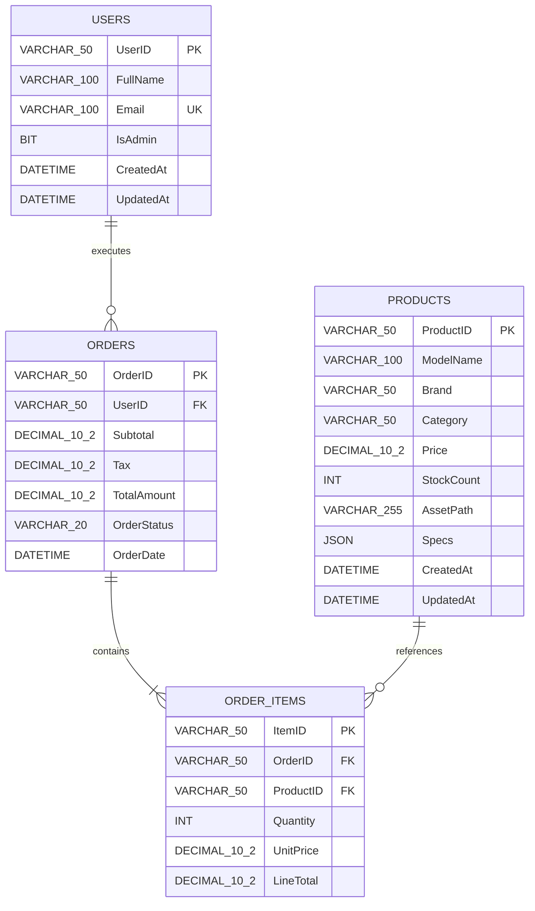
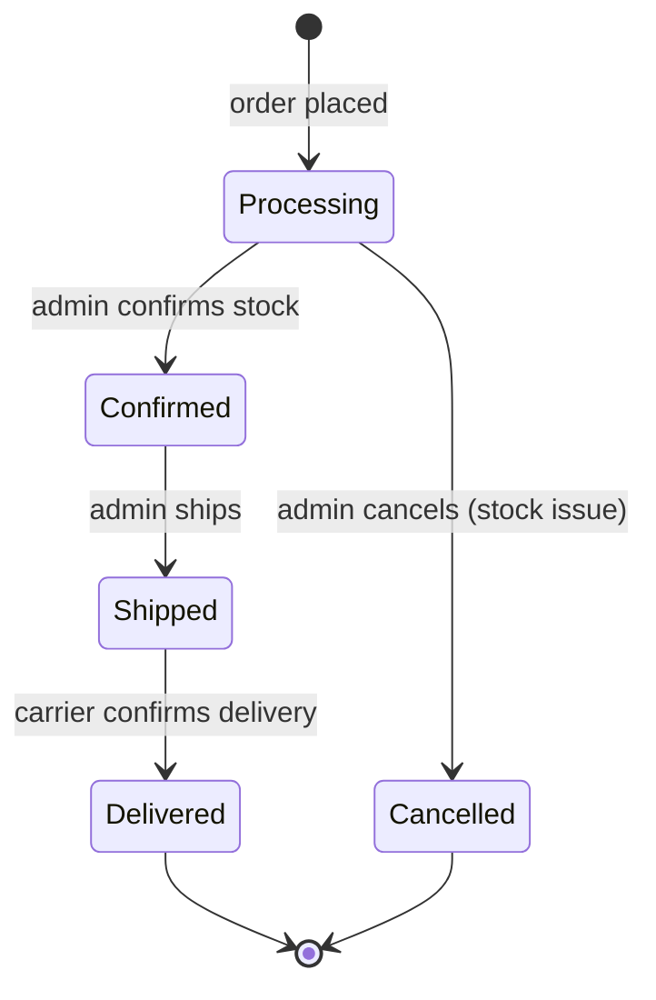
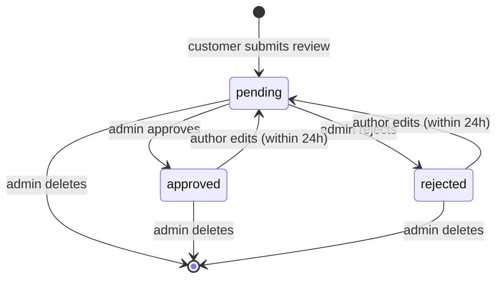
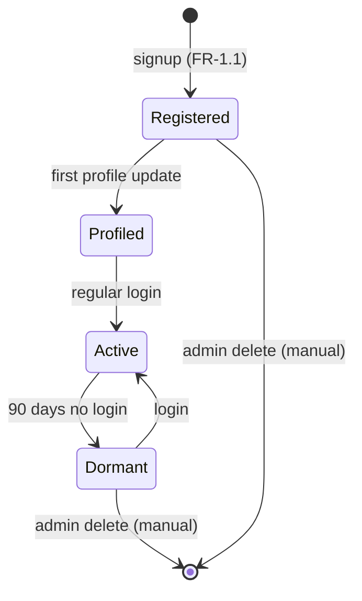
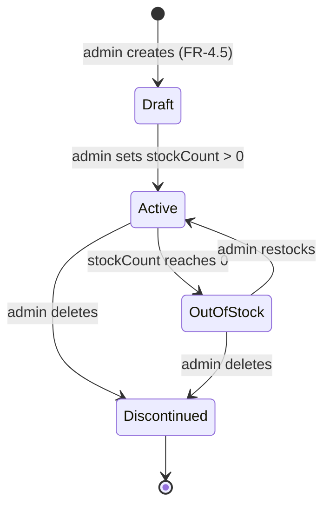

# Database Design

> Specification of the App-WatchHub data layer. To satisfy both academic evaluation requirements (relational ERD) and production reality (serverless NoSQL), the project maintains a dual data model: an academic ERD for documentation/grading and a production Firestore schema for actual implementation. This file is the single source of truth for both.

---

## Document Metadata

| Field | Value |
|---|---|
| **Title** | App-WatchHub — Database Design |
| **Purpose** | Define the dual data model (academic ERD + production NoSQL), collection schemas, indexing strategy, and data lifecycle |
| **Audience** | Engineers, DB reviewers, academic reviewers, AI coding agents |
| **Scope** | Data layer only; access patterns in [API_REFERENCE.md](API_REFERENCE.md), authz in [SECURITY.md](SECURITY.md) |
| **Version** | 1.0.0 |
| **Status** | Approved — locked for MVP cycle |
| **Owner** | Muhammad Faheem Khan (Student ID: 1593766) |
| **Last Updated** | 2026-07-15 |
| **Related Documents** | [API_REFERENCE.md](API_REFERENCE.md), [SECURITY.md](SECURITY.md), [SYSTEM_DESIGN.md](SYSTEM_DESIGN.md), [DECISIONS.md](DECISIONS.md) |

---

## Table of Contents

1. [Dual Data Model Rationale](#1-dual-data-model-rationale)
2. [Academic Relational ERD](#2-academic-relational-erd)
3. [Production Firestore Schema](#3-production-firestore-schema)
4. [Collection Schemas](#4-collection-schemas)
5. [Indexing Strategy](#5-indexing-strategy)
6. [Data Lifecycle](#6-data-lifecycle)
7. [Migration & Seeding](#7-migration--seeding)
8. [References](#8-references)

---

## 1. Dual Data Model Rationale

App-WatchHub maintains two parallel data representations, and this is intentional rather than accidental. The academic ERD in §2 satisfies the academic evaluation rubric, which expects a classical relational design with primary keys, foreign keys, and normalized entities. The production Firestore schema in §3 reflects the actual implementation, which is a NoSQL document database where normalization is intentionally avoided in favor of read-optimized denormalization.

The dual model is justified in [DECISIONS.md](DECISIONS.md) ADR-007. The short version: a relational ERD demonstrates that the author understands normalization, cardinality, and referential integrity; a NoSQL schema demonstrates that the author understands when to break those rules for performance and cost. Maintaining both in the same documentation tree proves the author knows the difference and chose deliberately.

The mapping between the two models is documented in §3.2 — every entity in the ERD has a corresponding collection (or embedded sub-document) in Firestore, and the mapping is bijective for the MVP scope. Any future schema change must update both representations in lockstep.

## 2. Academic Relational ERD

The ERD below is the classical relational representation used for academic evaluation. It uses Crow's Foot notation and standard SQL data types.



### 2.1 Entity Definitions (Academic)

| Entity | Purpose | Cardinality |
|---|---|---|
| `USERS` | Stores user identity and admin flag | One user → many orders |
| `PRODUCTS` | Stores watch catalog entries | One product → many order_items |
| `ORDERS` | Stores order header (customer, totals, status) | One order → many order_items |
| `ORDER_ITEMS` | Stores line items per order | Composite FK to ORDERS + PRODUCTS |

### 2.2 Normalization Notes

The ERD is in **3rd Normal Form (3NF)**. The `specs` JSON column on PRODUCTS is the only intentional denormalization — it stores heterogeneous watch specifications (movement, power reserve, water resistance, case material) that do not warrant their own entity given the small catalog size. In a production SQL system with a larger catalog, `specs` would be promoted to a separate `PRODUCT_SPECS` table with key-value pairs.

## 3. Production Firestore Schema

The production database is Cloud Firestore (NoSQL). The schema maps the four relational entities to three top-level collections — `order_items` is embedded as a sub-array inside the `orders` document because order items are never queried independently of their parent order.

### 3.1 Collection Map

```mermaid
graph TD
    DB[(Cloud Firestore<br/>app-watchhub-dev)]

    DB --> C1[/users/{uid}/]
    DB --> C2[/products/{productId}/]
    DB --> C3[/orders/{orderId}/]

    C1 --> F1[fullName<br/>email<br/>isAdmin<br/>createdAt<br/>updatedAt]
    C2 --> F2[modelName<br/>brand<br/>category<br/>price<br/>stockCount<br/>assetPath<br/>specs<br/>createdAt<br/>updatedAt]
    C3 --> F3[userId<br>subtotal<br/>tax<br/>totalAmount<br/>orderStatus<br/>createdAt<br/>items: array]

    C3 -.embedded.-> SA[items[] sub-array<br/>productId<br/>quantity<br/>unitPrice<br/>lineTotal]
```

### 3.2 ERD-to-Firestore Mapping

| ERD Entity | Firestore Representation | Rationale |
|---|---|---|
| `USERS` | `/users/{uid}` document | Direct 1:1 mapping; `uid` = Firebase Auth UID |
| `PRODUCTS` | `/products/{productId}` document | Direct 1:1 mapping; `productId` = URL-safe slug |
| `ORDERS` | `/orders/{orderId}` document | Direct 1:1 mapping; `orderId` = auto-generated |
| `ORDER_ITEMS` | Embedded `items[]` array inside `/orders/{orderId}` | Never queried independently; embedding avoids cross-collection joins |
| (none) | `/users/{uid}/cart` (Hive, not Firestore) | Cart is local-only per A-7 — see [SYSTEM_DESIGN.md](SYSTEM_DESIGN.md) §6 |
| (none) | `/users/{uid}/wishlist` (Hive, not Firestore) | Wishlist is local-only — see A-7 |

## 4. Collection Schemas

### 4.1 `/users/{uid}`

Stores the user's profile. Created on first successful authentication. The document ID equals the Firebase Auth UID for direct lookup.

```json
{
  "uid": "Zk9P3mXq8YvW2n1B",
  "fullName": "Muhammad Faheem Khan",
  "email": "fbux12@gmail.com",
  "isAdmin": true,
  "createdAt": "2026-07-14T22:00:00Z",
  "updatedAt": "2026-07-14T22:00:00Z"
}
```

| Field | Type | Constraint | Notes |
|---|---|---|---|
| `uid` | string | PK, equals Firebase Auth UID | Set by `auth_repository.dart` on creation |
| `fullName` | string | 2-100 chars | Validated client-side; server-side validation deferred (see [OPEN_QUESTIONS.md](OPEN_QUESTIONS.md) Q-2) |
| `email` | string | valid email format | Mirrors Firebase Auth; never writable from client |
| `isAdmin` | boolean | default false | Writable ONLY via Firebase Console — see [SECURITY.md](SECURITY.md) § Admin Bootstrap |
| `createdAt` | timestamp | server-set | `FieldValue.serverTimestamp()` |
| `updatedAt` | timestamp | server-set on every write | `FieldValue.serverTimestamp()` |

### 4.2 `/products/{productId}`

Stores a single watch listing. The document ID is a URL-safe slug (e.g., `watch_rolex_submariner_01`).

```json
{
  "productId": "watch_rolex_submariner_01",
  "modelName": "Submariner Date 41mm",
  "brand": "Rolex",
  "category": "Diver",
  "price": 14350.00,
  "stockCount": 8,
  "assetPath": "assets/images/watches/rolex_submariner.png",
  "specs": {
    "movement": "Automatic 3235",
    "powerReserve": "70 Hours",
    "waterResistance": "300m",
    "caseMaterial": "Oystersteel"
  },
  "createdAt": "2026-07-14T22:00:00Z",
  "updatedAt": "2026-07-14T22:00:00Z"
}
```

| Field | Type | Constraint | Notes |
|---|---|---|---|
| `productId` | string | PK, URL-safe slug | Lowercase, alphanumeric + underscores |
| `modelName` | string | 1-100 chars | Display name |
| `brand` | string | enum: see §4.2.1 | Used in filter |
| `category` | string | enum: see §4.2.2 | Used in filter |
| `price` | number | >= 0, decimal | USD; precision to cents |
| `stockCount` | integer | >= 0 | Decremented on order placement (in MVP: client writes; in v1.1: Cloud Function transaction) |
| `assetPath` | string | path to local asset | `assets/images/watches/*.png` |
| `specs` | map | free-form key-value | Displayed in product detail; not queried |
| `createdAt` | timestamp | server-set | — |
| `updatedAt` | timestamp | server-set on every write | — |

#### 4.2.1 Brand Enum (MVP Catalog)

The MVP catalog is seeded with the following brands. Adding a brand requires updating this enum and the seed script.

| Brand | Country |
|---|---|
| Rolex | Switzerland |
| Omega | Switzerland |
| Patek Philippe | Switzerland |
| Audemars Piguet | Switzerland |
| Vacheron Constantin | Switzerland |
| Cartier | France |
| IWC | Switzerland |
| Breitling | Switzerland |
| Tudor | Switzerland |
| Panerai | Italy |
| Hublot | Switzerland |
| A. Lange & Sohne | Germany |

#### 4.2.2 Category Enum

| Category | Description |
|---|---|
| Diver | Water-resistant sport watches rated >= 200m |
| Chronograph | Stop-watch complication |
| Dress | Minimal, formal aesthetic |
| GMT | Dual-time zone |
| Pilot | Aviator-style |
| Perpetual Calendar | High-complication calendar |
| Tourbillon | Rotating escapement complication |

### 4.3 `/orders/{orderId}`

Stores an order header with embedded line items. The document ID is auto-generated by Firestore (`add()`).

```json
{
  "orderId": "ord_88291039",
  "userId": "Zk9P3mXq8YvW2n1B",
  "subtotal": 14350.00,
  "tax": 1158.75,
  "totalAmount": 15508.75,
  "orderStatus": "Processing",
  "createdAt": "2026-07-14T22:15:30Z",
  "items": [
    {
      "productId": "watch_rolex_submariner_01",
      "modelName": "Submariner Date 41mm",
      "quantity": 1,
      "unitPrice": 14350.00,
      "lineTotal": 14350.00
    }
  ]
}
```

| Field | Type | Constraint | Notes |
|---|---|---|---|
| `orderId` | string | PK, auto-gen | Format: `ord_XXXXXXXXXX` (10-digit) |
| `userId` | string | FK to `/users/{uid}` | Must equal `request.auth.uid` on create |
| `subtotal` | number | >= 0 | Sum of `lineTotal` across items |
| `tax` | number | >= 0 | `subtotal * taxRate` (rate = `UNKNOWN`, see [OPEN_QUESTIONS.md](OPEN_QUESTIONS.md) Q-1) |
| `totalAmount` | number | = subtotal + tax | — |
| `orderStatus` | string | enum: see §4.3.1 | Mutated by admin only |
| `createdAt` | timestamp | server-set | — |
| `items[]` | array | 1-50 items | Embedded sub-documents |

#### 4.3.1 Order Status Enum



| Status | Mutated By | UI Implication |
|---|---|---|
| `Processing` | System (on create) | Customer sees "We received your order" |
| `Confirmed` | Admin | Customer sees "Order confirmed, preparing for shipment" |
| `Cancelled` | Admin | Customer sees "Order cancelled — a representative will contact you" |
| `Shipped` | Admin | Customer sees "Order shipped" |
| `Delivered` | Admin | Customer sees "Order delivered" |

### 4.4 Embedded `items[]` Sub-Document

Each element of the `items` array has the following shape. This is denormalized — `modelName` is copied from the product at order-create time so that historical orders remain accurate even if the product is later renamed or deleted.

| Field | Type | Constraint | Notes |
|---|---|---|---|
| `productId` | string | FK to `/products/{productId}` | — |
| `modelName` | string | denormalized from product | Snapshot at order time |
| `quantity` | integer | 1-99 | — |
| `unitPrice` | number | denormalized from product | Snapshot at order time |
| `lineTotal` | number | = quantity × unitPrice | Pre-computed for query efficiency |

### 4.4 `/reviews/{reviewId}`

Stores customer reviews of products. Reviews are subject to admin moderation before becoming publicly visible (`status: 'pending'` → `'approved'` or `'rejected'`).

```json
{
  "reviewId": "rev_a1b2c3d4e5",
  "productId": "watch_rolex_submariner_01",
  "userId": "Zk9P3mXq8YvW2n1B",
  "userFullName": "Muhammad Faheem Khan",
  "rating": 5,
  "title": "Exquisite timepiece",
  "body": "The Submariner exceeds every expectation. The bezel action is crisp...",
  "status": "pending",
  "createdAt": "2026-07-15T10:30:00Z",
  "updatedAt": "2026-07-15T10:30:00Z",
  "moderatedAt": null,
  "moderatedBy": null
}
```

| Field | Type | Constraint | Notes |
|---|---|---|---|
| `reviewId` | string | PK, auto-gen | Format: `rev_XXXXXXXXXX` |
| `productId` | string | FK to `/products/{productId}` | Indexed |
| `userId` | string | FK to `/users/{uid}` | Indexed; equals `auth.uid` on create |
| `userFullName` | string | denormalized from user | Snapshot at review time; never email (PII) |
| `rating` | integer | 1-5 | Star rating |
| `title` | string | 1-100 chars | Short summary |
| `body` | string | 1-1000 chars | Review text |
| `status` | string | enum: `pending`, `approved`, `rejected` | Default `pending`; mutated by admin only |
| `createdAt` | timestamp | server-set | — |
| `updatedAt` | timestamp | server-set on every write | — |
| `moderatedAt` | timestamp nullable | server-set when admin moderates | — |
| `moderatedBy` | string nullable | admin uid | — |

#### 4.4.1 Review Status State Machine



### 4.5 `/supportTickets/{ticketId}`

Stores customer support contact form submissions. Admin responds via the admin dashboard.

```json
{
  "ticketId": "tkt_xyz789",
  "userId": "Zk9P3mXq8YvW2n1B",
  "userFullName": "Muhammad Faheem Khan",
  "userEmail": "fbux12@gmail.com",
  "subject": "Order status inquiry",
  "subjectCategory": "order_inquiry",
  "messageBody": "Hi, my order #ord_88291039 has been in Processing for 3 days...",
  "relatedOrderId": "ord_88291039",
  "status": "open",
  "createdAt": "2026-07-15T11:00:00Z",
  "updatedAt": "2026-07-15T11:00:00Z",
  "adminResponse": null,
  "respondedAt": null,
  "respondedBy": null
}
```

| Field | Type | Constraint | Notes |
|---|---|---|---|
| `ticketId` | string | PK, auto-gen | Format: `tkt_XXXXXXXXXX` |
| `userId` | string | FK to `/users/{uid}` | Equals `auth.uid` on create |
| `userFullName` | string | denormalized | Snapshot |
| `userEmail` | string | denormalized | For admin reply; PII |
| `subject` | string | 1-200 chars | Free-text subject |
| `subjectCategory` | string | enum: `order_inquiry`, `product_question`, `shipping`, `account`, `other` | Indexed |
| `messageBody` | string | 1-5000 chars | — |
| `relatedOrderId` | string nullable | FK to `/orders/{orderId}` | Optional |
| `status` | string | enum: `open`, `in_progress`, `resolved`, `closed` | Default `open` |
| `createdAt` | timestamp | server-set | — |
| `updatedAt` | timestamp | server-set on every write | — |
| `adminResponse` | string nullable | 1-5000 chars | Appended when admin responds |
| `respondedAt` | timestamp nullable | server-set on first response | — |
| `respondedBy` | string nullable | admin uid | — |

### 4.6 `/feedback/{feedbackId}`

Stores customer feedback and issue reports. Distinct from support tickets — feedback is product improvement input, not a request for support.

```json
{
  "feedbackId": "fb_qrs456",
  "userId": "Zk9P3mXq8YvW2n1B",
  "isAnonymous": false,
  "category": "bug",
  "description": "The filter chip bar overlaps with the search bar on mobile devices...",
  "screenshotUrl": null,
  "relatedProductId": null,
  "status": "new",
  "createdAt": "2026-07-15T12:00:00Z",
  "triagedAt": null,
  "triagedBy": null,
  "triageNotes": null
}
```

| Field | Type | Constraint | Notes |
|---|---|---|---|
| `feedbackId` | string | PK, auto-gen | Format: `fb_XXXXXXXXXX` |
| `userId` | string nullable | FK to `/users/{uid}` | Null if anonymous |
| `isAnonymous` | boolean | default false | If true, `userId` is null |
| `category` | string | enum: `bug`, `suggestion`, `compliment`, `complaint`, `other` | Indexed |
| `description` | string | 1-5000 chars | — |
| `screenshotUrl` | string nullable | URL | Optional; file uploads OUT OF SCOPE |
| `relatedProductId` | string nullable | FK to `/products/{productId}` | Optional; pre-filled when reported from product detail |
| `status` | string | enum: `new`, `acknowledged`, `in_progress`, `resolved`, `dismissed` | Default `new` |
| `createdAt` | timestamp | server-set | — |
| `triagedAt` | timestamp nullable | server-set when admin triages | — |
| `triagedBy` | string nullable | admin uid | — |
| `triageNotes` | string nullable | admin's internal notes | Not visible to user |

### 4.7 `/faq/{faqId}`

Stores frequently asked questions rendered in-app. Admin-managed; grouped by category.

```json
{
  "faqId": "faq_001",
  "category": "Orders",
  "question": "How long does order processing take?",
  "answer": "Orders are typically processed within 1-2 business days. Once shipped, you will receive a tracking number...",
  "displayOrder": 1,
  "isActive": true,
  "createdAt": "2026-07-14T22:00:00Z",
  "updatedAt": "2026-07-14T22:00:00Z"
}
```

| Field | Type | Constraint | Notes |
|---|---|---|---|
| `faqId` | string | PK, auto-gen or slug | Format: `faq_XXX` |
| `category` | string | enum: `Orders`, `Shipping`, `Account`, `Payments`, `Products`, `Returns` | Indexed |
| `question` | string | 1-200 chars | Display text |
| `answer` | string | 1-2000 chars | Display text; supports basic markdown |
| `displayOrder` | integer | >= 0 | Sort order within category |
| `isActive` | boolean | default true | Admin can soft-hide without deleting |
| `createdAt` | timestamp | server-set | — |
| `updatedAt` | timestamp | server-set on every write | — |

### 4.8 `/users/{uid}` Extension — `addresses[]` Array

The `/users/{uid}` document is extended with an `addresses[]` array per FR-9.6. Each element:

```json
{
  "addressId": "addr_a1b2",
  "label": "Home",
  "recipientName": "Muhammad Faheem Khan",
  "street": "123 Main Street, Apt 4B",
  "city": "Karachi",
  "stateProvince": "Sindh",
  "postalCode": "74000",
  "country": "Pakistan",
  "phone": "+92 300 1234567",
  "isDefault": true
}
```

| Field | Type | Constraint | Notes |
|---|---|---|---|
| `addressId` | string | PK within array | Auto-generated UUID |
| `label` | string | 1-30 chars | "Home", "Work", etc. |
| `recipientName` | string | 2-100 chars | May differ from account holder |
| `street` | string | 5-200 chars | Full street address |
| `city` | string | 2-100 chars | — |
| `stateProvince` | string | 2-100 chars | — |
| `postalCode` | string | 3-20 chars | — |
| `country` | string | 2-100 chars | Country name |
| `phone` | string | 7-20 chars | E.164 format preferred |
| `isDefault` | boolean | default false | Only one address may be default at a time |

The `isDefault: true` constraint (only one default) is enforced client-side — when a user sets a new default, the client unsets the previous default in the same `update()` batch.

### 4.9 Embedded `items[]` Sub-Document (in `/orders/{orderId}`)

Each element of the `items` array has the following shape. This is denormalized — `modelName` is copied from the product at order-create time so that historical orders remain accurate even if the product is later renamed or deleted.

| Field | Type | Constraint | Notes |
|---|---|---|---|
| `productId` | string | FK to `/products/{productId}` | — |
| `modelName` | string | denormalized from product | Snapshot at order time |
| `quantity` | integer | 1-99 | — |
| `unitPrice` | number | denormalized from product | Snapshot at order time |
| `lineTotal` | number | = quantity × unitPrice | Pre-computed for query efficiency |

## 5. Indexing Strategy

Firestore automatically creates single-field indexes for every field. Composite indexes must be declared in `firestore.indexes.json` and deployed via `firebase deploy --only firestore:indexes`.

### 5.1 Composite Indexes (MVP)

| Collection | Fields | Query Scope | Rationale |
|---|---|---|---|
| `products` | `brand` ASC, `price` ASC | Collection | Filter by brand + sort by price |
| `products` | `category` ASC, `price` ASC | Collection | Filter by category + sort by price |
| `products` | `brand` ASC, `category` ASC | Collection | Filter by brand + category |
| `orders` | `userId` ASC, `createdAt` DESC | Collection | Customer order history (newest first) |
| `orders` | `orderStatus` ASC, `createdAt` DESC | Collection | Admin dashboard: filter by status |
| `reviews` | `productId` ASC, `status` ASC, `createdAt` DESC | Collection | Product detail page: approved reviews newest-first |
| `reviews` | `userId` ASC, `createdAt` DESC | Collection | Customer's own reviews (for edit/delete within 24h) |
| `reviews` | `status` ASC, `createdAt` DESC | Collection | Admin moderation queue: pending newest-first |
| `supportTickets` | `userId` ASC, `createdAt` DESC | Collection | Customer's support ticket history |
| `supportTickets` | `status` ASC, `createdAt` DESC | Collection | Admin ticket queue: open tickets newest-first |
| `feedback` | `status` ASC, `createdAt` DESC | Collection | Admin feedback triage queue |
| `faq` | `category` ASC, `displayOrder` ASC | Collection | FAQ page grouped by category, ordered |

### 5.2 `firestore.indexes.json`

```json
{
  "indexes": [
    {
      "collectionGroup": "products",
      "queryScope": "COLLECTION",
      "fields": [
        { "fieldPath": "brand", "order": "ASCENDING" },
        { "fieldPath": "price", "order": "ASCENDING" }
      ]
    },
    {
      "collectionGroup": "products",
      "queryScope": "COLLECTION",
      "fields": [
        { "fieldPath": "category", "order": "ASCENDING" },
        { "fieldPath": "price", "order": "ASCENDING" }
      ]
    },
    {
      "collectionGroup": "products",
      "queryScope": "COLLECTION",
      "fields": [
        { "fieldPath": "brand", "order": "ASCENDING" },
        { "fieldPath": "category", "order": "ASCENDING" }
      ]
    },
    {
      "collectionGroup": "orders",
      "queryScope": "COLLECTION",
      "fields": [
        { "fieldPath": "userId", "order": "ASCENDING" },
        { "fieldPath": "createdAt", "order": "DESCENDING" }
      ]
    },
    {
      "collectionGroup": "orders",
      "queryScope": "COLLECTION",
      "fields": [
        { "fieldPath": "orderStatus", "order": "ASCENDING" },
        { "fieldPath": "createdAt", "order": "DESCENDING" }
      ]
    },
    {
      "collectionGroup": "reviews",
      "queryScope": "COLLECTION",
      "fields": [
        { "fieldPath": "productId", "order": "ASCENDING" },
        { "fieldPath": "status", "order": "ASCENDING" },
        { "fieldPath": "createdAt", "order": "DESCENDING" }
      ]
    },
    {
      "collectionGroup": "reviews",
      "queryScope": "COLLECTION",
      "fields": [
        { "fieldPath": "userId", "order": "ASCENDING" },
        { "fieldPath": "createdAt", "order": "DESCENDING" }
      ]
    },
    {
      "collectionGroup": "reviews",
      "queryScope": "COLLECTION",
      "fields": [
        { "fieldPath": "status", "order": "ASCENDING" },
        { "fieldPath": "createdAt", "order": "DESCENDING" }
      ]
    },
    {
      "collectionGroup": "supportTickets",
      "queryScope": "COLLECTION",
      "fields": [
        { "fieldPath": "userId", "order": "ASCENDING" },
        { "fieldPath": "createdAt", "order": "DESCENDING" }
      ]
    },
    {
      "collectionGroup": "supportTickets",
      "queryScope": "COLLECTION",
      "fields": [
        { "fieldPath": "status", "order": "ASCENDING" },
        { "fieldPath": "createdAt", "order": "DESCENDING" }
      ]
    },
    {
      "collectionGroup": "feedback",
      "queryScope": "COLLECTION",
      "fields": [
        { "fieldPath": "status", "order": "ASCENDING" },
        { "fieldPath": "createdAt", "order": "DESCENDING" }
      ]
    },
    {
      "collectionGroup": "faq",
      "queryScope": "COLLECTION",
      "fields": [
        { "fieldPath": "category", "order": "ASCENDING" },
        { "fieldPath": "displayOrder", "order": "ASCENDING" }
      ]
    }
  ],
  "fieldOverrides": []
}
```

### 5.3 Index Cost Awareness

Each composite index consumes Firestore storage. On the Spark Free Tier, this is not a billing concern (free), but it does count toward the 200 composite-index limit per database. The thirteen indexes above use 13/200 — plenty of headroom for post-MVP additions.

## 6. Data Lifecycle

### 6.1 User Lifecycle



> **NOTE** — Automated account deletion is OUT OF SCOPE for MVP. Deletion is manual via Firebase Console. GDPR right-to-erasure handling is documented in [SECURITY.md](SECURITY.md) § PII Handling.

### 6.2 Product Lifecycle



A "Draft" state (created but `stockCount = 0`) is treated identically to `OutOfStock` for filtering purposes — both have `stockCount = 0` and are excluded by the `inStock` filter. The distinction is conceptual only.

### 6.3 Order Lifecycle

See §4.3.1 Order Status Enum. The order document is never deleted — it transitions to a terminal state (`Delivered` or `Cancelled`). This preserves the audit trail.

### 6.4 Cart Lifecycle

The cart lives in Hive local storage, not Firestore. Lifecycle:

| Event | Action |
|---|---|
| App first launch | Hive box `cart` initialized empty |
| User adds item | Hive box `cart` updated; Riverpod state emits new `AsyncData` |
| User places order | Hive box `cart` cleared; order written to Firestore |
| User uninstalls app | Hive box `cart` destroyed (cart data lost) |
| User reinstalls app | Cart starts empty |

Cross-device cart sync is OUT OF SCOPE per A-7.

## 7. Migration & Seeding

### 7.1 Initial Seed

The seed script `scripts/seed_emulator.dart` populates the Firebase Emulator with:

- 1 admin user (manual email verification required)
- 12 products (one per brand in §4.2.1)
- 3 sample orders (Processing, Shipped, Delivered)

Seed data is for development only — production data is entered manually via the admin panel.

### 7.2 Schema Migration Strategy

Firestore is schemaless, so "migrations" are conceptual. The strategy for schema changes is:

| Change Type | Strategy |
|---|---|
| Add field | Deploy code that writes new field; backfill via admin panel script |
| Remove field | Stop writing it; backfill reads with null-coalescing |
| Rename field | Add new field, dual-write for one release, then drop old |
| Type change | Treat as rename (add new, dual-write, drop old) |
| Restructure (e.g., flatten map) | Document as breaking change; backfill script required |

All migrations are documented in [CHANGELOG.md](../CHANGELOG.md) under the release that ships them.

## 8. References

- Internal: [API_REFERENCE.md](API_REFERENCE.md), [SECURITY.md](SECURITY.md), [SYSTEM_DESIGN.md](SYSTEM_DESIGN.md), [DECISIONS.md](DECISIONS.md), [OPEN_QUESTIONS.md](OPEN_QUESTIONS.md)
- External: [Cloud Firestore data model](https://firebase.google.com/docs/firestore/data-model), [Firestore indexes](https://firebase.google.com/docs/firestore/query-data/indexing), [NoSQL design patterns](https://firebase.google.com/docs/firestore/manage-data/structure-data)
