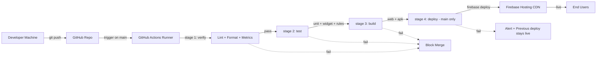

# Deployment

> Release engineering specification for App-WatchHub. Covers the GitHub Actions CI/CD pipeline, Firebase Hosting deployment procedure, Android APK build, rollback strategy, and disaster recovery. Pairs with [CONFIGURATION.md](CONFIGURATION.md) (setup) and [ARCHITECTURE.md](ARCHITECTURE.md) (deployment topology).

---

## Document Metadata

| Field | Value |
|---|---|
| **Title** | App-WatchHub — Deployment |
| **Purpose** | Specify CI/CD pipeline, deployment procedure, rollback, and disaster recovery |
| **Audience** | DevOps, contributors, recruiters, AI coding agents |
| **Scope** | Release engineering only; infrastructure in [ARCHITECTURE.md](ARCHITECTURE.md), config in [CONFIGURATION.md](CONFIGURATION.md) |
| **Version** | 1.0.0 |
| **Status** | Approved — locked for MVP cycle |
| **Owner** | Muhammad Faheem Khan (Student ID: 1593766) |
| **Last Updated** | 2026-07-15 |
| **Related Documents** | [CONFIGURATION.md](CONFIGURATION.md), [ARCHITECTURE.md](ARCHITECTURE.md), [TESTING.md](TESTING.md), [DEPENDENCIES.md](DEPENDENCIES.md), [SECURITY.md](SECURITY.md) |

---

## Table of Contents

1. [Deployment Model Overview](#1-deployment-model-overview)
2. [CI/CD Pipeline Stages](#2-cicd-pipeline-stages)
3. [Workflow File](#3-workflow-file)
4. [Branch Protection Rules](#4-branch-protection-rules)
5. [Firebase Hosting Deployment](#5-firebase-hosting-deployment)
6. [Android APK Build](#6-android-apk-build)
7. [Rollback Procedure](#7-rollback-procedure)
8. [Disaster Recovery](#8-disaster-recovery)
9. [Post-Deployment Verification](#9-post-deployment-verification)
10. [References](#10-references)

---

## 1. Deployment Model Overview

App-WatchHub uses a single-environment deployment model for MVP. All merges to `main` trigger a CI pipeline that builds, tests, and (if all stages pass) deploys to Firebase Hosting. There is no separate staging environment — the MVP is small enough that the GitHub `main` branch IS production.



### 1.1 Deployment Triggers

| Trigger | Pipeline Stages Run | Deploy? |
|---|---|---|
| Pull request opened/updated | Verify + Test + Build | No |
| Push to `main` (via PR merge or direct) | Verify + Test + Build + Deploy | Yes |
| Push to feature branch | None (PR will trigger) | No |
| Manual workflow dispatch | Verify + Test + Build + Deploy (optional) | Optional |

### 1.2 Deployment Frequency

For MVP, deployment is on-demand — every merge to `main` deploys. This is acceptable because the user base is academic (reviewer + recruiter visits). Post-MVP, a staged rollout strategy (canary → 25% → 50% → 100%) should be introduced — see [ROADMAP.md](ROADMAP.md) § Post-MVP.

## 2. CI/CD Pipeline Stages

The pipeline is structured as four sequential stages. A failure in any stage halts the pipeline.

### 2.1 Stage 1: Verify

Static analysis to catch issues before tests run.

| Step | Command | Failure Behavior |
|---|---|---|
| Checkout code | `actions/checkout@v4` | — |
| Setup Flutter | `subosito/flutter-action@v2` with `channel: stable` | — |
| Cache pub packages | `actions/cache@v4` on `~/.pub-cache` | — |
| Install dependencies | `flutter pub get` | Pipeline fails |
| Analyze | `dart analyze` | Pipeline fails on any warning |
| Format check | `dart format --set-exit-if-changed lib test` | Pipeline fails if formatting needed |
| Code metrics | `dart pub run dart_code_metrics:analyze lib` | Pipeline fails on severity >= warning |

### 2.2 Stage 2: Test

Runs the full test suite.

| Step | Command | Failure Behavior |
|---|---|---|
| Unit + widget tests | `flutter test --coverage` | Pipeline fails on any test failure |
| Coverage check | Script verifies `lib/core/` and `lib/features/` coverage >= 60% | Pipeline fails if below threshold |
| Security rules tests | `firebase emulators:exec --only firestore 'cd test/rules && npm test'` | Pipeline fails on any rule test failure |
| Upload coverage | `actions/upload-artifact@v4` with coverage report | — |

### 2.3 Stage 3: Build

Produces deployable artifacts.

| Step | Command | Failure Behavior |
|---|---|---|
| Build web | `flutter build web --release --tree-shake-icons` | Pipeline fails |
| Build Android APK | `flutter build apk --release --split-per-abi --flavor dev` | Pipeline fails |
| Upload web artifact | `actions/upload-artifact@v4` with `build/web` | — |
| Upload APK artifact | `actions/upload-artifact@v4` with `build/app/outputs/flutter-apk/*.apk` | — |

### 2.4 Stage 4: Deploy (main branch only)

Deploys to Firebase Hosting.

| Step | Command | Failure Behavior |
|---|---|---|
| Download web artifact | `actions/download-artifact@v4` | — |
| Authenticate to Firebase | `firebaseextended/action-hosting-deploy@v0` with service account secret | — |
| Deploy to hosting | `firebase deploy --only hosting` | Pipeline fails; previous deploy stays live |
| Notify on success | Slack/email via `rtCamp/action-slack-notify@v2` | — |
| Notify on failure | Slack/email with failure log link | — |

## 3. Workflow File

The full GitHub Actions workflow lives at `.github/workflows/ci.yml`:

```yaml
name: CI/CD

on:
  push:
    branches: [main]
  pull_request:
    branches: [main]
  workflow_dispatch:

concurrency:
  group: ${{ github.workflow }}-${{ github.ref }}
  cancel-in-progress: ${{ github.event_name == 'pull_request' }}

jobs:
  verify:
    runs-on: ubuntu-latest
    timeout-minutes: 10
    steps:
      - uses: actions/checkout@v4
      - uses: subosito/flutter-action@v2
        with:
          channel: stable
          cache: true
      - run: flutter pub get
      - run: dart analyze
      - run: dart format --set-exit-if-changed lib test
      - run: dart pub global activate dart_code_metrics
      - run: dart pub global run dart_code_metrics:analyze lib

  test:
    needs: verify
    runs-on: ubuntu-latest
    timeout-minutes: 15
    steps:
      - uses: actions/checkout@v4
      - uses: subosito/flutter-action@v2
        with:
          channel: stable
          cache: true
      - run: flutter pub get
      - run: flutter test --coverage
      - name: Check coverage threshold
        run: |
          COVERAGE=$(dart run test_coverage_check)
          echo "Coverage: $COVERAGE%"
          if [ "$COVERAGE" -lt 60 ]; then
            echo "Coverage below 60% threshold"
            exit 1
          fi
      - name: Install Firebase CLI for rules tests
        run: npm install -g firebase-tools
      - name: Run Firestore rules tests
        run: firebase emulators:exec --only firestore "cd test/rules && npm test"
      - uses: actions/upload-artifact@v4
        with:
          name: coverage-report
          path: coverage/

  build:
    needs: test
    runs-on: ubuntu-latest
    timeout-minutes: 20
    steps:
      - uses: actions/checkout@v4
      - uses: subosito/flutter-action@v2
        with:
          channel: stable
          cache: true
      - run: flutter pub get
      - name: Build Web
        run: flutter build web --release --tree-shake-icons
      - name: Build Android APK
        run: flutter build apk --release --split-per-abi --flavor dev
      - uses: actions/upload-artifact@v4
        with:
          name: web-build
          path: build/web
      - uses: actions/upload-artifact@v4
        with:
          name: apk-build
          path: build/app/outputs/flutter-apk/*.apk

  deploy:
    needs: build
    if: github.ref == 'refs/heads/main' && github.event_name == 'push'
    runs-on: ubuntu-latest
    timeout-minutes: 10
    steps:
      - uses: actions/checkout@v4
      - uses: actions/download-artifact@v4
        with:
          name: web-build
          path: build/web
      - uses: firebaseextended/action-hosting-deploy@v0
        with:
          repoToken: ${{ secrets.GITHUB_TOKEN }}
          firebaseServiceAccount: ${{ secrets.FIREBASE_SERVICE_ACCOUNT_APP_WATCH_HUB_DEV }}
          projectId: app-watchhub-dev
          channelId: live
      - name: Notify Slack
        if: always()
        uses: rtCamp/action-slack-notify@v2
        env:
          SLACK_WEBHOOK: ${{ secrets.SLACK_WEBHOOK }}
          SLACK_MESSAGE: "Deployment ${{ job.status }} for commit ${{ github.sha }}"
```

### 3.1 Required GitHub Secrets

| Secret Name | Purpose | How to Generate |
|---|---|---|
| `FIREBASE_SERVICE_ACCOUNT_APP_WATCH_HUB_DEV` | Firebase service account JSON for deploy auth | Firebase Console → Project Settings → Service Accounts → Generate New Private Key → paste JSON |
| `SLACK_WEBHOOK` | Slack incoming webhook for deploy notifications | Slack → Apps → Incoming Webhooks → create |

## 4. Branch Protection Rules

The `main` branch is protected with the following rules (configured in GitHub repo settings → Branches):

| Rule | Value | Rationale |
|---|---|---|
| Require pull request before merging | On | Forces code review even for solo dev (self-review + AI agent review) |
| Required approvals | 1 | Solo dev: self-approval acceptable for MVP |
| Dismiss stale approvals on new push | On | Prevents rubber-stamping outdated PRs |
| Require status checks to pass | On | Blocks broken code from merging |
| Required status checks | `verify`, `test`, `build` | All three stages must pass |
| Require branches up to date before merging | On | Ensures PR is tested against latest main |
| Require linear history | On | Clean git log; no merge commits |
| Allow force pushes | Off | Protects history |
| Allow deletions | Off | Protects branch |

## 5. Firebase Hosting Deployment

### 5.1 Hosting Configuration

`firebase.json` (relevant section):

```json
{
  "hosting": {
    "public": "build/web",
    "ignore": [
      "firebase.json",
      "**/.*",
      "**/node_modules/**"
    ],
    "rewrites": [
      { "source": "**", "destination": "/index.html" }
    ],
    "headers": [
      {
        "source": "**/*.@(js|css|png|jpg|jpeg|webp|svg|woff2)",
        "headers": [
          { "key": "Cache-Control", "value": "max-age=604800, s-maxage=2592000" }
        ]
      },
      {
        "source": "index.html",
        "headers": [
          { "key": "Cache-Control", "value": "no-cache, no-store, must-revalidate" }
        ]
      }
    ]
  }
}
```

### 5.2 Cache Strategy

| Asset Type | Cache-Control | Rationale |
|---|---|---|
| `index.html` | `no-cache` | Must always fetch latest (entry point) |
| JS/CSS bundles | `max-age=604800` (7 days), `s-maxage=2592000` (30 days CDN) | Hashed filenames allow aggressive cache |
| Images/fonts | `max-age=604800` | Rarely change; aggressive cache safe |

### 5.3 Custom Domain (Optional, Post-MVP)

The MVP deploys to the default Firebase Hosting URL: `https://app-watchhub-dev.web.app`. A custom domain (e.g., `app-watchhub.com`) requires DNS configuration and is OUT OF SCOPE for MVP — see [ROADMAP.md](ROADMAP.md) § Post-MVP.

## 6. Android APK Build

The Android APK is built for the demonstration video. It is NOT published to Google Play (OUT OF SCOPE per [PROJECT_SCOPE.md](PROJECT_SCOPE.md) §5).

### 6.1 Build Commands

```bash
# Production APK, split per ABI (smaller per-architecture binaries)
flutter build apk --release --split-per-abi --flavor dev

# Output:
# build/app/outputs/flutter-apk/app-dev-armeabi-v7a-release.apk
# build/app/outputs/flutter-apk/app-dev-arm64-v8a-release.apk
# build/app/outputs/flutter-apk/app-dev-x86_64-release.apk
```

### 6.2 APK Size Targets

| ABI | Target Size | Verification |
|---|---|---|
| arm64-v8a (modern Android) | < 25 MB | `ls -lh build/app/outputs/flutter-apk/app-dev-arm64-v8a-release.apk` |
| armeabi-v7a (legacy) | < 20 MB | — |
| x86_64 (emulator) | < 30 MB | — |

If size exceeds target, run `flutter build apk --analyze-size` to identify large assets.

### 6.3 APK Signing

For MVP demo, the APK is signed with a debug key (sufficient for sideloading on the demo device). Production signing requires uploading a `.keystore` to GitHub secrets — deferred per [ROADMAP.md](ROADMAP.md) § Post-MVP.

## 7. Rollback Procedure

Firebase Hosting maintains version history. Rollback is a single CLI command or Console click.

### 7.1 List Recent Releases

```bash
firebase hosting:channel:list
```

Or in the Firebase Console → Hosting → see release history.

### 7.2 Rollback to Previous Version

```bash
# Roll back to the immediately previous release
firebase hosting:rollback

# Or specify a release ID
firebase hosting:rollback --release <RELEASE_ID>
```

### 7.3 Rollback Decision Matrix

| Situation | Action |
|---|---|
| Deploy failed before cutover | No rollback needed; previous version is still live |
| Deploy succeeded but critical bug in new version | `firebase hosting:rollback` immediately |
| Data corruption (Firestore schema issue) | Rollback hosting AND restore Firestore from backup (see §8) |
| Security rule regression | Roll back rules: `git checkout HEAD~1 firestore.rules && firebase deploy --only firestore:rules` |

### 7.4 Rollback Limitations

- **Firestore data is NOT versioned.** A rollback restores the previous Hosting build, but any data writes that occurred between the bad deploy and the rollback persist in Firestore. Manual data repair may be required.
- **CDN cache propagation.** After rollback, the CDN may serve the old (bad) version for up to 60 seconds while the new (previous) version propagates. Hard-refresh to verify.

## 8. Disaster Recovery

### 8.1 Backup Strategy

| Data | Backup Method | Frequency | Retention |
|---|---|---|---|
| Firestore data | `gcloud firestore export` (paid — deferred) | Daily | 30 days |
| Firestore rules | Git version control | Per commit | Forever |
| Firestore indexes | Git version control | Per commit | Forever |
| Firebase Auth users | `firebase auth:export` | Weekly | 90 days |
| Hosting builds | Firebase Hosting version history | Per deploy | 90 days |

> **WARNING** — Automated Firestore exports require the Blaze tier and are OUT OF SCOPE for MVP. For MVP, manual exports via Console → Firestore → Export Data are required if disaster recovery is needed. This is a known risk — see [RISKS.md](RISKS.md) R-3.

### 8.2 Recovery Time Objective (RTO) and Recovery Point Objective (RPO)

| Objective | Target | MVP Achievement |
|---|---|---|
| RTO (time to recover) | < 1 hour | < 5 minutes (Hosting rollback) for app-only; > 1 hour for data loss (manual export/restore) |
| RPO (acceptable data loss) | < 24 hours | Unknown — depends on last manual export |

### 8.3 Disaster Recovery Procedure

1. **Identify the scope of the disaster.** Is it app-only (bad deploy) or data-corruption (bad Firestore migration)?
2. **App-only:** Execute rollback per §7.
3. **Data corruption:**
   a. Stop all writes (pause CI deploys via GitHub branch protection).
   b. Export current Firestore data via Console.
   c. Restore from last known good backup (manual export).
   d. Communicate with users (email to affected customers).
4. **Post-incident:** File an incident report in [CHANGELOG.md](../CHANGELOG.md) and update [RISKS.md](RISKS.md) with lessons learned.

## 9. Post-Deployment Verification

After every successful deploy to Firebase Hosting, run this checklist:

| Check | Expected Result |
|---|---|
| Visit `https://app-watchhub-dev.web.app` | Boutique page renders within 3 seconds |
| Lighthouse audit | Performance >= 80, Accessibility >= 90 |
| Login as customer | Lands on `/boutique` |
| Login as admin | Lands on `/admin` |
| Add product to cart | Cart updates; persists across page reload |
| Place order | Order document appears in Firestore `/orders` collection |
| Firebase Console → Analytics | Events (`page_view`, `login`) appearing within 5 minutes |
| Firebase Console → Crashlytics | No new crashes within 30 minutes of deploy |

## 10. References

- Internal: [CONFIGURATION.md](CONFIGURATION.md), [ARCHITECTURE.md](ARCHITECTURE.md) §5 CI/CD Pipeline, [TESTING.md](TESTING.md), [DEPENDENCIES.md](DEPENDENCIES.md), [SECURITY.md](SECURITY.md), [RISKS.md](RISKS.md)
- External: [GitHub Actions for Firebase Hosting](https://github.com/FirebaseExtended/action-hosting-deploy), [Firebase Hosting docs](https://firebase.google.com/docs/hosting), [Flutter deployment docs](https://docs.flutter.dev/deployment), [Firebase CLI reference](https://firebase.google.com/docs/cli)
