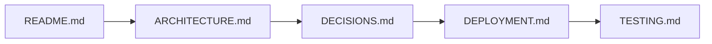
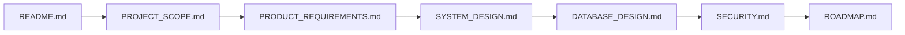
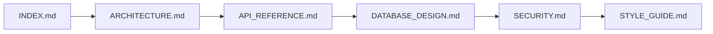
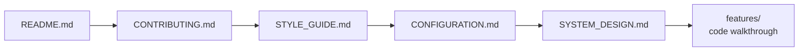

# Documentation Index

> Master navigation map for the App-WatchHub documentation tree. This file is the canonical entry point for both human readers and AI coding agents exploring the documentation.

---

## Document Metadata

| Field | Value |
|---|---|
| **Title** | App-WatchHub — Documentation Index |
| **Purpose** | Provide a single navigable map of every documentation file, its scope, and its intended audience |
| **Audience** | All audiences — first stop for orientation |
| **Scope** | Index only; substantive content lives in referenced files |
| **Version** | 1.0.0 |
| **Status** | Active — maintained in lockstep with the doc tree |
| **Owner** | Muhammad Faheem Khan (Student ID: 1593766) |
| **Last Updated** | 2026-07-15 |
| **Related Documents** | All files in `/docs/`, plus [README.md](../README.md), [CHANGELOG.md](../CHANGELOG.md), [CONTRIBUTING.md](../CONTRIBUTING.md), [LICENSE.md](../LICENSE.md) |

---

## 1. How to Use This Index

This index is the documentation's information-architecture backbone. Every Markdown file in the project is listed below with a one-line purpose statement, primary audience, and cross-references. When a piece of information lives in multiple places conceptually, this index points to the **single source of truth** — duplicates are forbidden per the role spec.

If you are an AI coding agent: parse this file first, then drill into the specific document that matches the user's task. If you are a human: use the audience-based reading orders in [README.md §4](../README.md#4-documentation-index) to choose a path.

If you cannot find what you need, file a gap in [OPEN_QUESTIONS.md](OPEN_QUESTIONS.md) rather than improvising.

## 2. Root-Level Files

| File | Purpose | Primary Audience |
|---|---|---|
| [README.md](../README.md) | Repository front page, 30-second pitch, quickstart, doc index | All |
| [CHANGELOG.md](../CHANGELOG.md) | Reverse-chronological release history, semantic version deltas | Maintainers, reviewers |
| [CONTRIBUTING.md](../CONTRIBUTING.md) | Branch model, commit convention, PR template, review checklist | Contributors |
| [LICENSE.md](../LICENSE.md) | Licensing posture — currently `REQUIRES DECISION` | Legal, contributors |

## 3. Documentation Tree

### 3.1 Scope & Requirements Tier

| File | Purpose | Primary Audience |
|---|---|---|
| [PROJECT_SCOPE.md](PROJECT_SCOPE.md) | Vision, problem statement, in-scope features, explicit out-of-scope exclusions, success criteria | All |
| [PRODUCT_REQUIREMENTS.md](PRODUCT_REQUIREMENTS.md) | Functional/non-functional requirements, user stories, acceptance criteria, personas | PMs, reviewers, QA |
| [ROADMAP.md](ROADMAP.md) | 4-week MVP sprint plan, post-MVP backlog, milestone gates | Maintainers, stakeholders |

### 3.2 Architecture & Design Tier

| File | Purpose | Primary Audience |
|---|---|---|
| [SYSTEM_DESIGN.md](SYSTEM_DESIGN.md) | Component decomposition, layer responsibilities, sequence flows, state design | Engineers, architects |
| [ARCHITECTURE.md](ARCHITECTURE.md) | SEDA explanation, deployment topology, CI/CD pipeline, caching layers, security boundaries | Engineers, architects, recruiters |
| [DATABASE_DESIGN.md](DATABASE_DESIGN.md) | Dual data model (academic ERD + production NoSQL), schemas, indexing strategy | Engineers, DB reviewers |
| [API_REFERENCE.md](API_REFERENCE.md) | Firestore collection operations, query patterns, field constraints, code examples | Engineers, AI agents |

### 3.3 Operations & Quality Tier

| File | Purpose | Primary Audience |
|---|---|---|
| [SECURITY.md](SECURITY.md) | Auth flow, Firestore rules, threat model (STRIDE), edge firewall, PII handling | Security engineers, reviewers |
| [CONFIGURATION.md](CONFIGURATION.md) | Firebase provisioning, flavor setup, env vars, emulator config | Engineers, DevOps |
| [DEPLOYMENT.md](DEPLOYMENT.md) | Firebase Hosting release, GitHub Actions CI/CD, rollback procedure, APK build | DevOps, reviewers |
| [TESTING.md](TESTING.md) | Test pyramid, widget tests, integration tests, rules tests, manual QA checklist | QA, engineers |

### 3.4 Governance Tier

| File | Purpose | Primary Audience |
|---|---|---|
| [DECISIONS.md](DECISIONS.md) | Architecture Decision Records (ADRs) — why every major choice was made | Recruiters, reviewers, maintainers |
| [RISKS.md](RISKS.md) | Risk register, free-tier quota limits, 30-day timeline risks, mitigations | Maintainers, stakeholders |
| [OPEN_QUESTIONS.md](OPEN_QUESTIONS.md) | Gaps requiring stakeholder input, ambiguous specs, deferred decisions | Maintainers, stakeholders |

### 3.5 Reference Tier

| File | Purpose | Primary Audience |
|---|---|---|
| [TROUBLESHOOTING.md](TROUBLESHOOTING.md) | Common failure modes, diagnostics, recovery procedures | Engineers, QA |
| [DEPENDENCIES.md](DEPENDENCIES.md) | pubspec manifest, license classification, free-tier budget impact | Maintainers, legal |
| [STYLE_GUIDE.md](STYLE_GUIDE.md) | Dart style, naming conventions, file structure discipline, review checklist | Contributors |
| [GLOSSARY.md](GLOSSARY.md) | Terminology, abbreviations, domain terms, portfolio defense script | All |
| [FAQ.md](FAQ.md) | Anticipated questions from graders, recruiters, contributors | All |

## 4. Reading Orders by Audience

### 4.1 Recruiters & Hiring Managers (15-minute scan)

The goal of this path is to evaluate engineering judgment in the shortest possible time. README establishes the pitch, ARCHITECTURE proves system thinking, DECISIONS demonstrates decision traceability, DEPLOYMENT proves DevOps maturity, and TESTING closes the loop on quality discipline.

### 4.2 Academic Reviewers (full read)

This path mirrors the structure of a traditional Software Design Document submission, broken into modular files. Each document corresponds to a section a reviewer expects to find in an academic SDD.

### 4.3 AI Coding Agents

AI agents should read the architecture for orientation, the API reference for available operations, the database design for schema constraints, the security doc for authz boundaries, and the style guide before writing any code. ADRs in [DECISIONS.md](DECISIONS.md) provide rationale when an agent must choose between equivalent approaches.

### 4.4 New Contributors (onboarding, ~30 min)

Contributors must internalize the branch model and style guide before touching code. Configuration must be runnable before any feature work begins. SYSTEM_DESIGN explains the layer model the contributor will be working inside.

## 5. Document Inventory Summary

| Tier | Files | Total Purpose |
|---|---|---|
| Root | 4 | Repo-level metadata and contributor entry |
| Scope & Requirements | 3 | What we are building and why |
| Architecture & Design | 4 | How the system is structured |
| Operations & Quality | 4 | How the system runs and is verified |
| Governance | 3 | How decisions, risks, and open questions are tracked |
| Reference | 5 | How to look things up and stay consistent |
| **Total** | **23** | Complete production documentation tree |

## 6. Maintenance Protocol

This index must be updated whenever a new Markdown file is added to or removed from `/docs/`. The protocol is non-negotiable — an out-of-date index breaks the documentation's information architecture and silently invalidates every cross-reference in the tree.

When adding a new doc:

1. Add an entry to the appropriate tier table in §3.
2. Update the inventory summary in §5.
3. Add the file to any audience reading order in §4 that should reference it.
4. Cross-link the new file from at least one existing doc (usually the closest conceptual neighbor).
5. Update [CHANGELOG.md](../CHANGELOG.md) with the documentation delta.

When removing a doc:

1. Confirm no inbound cross-references exist (search the entire repo).
2. Update this index.
3. Update [CHANGELOG.md](../CHANGELOG.md) with the removal rationale.
