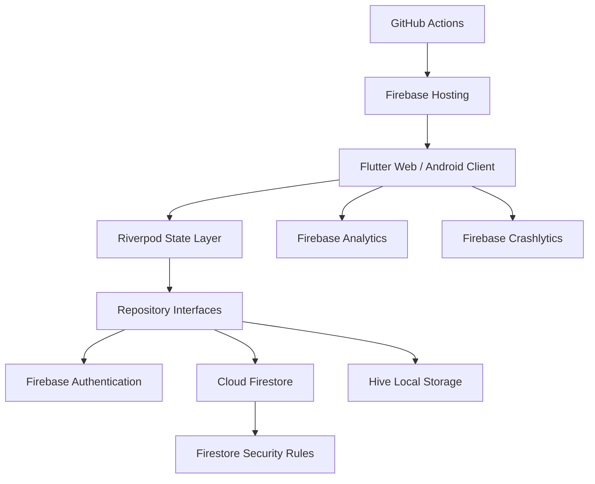

# App-WatchHub

> Premium luxury watch e-commerce documentation for a Flutter and Firebase application built on a serverless, zero-cost MVP architecture.

---

## Project Summary

**App-WatchHub** is a cross-platform luxury watch commerce application for collectors and boutique administrators. The customer experience focuses on fast catalog discovery, detailed product exploration, wishlist and cart management, order placement, order tracking, reviews, support, feedback, and profile management. The admin experience provides protected tools for inventory, orders, reviews, support tickets, feedback, FAQs, users, and dashboard metrics.

The project is designed as a polished academic and portfolio-grade MVP delivered within a 30-day timeline while staying on Firebase Spark Free Tier and GitHub Actions free infrastructure.

## Implementation Progress - 2026-07-27

| Area | Status | Link |
|---|---|---|
| Catalog | Done | [Architecture status](ARCHITECTURE.md#21-implementation-status-sync---2026-07-27) |
| Cart | Done / Hive gap | [Testing harness](TESTING.md#11-current-test-harness-notes---2026-07-27) |
| Routing | Done | [Architecture status](ARCHITECTURE.md#21-implementation-status-sync---2026-07-27) |
| Orders tracking | Partial | [Roadmap](ROADMAP.md) |
| Wishlist | Partial | [Open questions](OPEN_QUESTIONS.md) |
| Reviews | Partial | [Roadmap](ROADMAP.md) |
| Auth | Partial | [Security](SECURITY.md) |
| Support | Partial | [Architecture status](ARCHITECTURE.md#21-implementation-status-sync---2026-07-27) |

Progress notes are kept in sync with the root [README](../README.md), [AGENTS](../AGENTS.md), [GEMINI](../GEMINI.md), [ARCHITECTURE](ARCHITECTURE.md), and [TESTING](TESTING.md) files.

!!! info "Start Here"
    The main reference is the [Unified Project Documentation](UNIFIED_PROJECT_DOCUMENTATION.md). It consolidates project scope, product definition, architecture, data model, roadmap, assumptions, and success criteria.

## What We Are Building

| Area | Description |
|---|---|
| Customer boutique | Browse, search, filter, inspect, wishlist, cart, checkout, review, support, and track orders |
| Admin governance panel | Manage catalog, stock, orders, reviews, support, feedback, FAQs, users, and operational metrics |
| Serverless backend | Firebase Auth, Cloud Firestore, Firestore Security Rules, Firebase Hosting, Analytics, and Crashlytics |
| Cross-platform client | Single Flutter codebase targeting Web and Android |
| Local persistence | Hive-based cart and wishlist persistence for fast offline-tolerant local state |
| Documentation system | MkDocs Material site generated from the project markdown documentation |

## Core Goals

- Deliver a working MVP by **August 14, 2026**.
- Keep steady-state infrastructure cost at **$0.00/month**.
- Provide a premium dark luxury interface aligned with high-end horology.
- Enforce authorization at the Firestore Security Rules layer.
- Demonstrate engineering maturity through architecture, testing, deployment, security, and decision records.

## Architecture at a Glance

## MVP Feature Map

| Feature | Status |
|---|---|
| Email/password authentication | Partial |
| Dynamic catalog, search, and filters | Done / expanding |
| Product detail pages with image zoom and specs | Partial |
| Cart, wishlist, and order placement | Cart done; wishlist/orders partial |
| Profile, addresses, order history, and tracking | In scope |
| Reviews and ratings with moderation | Partial |
| Support contact form and FAQ | Screens done; persistence pending |
| Feedback and issue reporting | In scope |
| Admin dashboard and CRUD tools | In scope |
| Payment gateway integration | Out of scope for MVP |
| Custom backend/API server | Out of scope for MVP |

## Recommended Reading Paths

### Product and Stakeholder Review

1. [Unified Project Documentation](UNIFIED_PROJECT_DOCUMENTATION.md)
2. [Project Scope](PROJECT_SCOPE.md)
3. [Product Requirements](PRODUCT_REQUIREMENTS.md)
4. [Roadmap](ROADMAP.md)

### Engineering Review

1. [Architecture](ARCHITECTURE.md)
2. [System Design](SYSTEM_DESIGN.md)
3. [Database Design](DATABASE_DESIGN.md)
4. [API Reference](API_REFERENCE.md)
5. [Security](SECURITY.md)
6. [Decisions](DECISIONS.md)

### Delivery and QA

1. [Configuration](CONFIGURATION.md)
2. [Deployment](DEPLOYMENT.md)
3. [Testing](TESTING.md)
4. [Risks](RISKS.md)
5. [Troubleshooting](TROUBLESHOOTING.md)

## Roadmap Snapshot

| Phase | Timeframe | Outcome |
|---|---|---|
| Week 1 | July 14-20, 2026 | Project skeleton, Firebase, CI/CD, theme, rules, seed data |
| Week 2 | July 21-27, 2026 | Auth, catalog, search, cart, wishlist, product detail, profile |
| Week 3 | July 28-August 3, 2026 | Reviews, support, feedback, order tracking, admin workflows |
| Week 4 | August 4-14, 2026 | Tests, security hardening, deployment, docs, final report, demo video |

## Success Criteria

!!! success "MVP Complete When"
    The app is live on Firebase Hosting, customer and admin journeys work end-to-end, Firestore Security Rules pass, CI is green, the Android APK is built, documentation is complete, and the final demonstration video is recorded.

## Key Links

- [Unified Project Documentation](UNIFIED_PROJECT_DOCUMENTATION.md)
- [Project Scope](PROJECT_SCOPE.md)
- [Product Requirements](PRODUCT_REQUIREMENTS.md)
- [Roadmap](ROADMAP.md)
- [Architecture](ARCHITECTURE.md)
- [Security](SECURITY.md)
- [Testing](TESTING.md)
- [Deployment](DEPLOYMENT.md)
