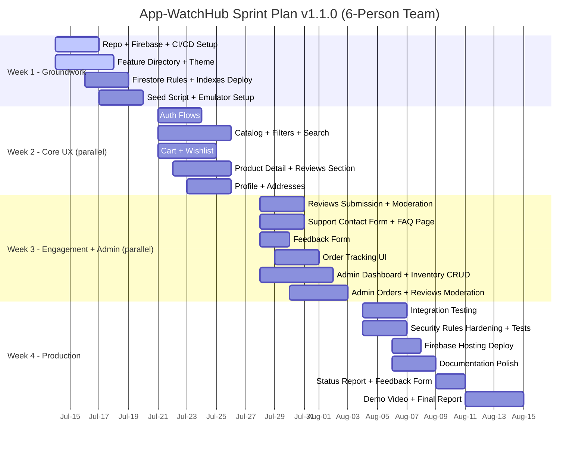
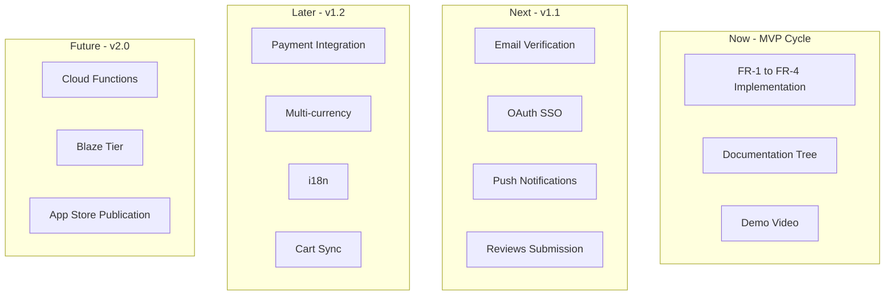

# Roadmap

> Project timeline, sprint plan, and post-MVP backlog for App-WatchHub. The MVP cycle is locked at 30 days (July 14 – August 14, 2026); post-MVP items are documented for future iteration but are not committed.

---

## Document Metadata

| Field | Value |
|---|---|
| **Title** | App-WatchHub — Roadmap |
| **Purpose** | Define the 4-week MVP sprint plan, post-MVP backlog, and milestone gates |
| **Audience** | Maintainers, stakeholders, reviewers |
| **Scope** | Timeline and backlog only; requirements in [PRODUCT_REQUIREMENTS.md](PRODUCT_REQUIREMENTS.md) |
| **Version** | 1.0.0 |
| **Status** | Approved — locked for MVP cycle |
| **Owner** | Muhammad Faheem Khan (Student ID: 1593766) |
| **Last Updated** | 2026-07-15 |
| **Related Documents** | [PROJECT_SCOPE.md](PROJECT_SCOPE.md), [PRODUCT_REQUIREMENTS.md](PRODUCT_REQUIREMENTS.md), [DECISIONS.md](DECISIONS.md), [RISKS.md](RISKS.md), [OPEN_QUESTIONS.md](OPEN_QUESTIONS.md) |

---

## Table of Contents

1. [MVP Timeline Overview](#1-mvp-timeline-overview)
2. [4-Week Sprint Plan](#2-4-week-sprint-plan)
3. [Milestone Gates](#3-milestone-gates)
4. [Post-MVP Backlog](#4-post-mvp-backlog)
5. [Versioning Strategy](#5-versioning-strategy)
6. [References](#6-references)

---

## 1. MVP Timeline Overview

The MVP cycle runs for 30 calendar days from July 14, 2026 to August 14, 2026. The timeline is partitioned into four one-week sprints, each with a single thematic objective. Every sprint ends with a milestone gate that must be cleared before the next sprint begins; failure to clear a gate triggers a re-planning conversation, not a slip of the entire timeline.

The timeline is aggressive but achievable for a solo developer working full-time on the project. The $0 budget constraint and the SEDA architecture (no custom backend) are the primary enablers — they eliminate entire categories of work (server provisioning, API design, deployment automation for backend services) that would otherwise consume the timeline. The remaining risk is concentrated in UI polish (luxury design system) and the demonstration video, both of which are scheduled for the final sprint when the system is functionally complete.

If a sprint overruns by more than two days, the response is to descope rather than to extend the timeline. The descope candidates are pre-identified in §3 Milestone Gates per sprint; each candidate is a feature that can be deferred to post-MVP without invalidating the academic evaluation rubric.

## 2. 4-Week Sprint Plan (v1.1.0 — Rebaselined for Expanded Scope + Team)

The sprint plan was rebaselined on 2026-07-15 to reflect: (a) the expanded scope from `App-WatchHub.doc` (7 new feature areas), (b) the team of 6 contributors enabling parallelization. The original 4-week timeline is preserved; the expanded scope is absorbed through parallel team work, not timeline extension.

### 2.1 Week 1: Groundwork (July 14 – July 20)

**Theme:** Establish the project skeleton, Firebase integration, design system, CI pipeline, and team workflow. By end of week, the project builds, lints, tests, and deploys an empty shell to Firebase Hosting. All 6 team members have committed at least once.

| Task | Deliverable | Suggested Assignee |
|---|---|---|
| Repo + Firebase + CI/CD Setup | GitHub repo created; 6 collaborators added; Firebase project provisioned; `.github/workflows/ci.yml` running | Faheem |
| Feature Directory + Theme | `lib/core/`, `lib/shared/`, `lib/features/` (all 11 feature folders) with placeholder files; `app_theme.dart`, `app_colors.dart`, `app_typography.dart` | Mubeen |
| Firestore Rules + Indexes Deploy | `firestore.rules` (all collections including reviews/support/feedback/faq) deployed; `firestore.indexes.json` deployed (13 indexes) | Faheem |
| Seed Script + Emulator Setup | `scripts/seed_emulator.dart` populating 12 products, 1 admin, 1 customer, 3 sample orders, 5 FAQs, 2 sample reviews | Maaz |

### 2.2 Week 2: Core UX (July 21 – July 27) — Parallel

**Theme:** Build the customer-facing boutique experience. With 6 contributors, multiple features are built in parallel. By end of week: a customer can register, login, browse, search, filter, view product details, add to cart, manage wishlist, and manage their profile + addresses.

| Task | Deliverable | Suggested Assignee |
|---|---|---|
| Auth Flows (FR-1) | Login, Register, Forgot Password pages wired to Firebase Auth | Asim |
| Catalog + Filters + Search (FR-2, FR-5) | Boutique page with multi-filter chip bar; client-side search bar (ADR-013); real-time stream | Musaib |
| Cart + Wishlist (FR-3) | Cart provider with Hive persistence; add/update/remove; wishlist ↔ cart moves | Maaz |
| Product Detail + Reviews Section (FR-10, FR-6.4) | Detail view with image zoom, specs, add-to-cart; reviews section placeholder (submission flow in Week 3) | Mubeen |
| Profile + Addresses (FR-9.1-9.7) | Profile page; address form dialog; addresses[] CRUD; default-address toggle | Ahmed |

### 2.3 Week 3: Engagement + Admin (July 28 – August 3) — Parallel

**Theme:** Build the engagement features (reviews, support, feedback, order tracking) and the admin panel. By end of week: customers can submit reviews/support tickets/feedback; admin can manage products, orders, reviews, support tickets, feedback, and FAQs.

| Task | Deliverable | Suggested Assignee |
|---|---|---|
| Reviews Submission + Moderation (FR-6) | Customer review form; admin moderation queue; approve/reject workflow; average rating calc | Maaz |
| Support Contact Form + FAQ Page (FR-7) | Contact support form; in-app FAQ page (reads from `/faq`); admin FAQ CRUD | Asim |
| Feedback Form (FR-8) | Feedback form with category dropdown; anonymous option; admin triage queue | Musaib |
| Order Tracking UI (FR-9.8-9.12) | Order history page; order tracking page with status timeline; real-time updates | Ahmed |
| Admin Dashboard + Inventory CRUD (FR-4, FR-11) | Admin dashboard with stats; inventory CRUD table; FAQ management | Mubeen |
| Admin Orders + Reviews Moderation (FR-4.6, FR-4.7, FR-11.1-11.3) | Orders admin table with status update; reviews moderation queue; support ticket queue | Faheem |

### 2.4 Week 4: Production (August 4 – August 14)

**Theme:** Finalize testing, harden security, deploy to production, polish documentation, record demonstration video, submit status report and feedback form. By end of week: project is live, documented, demonstrated, and all academic deliverables are submitted.

| Task | Deliverable | Suggested Assignee |
|---|---|---|
| Integration Testing | All integration tests in [TESTING.md](TESTING.md) §6 passing | All (each tests own feature) |
| Security Rules Hardening + Tests | All rules tests in [TESTING.md](TESTING.md) §7 passing; rules audit | Faheem |
| Firebase Hosting Deploy | Live at `https://app-watchhub-dev.web.app`; APK built | Mubeen |
| Documentation Polish | All 20+ docs in [INDEX.md](INDEX.md) complete; no `TODO`/`PLACEHOLDER` | Faheem |
| Status Report + Feedback Form | Both `eProject_Status_Report(V1).xls` and `eProject_Feeback_Form.xls` filled out and submitted | Faheem |
| Demo Video + Final Report | 5-10 minute demo video recorded; eProject Report with all required sections (Acknowledgements, Synopsis, Analysis, Design, Screenshots, Source Code, User Guide, Developer's Guide) | All |

## 3. Milestone Gates

Each sprint ends with a gate. The gate is a binary check — either the deliverable is met or it is not. If not met, the descope candidates listed are deferred to post-MVP.

### 3.1 Gate 1: End of Week 1 (July 20)

| Gate | Verification |
|---|---|
| Project builds | `flutter build web` succeeds |
| Lint passes | `dart analyze` returns no issues |
| CI runs green | Latest GitHub Actions run is `success` |
| Firebase project live | `firebase projects:list` shows `app-watchhub-dev` |
| Empty shell deployed | `https://app-watchhub-dev.web.app` returns HTTP 200 with placeholder text |

**Descope candidates if gate missed:** Theme polish (use Material defaults), CI/CD (manual deploy).

### 3.2 Gate 2: End of Week 2 (July 27)

| Gate | Verification |
|---|---|
| Customer can register | Manual QA §8.2 steps 1-3 pass |
| Customer can login | Manual QA §8.2 steps 4-5 pass |
| Catalog renders | Manual QA §8.2 steps 6-8 pass |
| Cart persists across restart | Add item, hot-restart app, item still in cart |

**Descope candidates if gate missed:** Filter chips (single filter only), wishlist (cart-only).

### 3.3 Gate 3: End of Week 3 (August 3)

| Gate | Verification |
|---|---|
| Admin can login | Manual QA §8.3 steps 1-3 pass |
| Admin can update stock | Manual QA §8.3 steps 4-6 pass |
| Admin can update order status | Manual QA §8.3 steps 7-9 pass |
| Security rules tests pass | All rules tests in [TESTING.md](TESTING.md) §7 green |

**Descope candidates if gate missed:** Admin dashboard stats (basic table only), review moderation queue (already deferred).

### 3.4 Gate 4: End of Week 4 (August 14) — Final

| Gate | Verification |
|---|---|
| All success criteria met | [PROJECT_SCOPE.md](PROJECT_SCOPE.md) §7 SC-1 through SC-10 pass |
| Live deployment stable | No crashes in Crashlytics for 24 hours post-deploy |
| Documentation complete | All 20+ docs in [INDEX.md](INDEX.md) exist, no `TODO`/`PLACEHOLDER` |
| Demo video recorded | 5-10 minute MP4 uploaded |
| Final report submitted | Submitted to Academic Review Board |

**Descope candidates if gate missed:** None — this gate is binary. If missed, project is graded as-is.

## 4. Post-MVP Backlog

Items below are documented for future iteration but are NOT committed for the MVP cycle. Each item is sized (S/M/L) and tagged with a target version.

### 4.1 v1.1 — Polish & Gaps (Estimated: 2-3 weeks post-MVP)

| Item | Size | Rationale |
|---|---|---|
| Email verification on signup | S | Closes security gap noted in [SECURITY.md](SECURITY.md) §5.3 |
| Google/Apple OAuth SSO | M | Reduces signup friction |
| Push notifications (FCM) | M | Order status updates |
| Product reviews submission flow | M | Currently admin-only moderation is in scope; customer submission deferred |
| Custom domain | S | `app-watchhub.com` DNS configuration |
| Staging environment | S | `app-watchhub-staging` Firebase project |
| Firebase Auth custom claims for `isAdmin` | M | Eliminates per-rule `get()` cost — see [SECURITY.md](SECURITY.md) §4.3 |
| Automated Firestore backups (Blaze tier required) | S | Disaster recovery — see [DEPLOYMENT.md](DEPLOYMENT.md) §8.1 |

### 4.2 v1.2 — Growth & International (Estimated: 4-6 weeks post-MVP)

| Item | Size | Rationale |
|---|---|---|
| Payment integration (Stripe) | L | Enables real transactions; requires KYC + PCI scope review |
| Multi-currency support | M | Requires daily FX rate source |
| Internationalization (i18n) | M | Add `fr_FR`, `de_DE`, `ar_AR` locales |
| Cart cross-device sync | M | Migrate cart from Hive to Firestore `/users/{uid}/cart` |
| Full-text search (Algolia) | M | When catalog exceeds 200 SKUs |
| Email templates for transactional emails | M | Order confirmation, shipping notification |
| A/B testing infrastructure | M | Firebase Remote Config integration |

### 4.3 v2.0 — Scale & Enterprise (Long-term)

| Item | Size | Rationale |
|---|---|---|
| Cloud Functions for backend logic | L | Tax calculation, inventory transactions, webhooks |
| Blaze tier upgrade | S | Required for Cloud Functions, automated backups |
| Multi-tenant architecture | L | If expanding to multiple boutiques |
| Mobile app store publication | M | Google Play + App Store submission |
| Analytics dashboard for admins | M | Custom dashboard beyond Firebase Analytics console |
| Server-side rendering for marketing pages | L | SEO for public-facing landing page |

### 4.4 Backlog Prioritization

## 5. Versioning Strategy

App-WatchHub follows [Semantic Versioning 2.0.0](https://semver.org/). The version format is `MAJOR.MINOR.PATCH`.

| Version Change | When | Example |
|---|---|---|
| MAJOR | Breaking change to public API (e.g., schema change requiring migration) | 1.0.0 → 2.0.0 |
| MINOR | New feature, backward-compatible | 1.0.0 → 1.1.0 |
| PATCH | Bug fix, backward-compatible | 1.0.0 → 1.0.1 |

### 5.1 MVP Version

The MVP ships as **v1.0.0**. All post-MVP work increments from there.

### 5.2 Pre-Release Versions

Pre-release versions use the suffix `-alpha.N`, `-beta.N`, or `-rc.N`:

| Suffix | Meaning |
|---|---|
| `-alpha.N` | Internal testing; features may be incomplete |
| `-beta.N` | Feature-complete; bug-fixing phase |
| `-rc.N` | Release candidate; pending final verification |

### 5.3 Version Tracking

Versions are tracked in:

- `pubspec.yaml` `version:` field
- [CHANGELOG.md](../CHANGELOG.md) entries
- Git tags (`git tag v1.0.0`)
- GitHub Releases (post-MVP)

## 6. References

- Internal: [PROJECT_SCOPE.md](PROJECT_SCOPE.md), [PRODUCT_REQUIREMENTS.md](PRODUCT_REQUIREMENTS.md), [DECISIONS.md](DECISIONS.md), [RISKS.md](RISKS.md), [OPEN_QUESTIONS.md](OPEN_QUESTIONS.md), [CHANGELOG.md](../CHANGELOG.md)
- External: [Semantic Versioning 2.0.0](https://semver.org/), [Agile/Scrum guides](https://www.scrum.org/resources/what-is-scrum), [MoSCoW method](https://en.wikipedia.org/wiki/MoSCoW_method)
