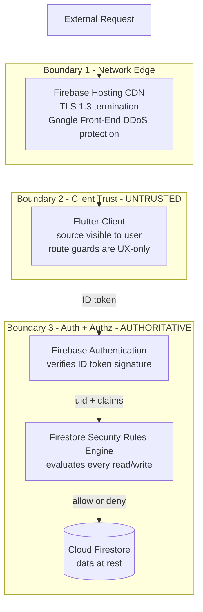
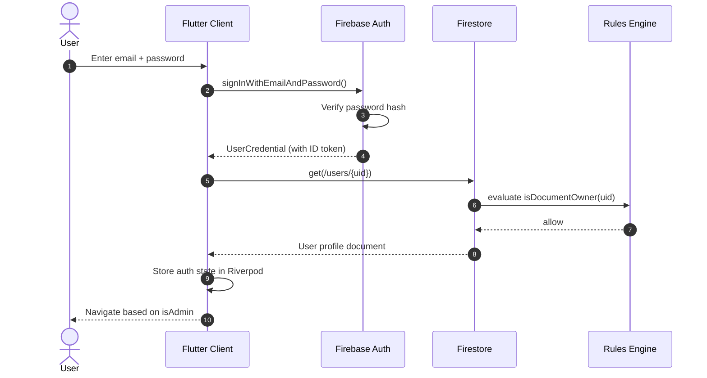

# Security

> Security specification for App-WatchHub. Because the architecture drops custom backend middleware (see [DECISIONS.md](DECISIONS.md) ADR-001), data validation and partition rules are executed natively at the serverless database firewall via Cloud Firestore Rules. This file is the authoritative specification of that firewall, the threat model, the admin bootstrap procedure, and PII handling.

---

## Document Metadata

| Field | Value |
|---|---|
| **Title** | App-WatchHub — Security |
| **Purpose** | Define the security architecture, Firestore rules, threat model, admin bootstrap, and PII handling |
| **Audience** | Security engineers, reviewers, contributors, AI coding agents |
| **Scope** | Application-layer and database-edge security; infrastructure security in [DEPLOYMENT.md](DEPLOYMENT.md) |
| **Version** | 1.0.0 |
| **Status** | Approved — locked for MVP cycle |
| **Owner** | Muhammad Faheem Khan (Student ID: 1593766) |
| **Last Updated** | 2026-07-15 |
| **Related Documents** | [ARCHITECTURE.md](ARCHITECTURE.md), [API_REFERENCE.md](API_REFERENCE.md), [DATABASE_DESIGN.md](DATABASE_DESIGN.md), [DECISIONS.md](DECISIONS.md), [TESTING.md](TESTING.md) |

---

## Table of Contents

1. [Security Architecture](#1-security-architecture)
2. [Threat Model (STRIDE)](#2-threat-model-stride)
3. [Admin Bootstrap Procedure](#3-admin-bootstrap-procedure)
4. [Firestore Security Rules](#4-firestore-security-rules)
5. [Authentication Flow](#5-authentication-flow)
6. [Authorization Matrix](#6-authorization-matrix)
7. [PII Handling](#7-pii-handling)
8. [Security Testing](#8-security-testing)
9. [Known Limitations](#9-known-limitations)
10. [References](#10-references)

---

## 1. Security Architecture

App-WatchHub's security posture is **defense-in-depth at the data edge**. There are three concentric trust boundaries; only the innermost is authoritative.



### 1.1 Trust Boundary Properties

| Boundary | Trust Level | Bypassable? | Defense Mechanism |
|---|---|---|---|
| 1. CDN / Network | Edge | DDoS absorbed by Google infra | TLS 1.3, automatic SSL, HTTP/2 |
| 2. Client | **UNTRUSTED** | Yes — user can modify JS/Dart source | All client checks treated as UX-only |
| 3. Auth + Rules | **AUTHORITATIVE** | No — server-side, source not visible | ID token verification + rules evaluation per request |

### 1.2 Core Principle

Any authorization decision made in the client (Boundary 2) is **advisory only** and exists to provide good UX (e.g., redirect a non-admin away from `/admin` so they don't see a confusing "Permission Denied" page). The authoritative decision is made in Boundary 3 by Firestore Security Rules. A malicious user who patches the client to skip route guards will still be unable to read or write protected data because the Firestore rules independently reject every unauthorized request.

This principle is non-negotiable. Any future code change that introduces client-side authz logic without a corresponding server-side rule is a critical security defect and must be reverted.

## 2. Threat Model (STRIDE)

The threat model uses the Microsoft STRIDE categorization. Each threat is rated by likelihood and impact, with mitigation documented.

| Threat | Category | Likelihood | Impact | Mitigation |
|---|---|---|---|---|
| Attacker spoofs another user's identity | **S**poofing | Low | Critical | Firebase Auth ID tokens; signature verified server-side; password reset email verifies email control |
| Attacker tampers with order contents (e.g., changes price) | **T**ampering | Medium | Critical | Order writes use denormalized `unitPrice` from product catalog (snapshot at order time); admin-only updates to products do not retroactively change orders |
| Attacker tampers with their own `isAdmin` flag | **T**ampering | High | Critical | Firestore rule blocks client writes to `isAdmin` field — see §4.1; flag can only be set via Firebase Console (server-side) |
| Customer repudiates an order ("I never placed this") | **R**epudiation | Low | Medium | All orders include `createdAt` server timestamp and `userId` = auth.uid; audit trail in Firestore |
| Attacker reads another user's profile or orders | **I**nformation Disclosure | Medium | High | Rules restrict `/users/{uid}` reads to owner or admin; `/orders/{orderId}` reads to owner (`userId == auth.uid`) or admin |
| Attacker reads `/products` without authentication | **I**nformation Disclosure | Intentional | None | Products are public-read by design (catalog browsing) |
| Bot floods Firestore with reads/writes | **D**enial of Service | Medium | Medium | Firebase Spark tier has automatic abuse protection; Firestore SDK has built-in rate limiting; Cloud Armor (paid) deferred |
| Attacker escalates privileges to admin | **E**levation of Privilege | High attempt rate | Critical | `isAdmin` cannot be self-set; admin panel route guard + Firestore rule both reject non-admin access |
| Attacker exploits client-side business logic (e.g., negative quantity) | **T**ampering | Medium | High | Client validates input, but server rules ALSO validate: order items array must have `quantity >= 1` (rule documented in §4.3) |

### 2.1 Threats Not in Scope (Deferred)

| Threat | Why Deferred | Re-evaluation Trigger |
|---|---|---|
| Card-not-present fraud | No payment processing in MVP | Payment integration (post-MVP) |
| Account takeover via credential stuffing | No rate limiting on login (Firebase Auth has built-in protection but no custom throttling) | If abuse observed |
| CSRF / XSS | Flutter Web canvas-based rendering mitigates XSS; no traditional form submissions | If Flutter Web HTML renderer enabled |
| Supply chain attacks (malicious pub package) | `pubspec.lock` pinned; Dependabot alerts configured | Continuous monitoring |

## 3. Admin Bootstrap Procedure

Because the `isAdmin` field cannot be written from the client (per the rule in §4.1), the first admin must be bootstrapped manually via the Firebase Console. This is a one-time operation per environment.

### 3.1 Bootstrap Steps

1. Deploy Firestore rules:
   ```bash
   firebase deploy --only firestore:rules
   ```

2. Start the app and register a new user via the `/register` page (e.g., `fbux12@gmail.com`).

3. Open the Firebase Console → Firestore Database → `users` collection.

4. Locate the document matching the registered user's UID.

5. Edit the `isAdmin` field: change `false` to `true`.

6. Save the document.

7. The user must sign out and sign back in for the Riverpod `authProvider` to re-read the profile and the GoRouter to redirect to `/admin`.

### 3.2 Bootstrap Verification

To verify the bootstrap succeeded:

| Check | Expected Result |
|---|---|
| User logs in with the bootstrapped account | Login succeeds |
| User is redirected to `/admin` instead of `/boutique` | Pass |
| Admin dashboard loads with summary stats | Pass |
| User attempts to access `/admin` from a non-bootstrapped account | Redirected to `/boutique` |
| Non-bootstrapped account attempts direct Firestore write to `/products` | `PERMISSION_DENIED` error |

### 3.3 Bootstrap Audit

The bootstrap action is logged in Firestore's audit logs (available on the Blaze paid tier — currently OUT OF SCOPE). For MVP, the bootstrap is documented in [CHANGELOG.md](../CHANGELOG.md) entry `1.0.0` with the date and the admin email.

## 4. Firestore Security Rules

The complete `firestore.rules` file. Every rule is paired with a test in [TESTING.md](TESTING.md) § Security Rules Tests.

### 4.1 Production Rules

```javascript
rules_version = '2';
service cloud.firestore {
  match /databases/{database}/documents {

    // ============================================
    // Core Operational Security Predicates
    // ============================================

    function isUserAuthenticated() {
      return request.auth != null;
    }

    function isDocumentOwner(userId) {
      return isUserAuthenticated() &&
        request.auth.uid == userId;
    }

    function isSystemAdmin() {
      return isUserAuthenticated() &&
        get(/databases/$(database)/documents/users/$(request.auth.uid)).data.isAdmin == true;
    }

    function isValidEmail(email) {
      return email is string &&
        email.matches('^[A-Za-z0-9._%+-]+@[A-Za-z0-9.-]+\\.[A-Za-z]{2,}$');
    }

    function isValidOrderStatus(status) {
      return status in ['Processing', 'Confirmed', 'Cancelled', 'Shipped', 'Delivered'];
    }

    // ============================================
    // Security Mapping Rules Per Data Node
    // ============================================

    // /users/{userId}
    // Owner can read + update (fullName only); admin can read all + update all.
    // isAdmin field is BLOCKED from client writes - can only be set via Console.
    match /users/{userId} {
      allow read: if isDocumentOwner(userId) || isSystemAdmin();

      allow create: if isDocumentOwner(userId) &&
        request.resource.data.uid == request.auth.uid &&
        request.resource.data.email is string &&
        request.resource.data.fullName is string &&
        request.resource.data.fullName.size() > 1 &&
        request.resource.data.fullName.size() <= 100 &&
        request.resource.data.isAdmin == false; // Force default on create

      allow update: if (isDocumentOwner(userId) &&
          // Owner may only change fullName; isAdmin must remain unchanged
          request.resource.data.isAdmin == resource.data.isAdmin &&
          request.resource.data.email == resource.data.email &&
          request.resource.data.uid == resource.data.uid)
        || isSystemAdmin();

      allow delete: if isSystemAdmin();
    }

    // /products/{productId}
    // Public read; admin-only write.
    match /products/{productId} {
      allow read: if true;
      allow create, update, delete: if isSystemAdmin() &&
        request.resource.data.price is number &&
        request.resource.data.price >= 0 &&
        request.resource.data.stockCount is int &&
        request.resource.data.stockCount >= 0;
    }

    // /orders/{orderId}
    // Authenticated user can CREATE their own order.
    // Owner or admin can READ.
    // Admin-only update (status change) and delete.
    match /orders/{orderId} {
      allow create: if isUserAuthenticated() &&
        request.resource.data.userId == request.auth.uid &&
        request.resource.data.orderStatus == 'Processing' &&
        request.resource.data.items is list &&
        request.resource.data.items.size() > 0 &&
        request.resource.data.items.size() <= 50;

      allow read: if isUserAuthenticated() &&
        (resource.data.userId == request.auth.uid || isSystemAdmin());

      allow update: if isSystemAdmin() &&
        // Admin may only change orderStatus - not items, totals, or userId
        request.resource.data.items == resource.data.items &&
        request.resource.data.userId == resource.data.userId &&
        request.resource.data.totalAmount == resource.data.totalAmount &&
        isValidOrderStatus(request.resource.data.orderStatus);

      allow delete: if isSystemAdmin();
    }

    // /reviews/{reviewId}
    // Authenticated user can CREATE their own review (pending status forced).
    // Public can READ approved reviews; owner can READ their own pending/rejected.
    // Admin can READ all, UPDATE status (approve/reject), DELETE any.
    // Owner can UPDATE their own review within 24h (status returns to pending).
    function isValidReviewStatus(status) {
      return status in ['pending', 'approved', 'rejected'];
    }

    function isValidReviewRating(rating) {
      return rating is int && rating >= 1 && rating <= 5;
    }

    match /reviews/{reviewId} {
      allow create: if isUserAuthenticated() &&
        request.resource.data.userId == request.auth.uid &&
        request.resource.data.status == 'pending' &&
        isValidReviewRating(request.resource.data.rating) &&
        request.resource.data.title is string &&
        request.resource.data.title.size() >= 1 &&
        request.resource.data.title.size() <= 100 &&
        request.resource.data.body is string &&
        request.resource.data.body.size() >= 1 &&
        request.resource.data.body.size() <= 1000;

      allow read: if isUserAuthenticated() == false ? false :
        (resource.data.status == 'approved') ||
        (resource.data.userId == request.auth.uid) ||
        isSystemAdmin();

      allow update: if (isDocumentOwner(resource.data.userId) &&
          // Owner may edit body/title/rating only; status forced to pending
          request.resource.data.status == 'pending' &&
          request.resource.data.userId == resource.data.userId &&
          request.resource.data.productId == resource.data.productId &&
          isValidReviewRating(request.resource.data.rating))
        || (isSystemAdmin() &&
          // Admin may only change status + moderation fields
          isValidReviewStatus(request.resource.data.status) &&
          request.resource.data.userId == resource.data.userId &&
          request.resource.data.productId == resource.data.productId &&
          request.resource.data.rating == resource.data.rating &&
          request.resource.data.title == resource.data.title &&
          request.resource.data.body == resource.data.body);

      allow delete: if isDocumentOwner(resource.data.userId) || isSystemAdmin();
    }

    // /supportTickets/{ticketId}
    // Authenticated user can CREATE their own ticket.
    // Owner or admin can READ.
    // Admin can UPDATE (status, adminResponse).
    // Owner can update messageBody only while status is 'open'.
    function isValidTicketStatus(status) {
      return status in ['open', 'in_progress', 'resolved', 'closed'];
    }

    match /supportTickets/{ticketId} {
      allow create: if isUserAuthenticated() &&
        request.resource.data.userId == request.auth.uid &&
        request.resource.data.status == 'open' &&
        request.resource.data.subject is string &&
        request.resource.data.subject.size() >= 1 &&
        request.resource.data.subject.size() <= 200 &&
        request.resource.data.messageBody is string &&
        request.resource.data.messageBody.size() >= 1 &&
        request.resource.data.messageBody.size() <= 5000;

      allow read: if isDocumentOwner(resource.data.userId) || isSystemAdmin();

      allow update: if (isDocumentOwner(resource.data.userId) &&
          resource.data.status == 'open' &&
          // Owner may only update messageBody; status unchanged
          request.resource.data.status == resource.data.status &&
          request.resource.data.subject == resource.data.subject)
        || (isSystemAdmin() &&
          isValidTicketStatus(request.resource.data.status) &&
          request.resource.data.userId == resource.data.userId);

      allow delete: if isSystemAdmin();
    }

    // /feedback/{feedbackId}
    // Anyone (including anonymous) can CREATE.
    // Only admin can READ, UPDATE (triage), DELETE.
    // If authenticated, userId is set; if anonymous, isAnonymous=true and userId=null.
    function isValidFeedbackCategory(cat) {
      return cat in ['bug', 'suggestion', 'compliment', 'complaint', 'other'];
    }

    function isValidFeedbackStatus(status) {
      return status in ['new', 'acknowledged', 'in_progress', 'resolved', 'dismissed'];
    }

    match /feedback/{feedbackId} {
      allow create: if request.resource.data.status == 'new' &&
        isValidFeedbackCategory(request.resource.data.category) &&
        request.resource.data.description is string &&
        request.resource.data.description.size() >= 1 &&
        request.resource.data.description.size() <= 5000 &&
        ((request.auth != null && request.resource.data.userId == request.auth.uid &&
          request.resource.data.isAnonymous == false) ||
         (request.auth == null && request.resource.data.userId == null &&
          request.resource.data.isAnonymous == true));

      allow read, update, delete: if isSystemAdmin();
    }

    // /faq/{faqId}
    // Public can READ active FAQs.
    // Admin can CREATE, UPDATE, DELETE.
    function isValidFaqCategory(cat) {
      return cat in ['Orders', 'Shipping', 'Account', 'Payments', 'Products', 'Returns'];
    }

    match /faq/{faqId} {
      allow read: if resource.data.isActive == true;
      allow create, update, delete: if isSystemAdmin() &&
        isValidFaqCategory(request.resource.data.category) &&
        request.resource.data.question is string &&
        request.resource.data.question.size() >= 1 &&
        request.resource.data.question.size() <= 200 &&
        request.resource.data.answer is string &&
        request.resource.data.answer.size() >= 1 &&
        request.resource.data.answer.size() <= 2000;
    }
  }
}
```

### 4.2 Rule Annotations

The rules above extend the source SDD with the following hardening:

| Hardening | Source SDD | Hardened Rule | Rationale |
|---|---|---|---|
| Force `isAdmin == false` on user create | Not enforced | `request.resource.data.isAdmin == false` | Prevents privilege escalation via signup |
| Block `isAdmin` field on owner update | Not enforced | `request.resource.data.isAdmin == resource.data.isAdmin` | Prevents self-promotion |
| Validate order status enum | Not enforced | `isValidOrderStatus()` function | Prevents arbitrary status strings |
| Lock order items/totals on admin update | Not enforced | `request.resource.data.items == resource.data.items` | Prevents admin-side tampering with order contents |
| Validate product price/stock types | Not enforced | `request.resource.data.price is number` etc. | Prevents bad data type writes |
| Enforce order item count bounds | Not enforced | `size() > 0 && size() <= 50` | Prevents DoS via huge order payload |

### 4.3 Rule Cost Awareness

Each `get()` call in a rule (e.g., `isSystemAdmin()`) consumes one Firestore read. The Spark Free Tier allows 50K reads/day — well above the expected admin operation volume. The `isSystemAdmin()` function is called per-rule-evaluation, so an admin listing 50 orders triggers ~50 reads for rule evaluation alone. This is acceptable for MVP; if admin volume grows, cache `isAdmin` in the Firebase Auth custom claims (deferred — requires Cloud Functions which is OUT OF SCOPE).

## 5. Authentication Flow



### 5.1 Token Lifecycle

| Event | Token Behavior |
|---|---|
| Login | ID token issued; valid for 1 hour |
| App restart | Firebase SDK auto-refreshes token from local cache |
| Token near expiry | SDK auto-refreshes in background (transparent to user) |
| Sign out | Token cleared from local storage |
| Password reset | All existing tokens for the user invalidated |

### 5.2 Password Storage

Passwords are NEVER stored in Firestore. Firebase Auth stores password hashes using scrypt with pepper, managed by Google. The client never sees the hash.

### 5.3 Email Verification

Email verification is OUT OF SCOPE for MVP (see [PRODUCT_REQUIREMENTS.md](PRODUCT_REQUIREMENTS.md) FR-1.10). Users can register and login without verifying email ownership. This is acceptable for academic evaluation; production deployment should enable email verification before public launch — see [ROADMAP.md](ROADMAP.md) § Post-MVP.

## 6. Authorization Matrix

The complete matrix of who-can-do-what. Every cell is enforced by a Firestore rule, not by client code.

| Resource | Operation | Anonymous | Authenticated Customer | Authenticated Admin |
|---|---|---|---|---|
| `/users/{uid}` | read | deny | allow if `uid == auth.uid` | allow all |
| `/users/{uid}` | create | deny | allow if `uid == auth.uid` and `isAdmin == false` | n/a (admins don't self-register) |
| `/users/{uid}` | update | deny | allow if `uid == auth.uid` and not modifying `isAdmin`/`email`/`uid` | allow all |
| `/users/{uid}` | delete | deny | deny | allow all |
| `/products` | list | allow | allow | allow |
| `/products/{id}` | read | allow | allow | allow |
| `/products/{id}` | create | deny | deny | allow (with type validation) |
| `/products/{id}` | update | deny | deny | allow (with type validation) |
| `/products/{id}` | delete | deny | deny | allow |
| `/orders` | list | deny | deny (must filter by `userId == auth.uid`) | allow |
| `/orders/{id}` | read | deny | allow if `userId == auth.uid` | allow all |
| `/orders/{id}` | create | deny | allow if `userId == auth.uid` and `status == 'Processing'` | n/a (admins don't place orders) |
| `/orders/{id}` | update | deny | deny | allow (status field only) |
| `/orders/{id}` | delete | deny | deny | allow |

## 7. PII Handling

### 7.1 PII Inventory

| Field | Stored In | Sensitivity | Retention |
|---|---|---|---|
| `email` | Firebase Auth + `/users/{uid}.email` | High | Lifetime of account |
| `fullName` | `/users/{uid}.fullName` | Medium | Lifetime of account |
| `uid` | Firebase Auth + `/users/{uid}.uid` + `/orders/{orderId}.userId` | Low (pseudonymous) | Lifetime of account + order history |
| Delivery address | Stored as `addresses[]` in `/users/{uid}` (recipient name, street, city, state, postal code, country, phone) | High | Lifetime of account |
| Payment data | **NOT COLLECTED** in MVP | n/a | n/a |
| Order history | `/orders` collection | Medium | Indefinite (audit trail) |

### 7.2 GDPR / CCPA Considerations

| Right | MVP Implementation |
|---|---|
| Right to access | User can view own profile and orders in-app |
| Right to rectification | User can update `fullName` in-app |
| Right to erasure | Manual: admin deletes `/users/{uid}` document and Firebase Auth account via Console. Cart (Hive local) is destroyed on app uninstall. |
| Right to data portability | Manual: admin can export `/users/{uid}` and `/orders?userId={uid}` as JSON via Console |
| Right to object | n/a (no marketing emails in MVP) |

> **WARNING** — Automated GDPR right-to-erasure workflow is OUT OF SCOPE for MVP. If a production launch is contemplated, a Cloud Function must be implemented to cascade-delete `/orders` documents when a user is deleted. This is documented in [ROADMAP.md](ROADMAP.md) § Post-MVP.

### 7.3 Data Encryption

| Layer | Encryption |
|---|---|
| In transit | TLS 1.3 (enforced by Firebase) |
| At rest | AES-256 (Firestore default, Google-managed) |
| Client-side encryption | Not used (no PII sensitive enough to warrant; would complicate offline sync) |

## 8. Security Testing

Security rules are tested with the `firebase.rules` unit testing framework. Full test suite in [TESTING.md](TESTING.md) § Security Rules Tests. Summary:

| Test Category | Coverage |
|---|---|
| Anonymous access | Anonymous cannot read/write protected resources |
| Customer self-access | Customer can read own profile, orders; cannot read others' |
| Customer cross-access | Customer cannot read another customer's profile/orders |
| Customer order creation | Customer can create order with `userId == auth.uid`; cannot with another uid |
| Admin read | Admin can read all users and orders |
| Admin write | Admin can update product stock, order status |
| Privilege escalation | Customer cannot set `isAdmin: true` on self |
| Order immutability | Admin cannot modify order items/totals (only status) |
| Field validation | Invalid types (string price, negative stock) rejected |
| Status enum | Invalid `orderStatus` string rejected |

CI runs the rules test suite on every push — see [DEPLOYMENT.md](DEPLOYMENT.md) § CI/CD Pipeline.

## 9. Known Limitations

| Limitation | Risk | Mitigation |
|---|---|---|
| No rate limiting on login | Credential stuffing possible | Firebase Auth has built-in abuse detection; custom throttling deferred |
| No email verification | Fake email registration possible | Accepted for MVP; flagged in [ROADMAP.md](ROADMAP.md) |
| No CSRF token | n/a (Flutter Web uses canvas, no traditional forms) | Monitor if HTML renderer enabled |
| `isAdmin` cached in Riverpod | Stale role possible if admin demotes user | Mitigated by sign-out-on-role-change policy (manual) |
| No audit log (Blaze tier) | Cannot trace who changed what | Manual changelog in [CHANGELOG.md](../CHANGELOG.md) |
| Hive cart is unencrypted | Local cart visible to device-level attacker | Accepted (cart data is non-sensitive) |

## 10. References

- Internal: [ARCHITECTURE.md](ARCHITECTURE.md) §7 Security Boundaries, [API_REFERENCE.md](API_REFERENCE.md), [DATABASE_DESIGN.md](DATABASE_DESIGN.md), [TESTING.md](TESTING.md) § Security Rules Tests, [DECISIONS.md](DECISIONS.md) ADR-002
- External: [Firestore Security Rules documentation](https://firebase.google.com/docs/firestore/security/rules-structure), [Firebase Auth security best practices](https://firebase.google.com/docs/auth/web/password-auth), [STRIDE threat model (Microsoft)](https://learn.microsoft.com/en-us/azure/security/develop/threat-modeling-tool-threats#stride-model)
