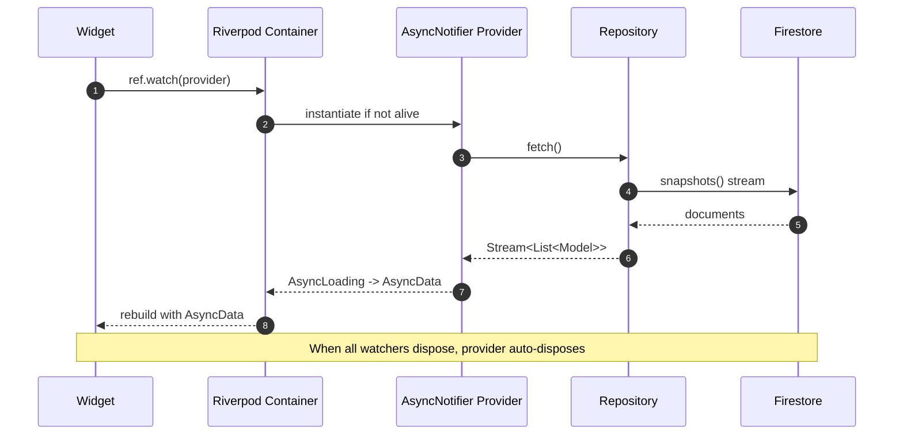
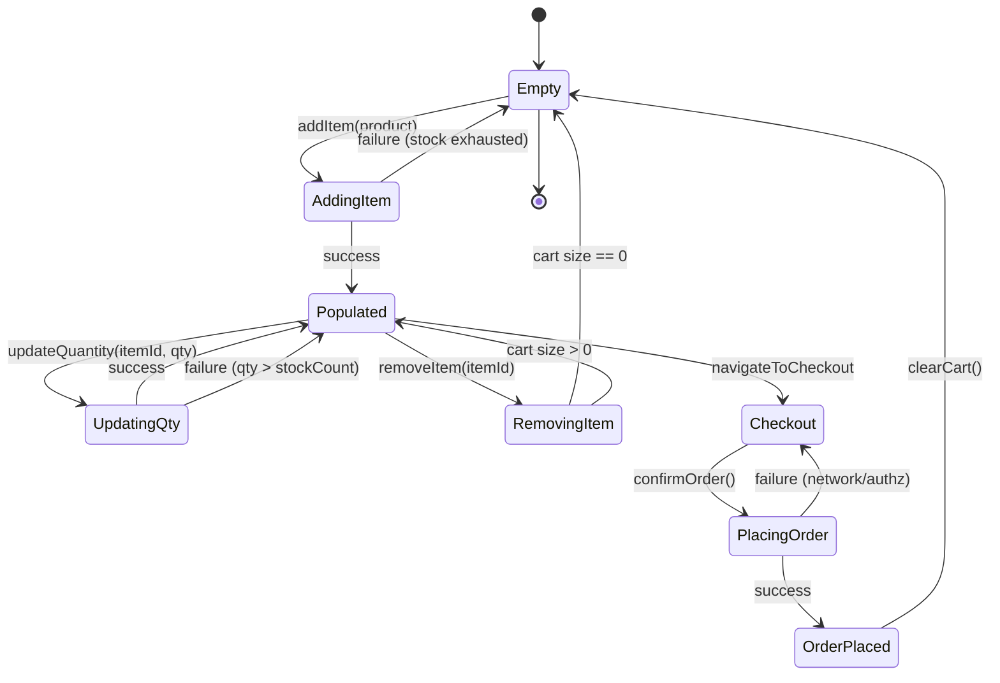
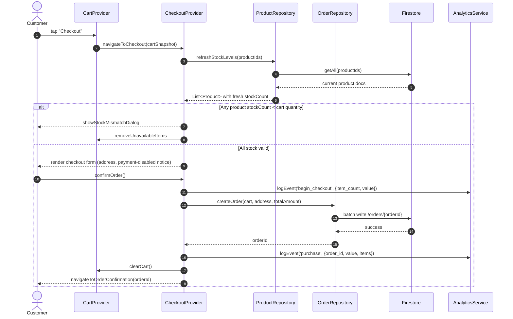
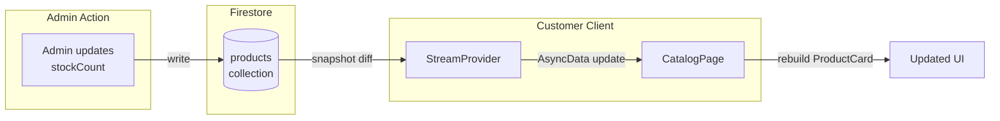
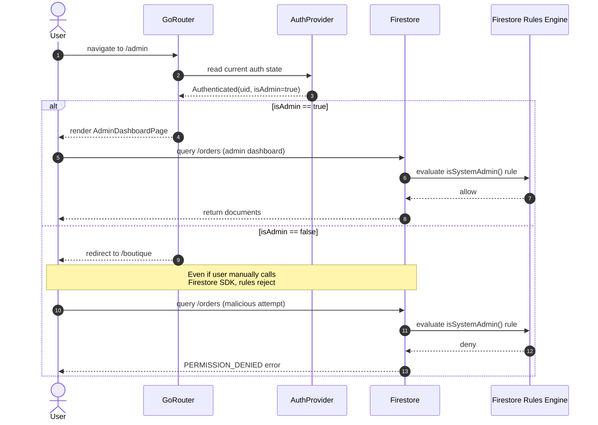

# System Design

> Component-level decomposition of App-WatchHub. Defines layer responsibilities, module boundaries, state management design, routing design, and key sequence flows. Pairs with [ARCHITECTURE.md](ARCHITECTURE.md) (which covers deployment topology and infrastructure) and [DATABASE_DESIGN.md](DATABASE_DESIGN.md) (which covers persistence).

---

## Document Metadata

| Field | Value |
|---|---|
| **Title** | App-WatchHub — System Design |
| **Purpose** | Specify internal component structure, layer responsibilities, state design, and inter-component interactions |
| **Audience** | Engineers, architects, contributors, AI coding agents |
| **Scope** | Application-level design only; infrastructure in [ARCHITECTURE.md](ARCHITECTURE.md), data in [DATABASE_DESIGN.md](DATABASE_DESIGN.md) |
| **Version** | 1.0.0 |
| **Status** | Approved — locked for MVP cycle |
| **Owner** | Muhammad Faheem Khan (Student ID: 1593766) |
| **Last Updated** | 2026-07-15 |
| **Related Documents** | [ARCHITECTURE.md](ARCHITECTURE.md), [DATABASE_DESIGN.md](DATABASE_DESIGN.md), [API_REFERENCE.md](API_REFERENCE.md), [PRODUCT_REQUIREMENTS.md](PRODUCT_REQUIREMENTS.md), [STYLE_GUIDE.md](STYLE_GUIDE.md) |

---

## Table of Contents

1. [Design Philosophy](#1-design-philosophy)
2. [Layered Architecture](#2-layered-architecture)
3. [Folder Structure](#3-folder-structure)
4. [State Management Design](#4-state-management-design)
5. [Routing Design](#5-routing-design)
6. [Cart State Machine](#6-cart-state-machine)
7. [Checkout Flow](#7-checkout-flow)
8. [Catalog Stream Design](#8-catalog-stream-design)
9. [Admin Authz Flow](#9-admin-authz-flow)
10. [Error Handling Strategy](#10-error-handling-strategy)
11. [References](#11-references)

---

## 1. Design Philosophy

App-WatchHub follows a **Feature-First Clean Architecture** adapted for Flutter. The adaptation is pragmatic rather than dogmatic: full Clean Architecture (domain/data/presentation layers per feature) is overkill for a 30-day MVP, but the core principles — separation of concerns, dependency inversion, immutable models, single-responsibility providers — are preserved. The result is a codebase that an engineer can navigate in under 10 minutes and an AI agent can extend without architectural surprises.

Three principles guide every design decision in this document:

1. **Single Source of Truth.** Each piece of state lives in exactly one Riverpod provider. Components subscribe; they do not duplicate. If two widgets need the same data, they read from the same provider — never fetch independently.
2. **Push Authz to the Edge.** Authorization is enforced by Firestore Security Rules, not by client-side guards. Client-side route guards exist for UX (prevent landing on `/admin` and bouncing), but the database is the actual security boundary. This is documented in [SECURITY.md](SECURITY.md) and justified in [DECISIONS.md](DECISIONS.md) ADR-002.
3. **Fail Loud, Never Silent.** Errors propagate to the UI as visible states (loading, error, data) via Riverpod's `AsyncValue`. Silent `try/catch` swallows are forbidden; they are flagged in code review per [STYLE_GUIDE.md](STYLE_GUIDE.md).

## 2. Layered Architecture

The application is divided into five logical layers. Each layer has a single responsibility and depends only on the layer immediately below it (or to the side for cross-cutting concerns).

```mermaid
graph TD
    subgraph L1_Presentation [1. Presentation Layer]
        W[Widgets<br/>Material 3 / Glassmorphism]
        PG[Pages / Screens]
    end
    subgraph L2_State [2. State Layer]
        PV[Riverpod Providers<br/>AsyncNotifier]
        SM[State Models<br/>Freezed immutable]
    end
    subgraph L3_Domain [3. Domain Layer]
        RP[Repository Interfaces<br/>abstract classes]
        DM[Domain Models<br/>Freezed entities]
    end subgraph
    subgraph L4_Infra [4. Infrastructure Layer]
        FI[Firebase Implementations<br/>AuthService, FirestoreRepo]
        LS[Local Storage<br/>Hive cart persistence]
    end
    subgraph L5_Core [5. Core / Cross-Cutting]
        TH[Theme]
        RT[Router]
        UT[Utils]
        CN[Constants]
        AN[Analytics]
    end

    W --> PG
    PG --> PV
    PV --> SM
    PV --> RP
    RP -.implemented by.-> FI
    RP -.implemented by.-> LS
    RP --> DM
    FI --> DM
    LS --> DM
    L5_Core -.consumed by.-> L1_Presentation
    L5_Core -.consumed by.-> L2_State
    L5_Core -.consumed by.-> L4_Infra
```

### 2.1 Layer Responsibilities

| Layer | Responsibility | What Lives Here | What Does NOT Live Here |
|---|---|---|---|
| Presentation | Render UI, capture user intent, display `AsyncValue` states | Widgets, Pages, Form fields, Theme tokens | Business logic, data fetching, state mutation |
| State | Hold UI state, orchestrate repository calls, transform domain models for view | Riverpod `AsyncNotifier` providers, view-state models | UI rendering, direct Firestore calls |
| Domain | Define business entities and repository contracts | Abstract repository classes, Freezed domain models, validators | Implementation of repositories, UI concerns |
| Infrastructure | Implement repository contracts against concrete backends | `FirebaseAuthService`, `FirestoreProductRepo`, `HiveCartStore` | UI, state holding, business rules |
| Core | Cross-cutting infrastructure shared across features | Theme, Router, Constants, Utils, Analytics service | Feature-specific logic |

The arrows in the diagram are read as "depends on". Note that the State layer depends on the Domain layer's *interfaces* (`abstract class`), not on the Infrastructure layer's *implementations*. Concrete implementations are injected via Riverpod's `Provider` overrides — this is the dependency inversion that makes the codebase testable.

## 3. Folder Structure

The codebase uses a strict **Feature-First** layout configuration. This structure prevents spaghetti code and ensures that developers can isolate features cleanly during high-velocity development cycles.

```text
lib/
├── core/                         # Core infrastructure system (Global scope)
│   ├── constants/                # System primitives, asset paths, layout scales
│   │   ├── app_constants.dart
│   │   ├── asset_paths.dart
│   │   ├── catalog_constants.dart
│   │   └── theme_constants.dart
│   ├── services/                 # Centralized framework interfaces (Firebase wrappers)
│   │   ├── auth_service.dart
│   │   ├── analytics_service.dart
│   │   └── crashlytics_service.dart
│   ├── theme/                    # Luxury design system definitions (Typography, Palettes)
│   │   ├── app_theme.dart
│   │   ├── app_colors.dart
│   │   └── app_typography.dart
│   ├── router/                   # GoRouter guard decks & route mappings
│   │   ├── app_router.dart
│   │   └── route_guards.dart
│   └── utils/                    # Common formatting extensions and mathematical helpers
│       ├── formatters.dart
│       ├── validators.dart
│       └── price_calculator.dart
├── shared/                       # Shared domain artifacts
│   ├── models/                   # Global data blueprints
│   │   ├── user_model.dart
│   │   ├── product_model.dart
│   │   ├── order_model.dart
│   │   └── cart_item_model.dart
│   ├── repositories/             # Shared abstract database patterns
│   │   ├── auth_repository.dart
│   │   ├── product_repository.dart
│   │   └── order_repository.dart
│   └── widgets/                  # High-utility atomic UI widgets
│       ├── luxury_button.dart
│       ├── glass_card.dart
│       ├── price_tag.dart
│       └── loading_indicator.dart
├── features/                     # Functional domain boundaries (Feature-First)
│   ├── auth/                     # Identity components, validation forms, recovery views
│   │   ├── presentation/
│   │   │   ├── login_page.dart
│   │   │   ├── register_page.dart
│   │   │   └── forgot_password_page.dart
│   │   ├── state/
│   │   │   ├── auth_provider.dart
│   │   │   └── login_form_provider.dart
│   │   └── widgets/
│   │       └── auth_form_field.dart
│   ├── catalog/                  # Horology listings, filter chips, catalog states
│   │   ├── presentation/
│   │   │   ├── catalog_page.dart
│   │   │   ├── product_detail_page.dart
│   │   │   └── widgets/
│   │   │       ├── filter_chip_bar.dart
│   │   │       └── product_card.dart
│   │   └── state/
│   │       ├── catalog_provider.dart
│   │       └── filter_provider.dart
│   ├── cart/                     # Subtotal counters, transactional modifiers
│   │   ├── presentation/
│   │   │   ├── cart_page.dart
│   │   │   └── checkout_page.dart
│   │   └── state/
│   │       ├── cart_provider.dart
│   │       └── checkout_provider.dart
│   ├── orders/                   # Order tracking matrices, historical records
│   │   ├── presentation/
│   │   │   ├── orders_list_page.dart
│   │   │   └── order_detail_page.dart
│   │   └── state/
│   │       └── orders_provider.dart
│   ├── search/                   # Search bar + debounced query state
│   │   ├── presentation/
│   │   │   └── widgets/
│   │   │       └── search_bar.dart
│   │   └── state/
│   │       └── search_query_provider.dart
│   ├── reviews/                  # Customer review submission + display
│   │   ├── presentation/
│   │   │   ├── review_form_dialog.dart
│   │   │   ├── reviews_section.dart
│   │   │   └── widgets/
│   │   │       ├── review_card.dart
│   │   │       └── star_rating_widget.dart
│   │   └── state/
│   │       ├── review_form_provider.dart
│   │       └── reviews_for_product_provider.dart
│   ├── support/                  # Contact form + ticket history
│   │   ├── presentation/
│   │   │   ├── contact_support_page.dart
│   │   │   └── support_ticket_history_page.dart
│   │   └── state/
│   │       └── support_ticket_provider.dart
│   ├── faq/                      # In-app FAQ page
│   │   ├── presentation/
│   │   │   └── faq_page.dart
│   │   └── state/
│   │       └── faq_provider.dart
│   ├── feedback/                 # Issue reporting + feedback submission
│   │   ├── presentation/
│   │   │   └── feedback_form_page.dart
│   │   └── state/
│   │       └── feedback_provider.dart
│   ├── profile/                  # User profile + addresses management
│   │   ├── presentation/
│   │   │   ├── profile_page.dart
│   │   │   └── address_form_dialog.dart
│   │   └── state/
│   │       ├── profile_provider.dart
│   │       └── addresses_provider.dart
│   └── admin/                    # Management dashboards, analytical metrics
│       ├── presentation/
│       │   ├── admin_dashboard_page.dart
│       │   ├── inventory_page.dart
│       │   └── orders_admin_page.dart
│       └── state/
│           ├── admin_stats_provider.dart
│           └── inventory_provider.dart
└── main.dart                     # Global engine initialization entrypoint
```

### 3.1 Folder Discipline Rules

| Rule | Enforcement |
|---|---|
| A feature folder MAY NOT import from another feature folder | Code review + `dart_code_metrics` ban-dependencies rule |
| `core/` MAY be imported by any layer | — |
| `shared/` MAY be imported by any layer | — |
| `features/X/state/` MUST depend only on `shared/repositories/` (interfaces), never on `core/services/` (implementations) directly | Code review |
| `features/X/presentation/` MUST NOT call Firestore directly | Code review + lint rule |
| A new shared widget must be promoted from `features/X/widgets/` to `shared/widgets/` only after it is used by >= 2 features | Refactor trigger |

## 4. State Management Design

State management is exclusively **Riverpod 2.x** with `AsyncNotifier` as the primary provider type. The choice is justified in [DECISIONS.md](DECISIONS.md) ADR-004. The design rules below are mandatory.

### 4.1 Provider Taxonomy

| Provider Type | Use Case | Example |
|---|---|---|
| `Provider<T>` | Stateless service singleton | `analyticsServiceProvider` |
| `FutureProvider<T>` | One-shot async read (rare — prefer `AsyncNotifierProvider`) | `productDetailProvider(productId)` |
| `StreamProvider<T>` | Reactive Firestore stream | `catalogStreamProvider` |
| `AsyncNotifierProvider<Notifier, T>` | Stateful async state with mutation methods | `authProvider`, `cartProvider` |
| `NotifierProvider<Notifier, T>` | Synchronous stateful state | `filterProvider` |
| `Provider.family<T, Param>` | Parameterized provider | `productByIdProvider(productId)` |

### 4.2 State Model Rules

- All state classes are `@freezed` immutable.
- Mutations return new instances; original is never modified in place.
- `loading` / `error` / `data` are represented by Riverpod's `AsyncValue<T>` — custom status enums are forbidden.
- A provider's `build()` method returns the initial `AsyncValue` (typically `AsyncLoading` then `AsyncData` after first await).

### 4.3 Provider Lifecycle



The auto-dispose behavior means a provider that loses all watchers will be torn down and re-instantiated on next watch. For state that must survive navigation (e.g., cart), use `AutoDisposeAsyncNotifierProvider` with `ref.keepAlive()` called once on first build.

## 5. Routing Design

Routing uses **GoRouter** with declarative `ShellRoute`s and `redirect` guards. The choice is justified in [DECISIONS.md](DECISIONS.md) ADR-005.

### 5.1 Route Table

| Path | Page | Guard | Notes |
|---|---|---|---|
| `/login` | LoginPage | redirect-if-authenticated | Sends authenticated users to `/boutique` |
| `/register` | RegisterPage | redirect-if-authenticated | — |
| `/forgot-password` | ForgotPasswordPage | none | — |
| `/boutique` | CatalogPage | redirect-if-unauthenticated | Main customer entry |
| `/product/:id` | ProductDetailPage | redirect-if-unauthenticated | Deep-linkable |
| `/cart` | CartPage | redirect-if-unauthenticated | — |
| `/checkout` | CheckoutPage | redirect-if-unauthenticated + cart-not-empty | — |
| `/orders` | OrdersListPage | redirect-if-unauthenticated | — |
| `/orders/:id` | OrderDetailPage | redirect-if-unauthenticated | — |
| `/admin` | AdminDashboardPage | redirect-if-unauthenticated + redirect-if-not-admin | Admin only |
| `/admin/inventory` | InventoryPage | redirect-if-unauthenticated + redirect-if-not-admin | — |
| `/admin/orders` | OrdersAdminPage | redirect-if-unauthenticated + redirect-if-not-admin | — |
| `/profile` | ProfilePage | redirect-if-unauthenticated | User profile + addresses |
| `/profile/addresses` | AddressListPage | redirect-if-unauthenticated | Address CRUD |
| `/orders/:id/track` | OrderTrackingPage | redirect-if-unauthenticated | Real-time order tracking |
| `/product/:id` | ProductDetailPage | redirect-if-unauthenticated | Includes reviews section + report-issue link |
| `/product/:id/review` | ReviewFormDialog | redirect-if-unauthenticated | Submit review (modal) |
| `/support` | ContactSupportPage | redirect-if-unauthenticated | Contact form |
| `/support/history` | SupportTicketHistoryPage | redirect-if-unauthenticated | User's tickets |
| `/faq` | FaqPage | none | In-app FAQ (public) |
| `/feedback` | FeedbackFormPage | none | Submit feedback (public, anonymous allowed) |
| `/search` | SearchResultsPage | none | (Optional — search bar is on boutique page) |
| `/` | (redirect) | — | Redirects to `/boutique` if authenticated, else `/login` |

### 5.2 Guard Implementation

```dart
// lib/core/router/route_guards.dart
Future<String?> guardRoute({
  required BuildContext context,
  required GoRouterState state,
  required AuthState authState,
}) async {
  final path = state.matchedLocation;
  final isAuthenticated = authState is Authenticated;
  final isAdmin = authState.maybeWhen(
    authenticated: (_, __, isAdmin) => isAdmin,
    orElse: () => false,
  );

  // Routes that require authentication
  const authRequiredRoutes = [
    '/boutique', '/product', '/cart', '/checkout',
    '/orders', '/admin', '/profile',
  ];

  // Routes that should redirect away if already authenticated
  const authOnlyRoutes = ['/login', '/register'];

  final requiresAuth = authRequiredRoutes.any((r) => path.startsWith(r));
  final isAuthOnly = authOnlyRoutes.contains(path);

  if (requiresAuth && !isAuthenticated) {
    return '/login?redirect=${Uri.encodeComponent(path)}';
  }

  if (isAuthOnly && isAuthenticated) {
    return isAdmin ? '/admin' : '/boutique';
  }

  if (path.startsWith('/admin') && isAuthenticated && !isAdmin) {
    return '/boutique';
  }

  return null; // No redirect
}
```

## 6. Cart State Machine

The cart transitions through a defined set of states. Every transition is logged via `AnalyticsService.logEvent('cart_state_transition', {from, to})`.



### 6.1 State Semantics

| State | UI Behavior | Persistence |
|---|---|---|
| Empty | "Your cart is empty" empty-state widget | Local storage cleared |
| AddingItem | Optimistic UI; brief loading shimmer on the tapped card | Pending write to local storage |
| Populated | Cart list visible with subtotals | Persisted to Hive box `cart` |
| UpdatingQty | Inline spinner on the affected row | Persisted on success |
| RemovingItem | Slide-out animation | Removed from Hive on success |
| Checkout | Checkout page; address form, tax preview | Cart snapshot frozen |
| PlacingOrder | Modal spinner with "Placing your order…" text | Order document write in flight |
| OrderPlaced | Success screen with order ID | Cart cleared; order persisted to Firestore |

## 7. Checkout Flow

The checkout flow is the most consequential user journey in the application. It is fully specified below.



### 7.1 Stock Validation Rule

Stock validation happens **server-side via Firestore Security Rules** as the primary enforcement, with a **client-side pre-check** as a UX optimization. The client pre-check catches 99% of mismatches before the user clicks "Confirm"; the server rule catches the remaining 1% (race conditions) by rejecting the write.

The rule implementation lives in [SECURITY.md](SECURITY.md) § Order Creation Rules.

### 7.2 Payment Exclusion Handling

Since payment integration is OUT OF SCOPE (see [PROJECT_SCOPE.md](PROJECT_SCOPE.md) §5), the checkout form includes a clearly visible callout:

> **Order Placement Notice**
> This is an academic MVP. No payment will be processed. Clicking "Place Order" records a non-binding order intent in our system. A representative will contact you to confirm availability and arrange payment.

This callout is rendered by `lib/features/cart/presentation/checkout_page.dart` and is non-dismissable.

## 8. Catalog Stream Design

The catalog is rendered from a real-time Firestore `snapshots()` stream. This means admin inventory changes appear on customer devices within seconds without any refresh action.



The stream is established by `catalogStreamProvider` in `lib/features/catalog/state/catalog_provider.dart`:

```dart
@riverpod
Stream<List<Product>> catalogStream(CatalogStreamRef ref) {
  final repo = ref.watch(productRepositoryProvider);
  return repo.watchAll().map((products) =>
    products..sort((a, b) => b.createdAt.compareTo(a.createdAt)));
}
```

Filters are applied client-side via a separate `filterProvider` (NotifierProvider). The catalog page combines the stream + filters via `ref.watch` composition. This avoids re-querying Firestore when only filters change — the stream stays open and emits the same data; the filter narrows what the UI renders.

## 9. Admin Authz Flow

Admin authorization is enforced at two layers, with the database layer being authoritative.



The key principle: the route guard is a UX optimization, not a security control. The Firestore rule is the security control. A user who bypasses the route guard (e.g., by modifying client code) is still blocked at the database.

## 10. Error Handling Strategy

All errors flow through Riverpod's `AsyncValue.error` state. The UI renders errors via a shared `ErrorStateWidget` that:

1. Displays a human-readable message (never the raw exception text).
2. Logs the full exception to Firebase Crashlytics via `crashlyticsService.recordError(...)`.
3. Offers a "Retry" button that re-invokes the provider's `build()` method.

Forbidden error patterns (enforced in code review):

| Pattern | Why Forbidden | Correct Pattern |
|---|---|---|
| `try { ... } catch (e) { /* ignore */ }` | Silent failure; user sees stale UI | `try { ... } catch (e) { state = AsyncError(e, st); Crashlytics.record(e); }` |
| `if (snapshot.hasError) return Text(snapshot.error.toString())` | Leaks exception internals to user | `ErrorStateWidget(message: 'Failed to load products', onRetry: ...)` |
| Throwing raw `Exception('msg')` | No type info for handler | Throw typed `AppException` subclasses: `AuthException`, `StockException`, `NetworkException` |

## 11. References

- Internal: [ARCHITECTURE.md](ARCHITECTURE.md), [DATABASE_DESIGN.md](DATABASE_DESIGN.md), [API_REFERENCE.md](API_REFERENCE.md), [PRODUCT_REQUIREMENTS.md](PRODUCT_REQUIREMENTS.md), [STYLE_GUIDE.md](STYLE_GUIDE.md), [DECISIONS.md](DECISIONS.md), [SECURITY.md](SECURITY.md)
- External: [Riverpod documentation](https://riverpod.dev), [GoRouter documentation](https://pub.dev/packages/go_router), [Freezed package](https://pub.dev/packages/freezed), [Clean Architecture (Martin Fowler)](https://martinfowler.com/bliki/PresentationDomainDataLayering.html)
