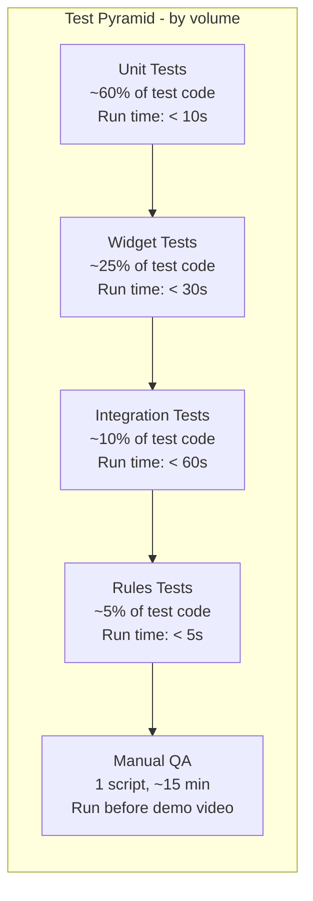

# Testing

> Test strategy and execution plan for App-WatchHub. Defines the test pyramid, coverage targets, test categories, security rules tests, and the manual QA checklist used for the demonstration video. This file is the single source of truth for "how we know the software works."

---

## Document Metadata

| Field | Value |
|---|---|
| **Title** | App-WatchHub — Testing |
| **Purpose** | Define test strategy, pyramid, coverage targets, security rules tests, and manual QA checklist |
| **Audience** | QA engineers, contributors, reviewers, AI coding agents |
| **Scope** | Testing only; requirements in [PRODUCT_REQUIREMENTS.md](PRODUCT_REQUIREMENTS.md), acceptance criteria traced via §6 RTM |
| **Version** | 1.0.0 |
| **Status** | Approved — locked for MVP cycle |
| **Owner** | Muhammad Faheem Khan (Student ID: 1593766) |
| **Last Updated** | 2026-07-27 |
| **Related Documents** | [PRODUCT_REQUIREMENTS.md](PRODUCT_REQUIREMENTS.md), [SYSTEM_DESIGN.md](SYSTEM_DESIGN.md), [SECURITY.md](SECURITY.md), [DEPLOYMENT.md](DEPLOYMENT.md), [CONFIGURATION.md](CONFIGURATION.md) |

---

## Table of Contents

1. [Test Strategy Overview](#1-test-strategy-overview)
2. [Test Pyramid](#2-test-pyramid)
3. [Coverage Targets](#3-coverage-targets)
4. [Unit Tests](#4-unit-tests)
5. [Widget Tests](#5-widget-tests)
6. [Integration Tests](#6-integration-tests)
7. [Security Rules Tests](#7-security-rules-tests)
8. [Manual QA Checklist](#8-manual-qa-checklist)
9. [Test Execution](#9-test-execution)
10. [References](#10-references)

---

## 1. Test Strategy Overview

App-WatchHub follows a pragmatic test strategy appropriate for a 30-day MVP: heavy on unit and rules tests (cheap, fast, high ROI), moderate on widget tests (verify UI behavior), light on integration tests (expensive, slow), and disciplined about manual QA (scripted, repeatable). The strategy explicitly rejects "100% coverage" as a goal — coverage is a proxy for confidence, not confidence itself, and chasing the number leads to low-value tests that brittle the codebase.

The strategy is anchored on three principles:

1. **Test behavior, not implementation.** Tests assert what the system does (e.g., "cart total updates when item added"), not how it does it (e.g., " cart provider calls `addToCart` method"). This allows refactoring without rewriting tests.
2. **Security rules are non-negotiable.** Every rule in [SECURITY.md](SECURITY.md) §4 has at least one positive test (rule allows intended operation) and one negative test (rule rejects unauthorized operation). A rule without tests is a rule we cannot trust.
3. **Manual QA is scripted.** The demonstration video is a recording of a manual QA pass against a written script. This ensures the video is reproducible and that any regression caught during recording can be filed as a bug with a clear reproduction path.

### 1.1 Current Test Harness Notes - 2026-07-27

Every widget test that reads Riverpod state must be wrapped in `ProviderScope`. Tests that construct the app shell or router must override Firebase-backed providers because Firebase is not initialized in normal unit/widget tests.

```dart
await tester.pumpWidget(
  ProviderScope(
    overrides: [
      routerProvider.overrideWithValue(mockRouter),
    ],
    child: const AppWatchHub(),
  ),
);
```

Current coverage anchors (100% passing test suite):

| Test | Coverage | Status |
|---|---|---|
| `test/widget_test.dart` | App bootstrap initialization with ProviderScope and mocked routerProvider | Passed |
| `test/cart_notifier_test.dart` | CartNotifier add, update, remove, clear, and totals behavior | Passed |
| `test/product_details_test.dart` | ProductDetailsScreen rendering, price formatting, reviews, and wishlist toggle | Passed |

## 2. Test Pyramid



### 2.1 Pyramid Distribution

| Layer | % of Test Code | Run Time | Cost | ROI |
|---|---|---|---|---|
| Unit | ~60% | < 10s | Low | Highest |
| Widget | ~25% | < 30s | Medium | High |
| Integration | ~10% | < 60s | High | Medium |
| Rules | ~5% | < 5s | Low | Very High (security) |
| Manual | 1 script | ~15 min | High | Demo-critical |

## 3. Coverage Targets

Coverage is measured by `flutter test --coverage` (LCOV format). The targets below are minimums, not maximums. Coverage above 80% is welcomed if the tests are valuable; coverage above 80% achieved via low-value tests is a smell.

| Path | Minimum Coverage | Rationale |
|---|---|---|
| `lib/core/constants/` | 100% | Pure data; trivially testable |
| `lib/core/utils/` | 80% | Pure functions; high ROI |
| `lib/core/services/` | 70% | Firebase wrappers; mock SDK |
| `lib/shared/models/` | 90% | Freezed-generated; test JSON round-trip |
| `lib/shared/repositories/` | 75% | Abstract; mock implementations |
| `lib/shared/widgets/` | 60% | Atomic widgets; widget tests |
| `lib/features/*/state/` | 70% | Riverpod providers; mock repo |
| `lib/features/*/presentation/` | 40% | Pages; widget tests for key flows only |
| `lib/main.dart` | 0% | Initialization; covered by integration tests |
| **Overall `lib/core/` + `lib/features/`** | **60%** | NFR-9 requirement |

### 3.1 Coverage Enforcement

Coverage is enforced in CI per [DEPLOYMENT.md](DEPLOYMENT.md) §2.2 Stage 2: Test. If overall coverage falls below 60%, the pipeline fails and the PR cannot merge.

## 4. Unit Tests

Unit tests cover pure functions, validators, formatters, and business logic that has no UI or external dependency.

### 4.1 Unit Test Examples

```dart
// test/core/utils/price_calculator_test.dart
import 'package:flutter_test/flutter_test.dart';
import 'package:app_watchhub/core/utils/price_calculator.dart';

void main() {
  group('PriceCalculator', () {
    group('calculateSubtotal', () {
      test('returns 0 for empty cart', () {
        expect(PriceCalculator.calculateSubtotal([]), 0.0);
      });

      test('sums line totals correctly', () {
        final items = [
          CartItem(productId: 'p1', unitPrice: 100.0, quantity: 2),
          CartItem(productId: 'p2', unitPrice: 50.0, quantity: 1),
        ];
        expect(PriceCalculator.calculateSubtotal(items), 250.0);
      });

      test('handles floating-point precision', () {
        final items = [
          CartItem(productId: 'p1', unitPrice: 0.1, quantity: 3),
        ];
        expect(PriceCalculator.calculateSubtotal(items), closeTo(0.3, 0.001));
      });
    });

    group('calculateTax', () {
      test('applies tax rate to subtotal', () {
        expect(
          PriceCalculator.calculateTax(subtotal: 100.0, taxRate: 0.08),
          8.0,
        );
      });

      test('returns 0 for zero subtotal', () {
        expect(PriceCalculator.calculateTax(subtotal: 0.0, taxRate: 0.08), 0.0);
      });
    });
  });
}
```

### 4.2 Unit Test Conventions

| Convention | Enforcement |
|---|---|
| One test file per source file | `test/<path>/<file>_test.dart` mirrors `lib/<path>/<file>.dart` |
| Group by class, then by method | `group('ClassName', () { group('methodName', () { ... }); });` |
| Test names are sentences | `test('returns 0 for empty cart', ...)` |
| One assertion per test when possible | Easier to identify failure |
| Use `setUp`/`tearDown` for shared state | Avoid test interdependence |
| No `print` statements in tests | Use `expect(..., reason: '...')` for context |

## 5. Widget Tests

Widget tests verify that UI components render correctly and respond to user interaction. They use Flutter's `testWidgets` framework and do not require a real device or emulator.

### 5.1 Widget Test Example

```dart
// test/features/catalog/presentation/product_card_test.dart
import 'package:flutter/material.dart';
import 'package:flutter_test/flutter_test.dart';
import 'package:app_watchhub/features/catalog/presentation/widgets/product_card.dart';
import 'package:app_watchhub/shared/models/product_model.dart';

void main() {
  group('ProductCard', () {
    final testProduct = Product(
      productId: 'p1',
      modelName: 'Submariner Date',
      brand: 'Rolex',
      price: 14350.00,
      stockCount: 8,
      assetPath: 'assets/images/watches/rolex_submariner.png',
    );

    testWidgets('displays product name and price', (tester) async {
      await tester.pumpWidget(
        MaterialApp(
          home: Scaffold(
            body: ProductCard(
              product: testProduct,
              onTap: () {},
            ),
          ),
        ),
      );

      expect(find.text('Submariner Date'), findsOneWidget);
      expect(find.text('\$14,350.00'), findsOneWidget);
      expect(find.text('Rolex'), findsOneWidget);
    });

    testWidgets('shows out-of-stock badge when stockCount is 0', (tester) async {
      final outOfStockProduct = testProduct.copyWith(stockCount: 0);

      await tester.pumpWidget(
        MaterialApp(
          home: Scaffold(
            body: ProductCard(
              product: outOfStockProduct,
              onTap: () {},
            ),
          ),
        ),
      );

      expect(find.text('Out of Stock'), findsOneWidget);
    });

    testWidgets('calls onTap when card is tapped', (tester) async {
      var tapCount = 0;
      await tester.pumpWidget(
        MaterialApp(
          home: Scaffold(
            body: ProductCard(
              product: testProduct,
              onTap: () => tapCount++,
            ),
          ),
        ),
      );

      await tester.tap(find.byType(ProductCard));
      expect(tapCount, 1);
    });
  });
}
```

### 5.2 Widget Test Coverage

| Widget | Test Coverage | Priority |
|---|---|---|
| `ProductCard` | Renders, out-of-stock, tap | High |
| `FilterChipBar` | Multi-select, deselect | High |
| `CartPage` list item | Quantity update, remove | High |
| `CheckoutPage` | Form validation, submit | High |
| `AdminDashboardPage` | Stats render, navigation | Medium |
| `LoginPage` form | Validation, submit | High |
| `LuxuryButton` | Disabled state, tap | Medium |
| `GlassCard` | Renders child | Low |

## 6. Integration Tests

Integration tests verify multi-component flows end-to-end against the Firebase Emulator. They use Flutter's `integration_test` package and run on a real or virtual device.

### 6.1 Integration Test Example

```dart
// integration_test/checkout_flow_test.dart
import 'package:flutter_test/flutter_test.dart';
import 'package:integration_test/integration_test.dart';
import 'package:app_watchhub/main.dart' as app;

void main() {
  IntegrationTestWidgetsFlutterBinding.ensureInitialized();

  group('Checkout Flow', () {
    testWidgets('customer can place an order end-to-end', (tester) async {
      app.main();
      await tester.pumpAndSettle();

      // 1. Login as seeded customer
      await tester.enterText(
        find.byKey(const Key('login_email_field')),
        'customer@watchhub.test',
      );
      await tester.enterText(
        find.byKey(const Key('login_password_field')),
        'Customer123!',
      );
      await tester.tap(find.byKey(const Key('login_submit_button')));
      await tester.pumpAndSettle();

      // 2. Verify on boutique page
      expect(find.text('Boutique'), findsOneWidget);

      // 3. Add a product to cart
      await tester.tap(find.byKey(const Key('product_card_p1')));
      await tester.pumpAndSettle();
      await tester.tap(find.byKey(const Key('add_to_cart_button')));
      await tester.pumpAndSettle();

      // 4. Navigate to cart
      await tester.tap(find.byKey(const Key('nav_cart')));
      await tester.pumpAndSettle();

      // 5. Checkout
      await tester.tap(find.byKey(const Key('checkout_button')));
      await tester.pumpAndSettle();

      // 6. Confirm order
      await tester.tap(find.byKey(const Key('confirm_order_button')));
      await tester.pumpAndSettle();

      // 7. Verify success screen
      expect(find.text('Order Confirmed'), findsOneWidget);
    });
  });
}
```

### 6.2 Integration Test Inventory

| Flow | Test | Pre-conditions |
|---|---|---|
| Auth | Login as customer | Seeded customer user |
| Auth | Login as admin | Seeded admin user |
| Auth | Register new user | Emulator running |
| Auth | Password reset flow | Emulator running |
| Catalog | Browse boutique | Logged in as customer |
| Catalog | Filter by brand | Logged in as customer |
| Catalog | Filter by availability | Logged in as customer |
| Cart | Add item | Logged in as customer |
| Cart | Update quantity | Logged in as customer |
| Cart | Move to wishlist | Logged in as customer |
| Checkout | Place order | Logged in as customer, item in cart |
| Orders | View order history | Logged in as customer with past orders |
| Admin | View dashboard | Logged in as admin |
| Admin | Update product stock | Logged in as admin |
| Admin | Update order status | Logged in as admin |

## 7. Security Rules Tests

Security rules tests are the highest-ROI tests in the project. They run against the Firebase Emulator and verify that every rule in [SECURITY.md](SECURITY.md) §4 correctly allows intended operations and rejects unauthorized ones.

### 7.1 Rules Test Setup

```bash
# test/rules/package.json
{
  "scripts": {
    "test": "mocha --timeout 10000"
  },
  "devDependencies": {
    "@firebase/rules-unit-testing": "^3.0.0",
    "mocha": "^10.0.0"
  }
}
```

### 7.2 Rules Test Example

```javascript
// test/rules/users.test.js
const { initializeTestApp, assertSucceeds, assertFails } =
  require('@firebase/rules-unit-testing');

const PROJECT_ID = 'app-watchhub-dev-test';

describe('Users collection rules', () => {
  it('allows anonymous user to NOT read user profiles', async () => {
    const unauthApp = initializeTestApp({ projectId: PROJECT_ID });
    await assertFails(
      unauthApp.firestore().collection('users').doc('alice').get()
    );
  });

  it('allows owner to read own profile', async () => {
    const aliceApp = initializeTestApp({
      projectId: PROJECT_ID,
      auth: { uid: 'alice' }
    });
    // Seed profile
    await aliceApp.firestore().collection('users').doc('alice').set({
      uid: 'alice', fullName: 'Alice', email: 'alice@test',
      isAdmin: false, createdAt: new Date()
    });
    await assertSucceeds(
      aliceApp.firestore().collection('users').doc('alice').get()
    );
  });

  it('blocks owner from setting isAdmin=true on self', async () => {
    const aliceApp = initializeTestApp({
      projectId: PROJECT_ID,
      auth: { uid: 'alice' }
    });
    await aliceApp.firestore().collection('users').doc('alice').set({
      uid: 'alice', fullName: 'Alice', email: 'alice@test',
      isAdmin: false, createdAt: new Date()
    });
    await assertFails(
      aliceApp.firestore().collection('users').doc('alice').update({
        isAdmin: true
      })
    );
  });

  it('allows admin to read any user profile', async () => {
    const adminApp = initializeTestApp({
      projectId: PROJECT_ID,
      auth: { uid: 'admin' }
    });
    // Seed admin
    await adminApp.firestore().collection('users').doc('admin').set({
      uid: 'admin', fullName: 'Admin', email: 'admin@test',
      isAdmin: true, createdAt: new Date()
    });
    // Seed another user
    await adminApp.firestore().collection('users').doc('bob').set({
      uid: 'bob', fullName: 'Bob', email: 'bob@test',
      isAdmin: false, createdAt: new Date()
    });
    await assertSucceeds(
      adminApp.firestore().collection('users').doc('bob').get()
    );
  });
});
```

### 7.3 Required Rules Tests

| Rule | Positive Test | Negative Test |
|---|---|---|
| `/users/{uid}` read | Owner reads own | Anonymous read fails; non-owner read fails |
| `/users/{uid}` create | Owner creates own with `isAdmin: false` | Attempt to create with `isAdmin: true` fails |
| `/users/{uid}` update | Owner updates `fullName` | Owner updates `isAdmin` fails; non-owner update fails |
| `/products` read | Anonymous reads | n/a (public) |
| `/products/{id}` create | Admin creates with valid types | Non-admin create fails; invalid type fails |
| `/products/{id}` update | Admin updates stock | Non-admin update fails |
| `/orders/{id}` create | Customer creates own with `userId == auth.uid` | Customer creates with another uid fails |
| `/orders/{id}` read | Owner reads own | Non-owner read fails |
| `/orders/{id}` update | Admin updates `orderStatus` only | Admin updates `items` fails; non-admin update fails |

## 8. Manual QA Checklist

The manual QA checklist is the script used to record the demonstration video. Every item must pass before the video is recorded. Failed items are filed as bugs and either fixed or documented as known limitations in [TROUBLESHOOTING.md](TROUBLESHOOTING.md).

### 8.1 Pre-Demo Setup

| Step | Action | Expected |
|---|---|---|
| 1 | Start Firebase Emulator | `firebase emulators:start` |
| 2 | Run seed script | `dart scripts/seed_emulator.dart` |
| 3 | Launch app on Chrome | `flutter run -d chrome` |
| 4 | Verify boutique renders | Page loads in < 3 seconds |

### 8.2 Customer Journey QA

| Step | Action | Expected |
|---|---|---|
| 1 | Tap "Register" | Register page renders |
| 2 | Enter email + password + name | Form accepts input |
| 3 | Tap "Sign Up" | Account created; redirected to `/boutique` |
| 4 | Tap "Logout" | Returns to `/login` |
| 5 | Login with seeded customer | Lands on `/boutique` |
| 6 | Browse catalog | 12 products visible |
| 7 | Filter by brand "Rolex" | Only Rolex products visible |
| 8 | Filter by availability "In Stock" | Out-of-stock items hidden |
| 9 | Tap a product | Detail page renders with specs |
| 10 | Tap "Add to Cart" | Cart badge increments |
| 11 | Open cart | Cart page renders with item |
| 12 | Change quantity to 2 | Subtotal updates |
| 13 | Tap "Checkout" | Checkout page renders |
| 14 | Confirm order | "Order Confirmed" screen |
| 15 | Navigate to "Orders" | New order in list |
| 16 | Tap order | Detail page with status "Processing" |

### 8.3 Admin Journey QA

| Step | Action | Expected |
|---|---|---|
| 1 | Logout customer | Returns to `/login` |
| 2 | Login with seeded admin | Lands on `/admin` |
| 3 | Verify dashboard stats | Total orders, revenue, low-stock visible |
| 4 | Tap "Inventory" | Inventory page with 12 products |
| 5 | Tap a product | Edit form opens |
| 6 | Change stock count | Save persists; catalog updates in real-time |
| 7 | Tap "Orders" | Orders admin page |
| 8 | Tap an order | Detail view |
| 9 | Change status to "Shipped" | Status updates; customer sees change in real-time |

### 8.4 Cross-Platform QA

| Step | Action | Expected |
|---|---|---|
| 1 | Repeat customer journey on Android device | All steps pass |
| 2 | Verify page transitions < 1.5s | NFR-1 verified |
| 3 | Verify theme is dark with gold accents | NFR-14 verified |
| 4 | Verify no console errors in Chrome DevTools | Clean console |

### 8.5 Failure Scenario QA

| Step | Action | Expected |
|---|---|---|
| 1 | Attempt to access `/admin` as customer | Redirected to `/boutique` |
| 2 | Stop emulator, attempt to add to cart | Error state widget with retry |
| 3 | Attempt to register with invalid email | Inline validation error |
| 4 | Attempt to login with wrong password | Inline error "Invalid credentials" |
| 5 | Attempt to place order with out-of-stock item | Stock mismatch dialog |

## 9. Test Execution

### 9.1 Local Execution

```bash
# Run all tests
flutter test

# Run with coverage
flutter test --coverage

# Run specific test file
flutter test test/core/utils/price_calculator_test.dart

# Run integration tests (requires emulator running)
flutter test integration_test/

# Run rules tests (requires Node.js)
cd test/rules && npm test
```

### 9.2 CI Execution

Per [DEPLOYMENT.md](DEPLOYMENT.md) §2.2, all tests run on every push and PR. Coverage report is uploaded as an artifact.

### 9.3 Pre-Demo Test Run

Before recording the demonstration video:

```bash
# 1. Clean build
flutter clean
flutter pub get

# 2. Run full test suite
flutter test --coverage

# 3. Run rules tests
cd test/rules && npm test

# 4. Verify coverage threshold
# (covered by CI script, but verify locally)

# 5. Start emulator and run integration tests
firebase emulators:start --only auth,firestore &
flutter test integration_test/

# 6. Manual QA per §8
```

## 10. References

- Internal: [PRODUCT_REQUIREMENTS.md](PRODUCT_REQUIREMENTS.md) §6 RTM, [SYSTEM_DESIGN.md](SYSTEM_DESIGN.md), [SECURITY.md](SECURITY.md) §4 Rules, [DEPLOYMENT.md](DEPLOYMENT.md) §2.2 Stage 2, [CONFIGURATION.md](CONFIGURATION.md) §5 Emulator, [TROUBLESHOOTING.md](TROUBLESHOOTING.md)
- External: [Flutter testing docs](https://docs.flutter.dev/testing), [Flutter integration tests](https://docs.flutter.dev/testing/integration-tests), [Firebase rules unit testing](https://firebase.google.com/docs/firestore/security/test-rules-emulator), [Mocha test framework](https://mochajs.org/)
