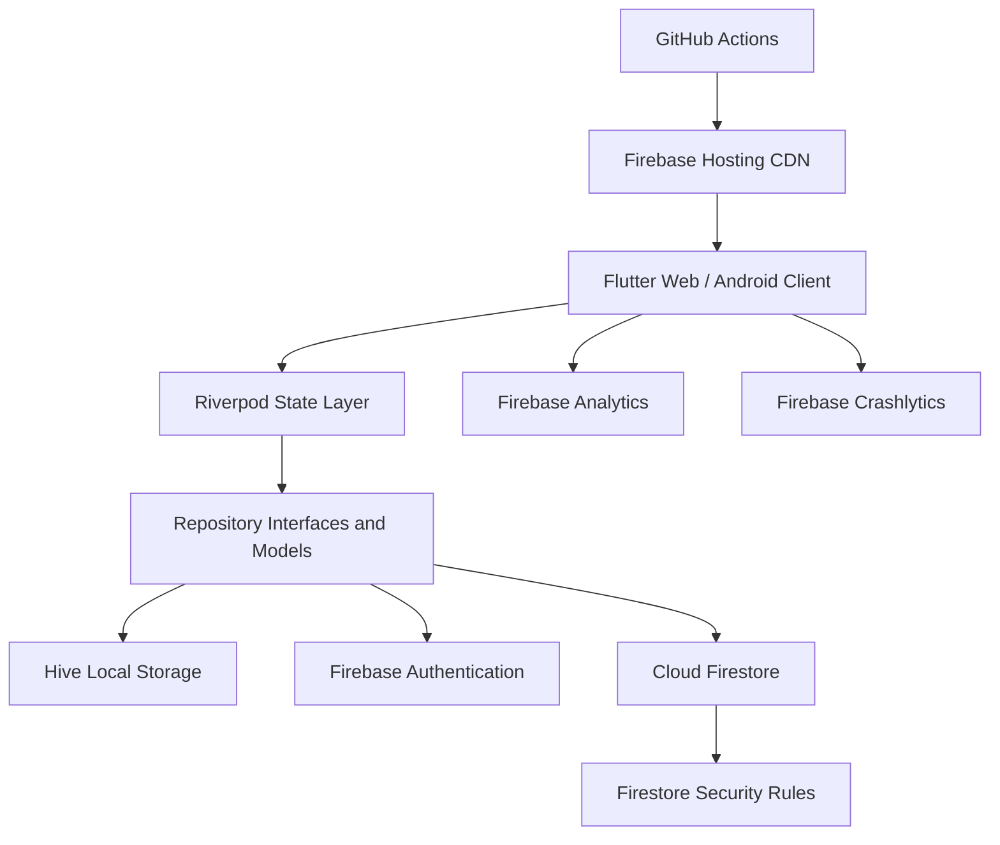

# App-WatchHub Unified Project Documentation

> Single consolidated reference for App-WatchHub, synthesized from the existing project markdown documentation. This document defines what the project is, what the application does, what is in scope, what is out of scope, how the product is structured, and how the team should deliver it.

---

## Table of Contents

1. [Project Overview](#project-overview)
2. [App Description](#app-description)
3. [Project Scope](#project-scope)
4. [What We Are Building](#what-we-are-building)
5. [Roadmap](#roadmap)
6. [Assumptions and Open Decisions](#assumptions-and-open-decisions)
7. [Success Criteria](#success-criteria)

---

## Project Overview

### High-Level Summary

**App-WatchHub** is a premium luxury watch e-commerce application built with a single Flutter codebase and a Firebase-backed serverless architecture. The app provides a digital boutique experience for high-end timepieces, including catalog browsing, search, filtering, product details, cart and wishlist flows, order placement, order tracking, reviews, customer support, feedback reporting, and an admin governance panel.

The project is designed to prove that a polished, production-style e-commerce experience can be built by a student team within a 30-day timeline while staying on a **$0/month infrastructure budget**. It uses Firebase Authentication, Cloud Firestore, Firebase Hosting, Firebase Analytics, Firebase Crashlytics, Firestore Security Rules, local asset bundles, and local storage instead of a custom backend or paid infrastructure.

### Purpose and Problem Solved

Luxury watch buyers expect a fast, quiet, premium digital experience. Traditional e-commerce stacks often introduce latency, operational overhead, cost, and deployment complexity through custom APIs, server provisioning, SQL database management, external media hosting, and paid integrations.

App-WatchHub solves this by:

- Delivering a high-fidelity customer boutique using Flutter Web and Android from one codebase.
- Using Firebase managed services instead of a custom server.
- Enforcing authorization at the Firestore Security Rules layer.
- Keeping product media local to reduce latency and avoid cloud storage costs.
- Providing an admin panel so inventory, orders, reviews, support tickets, feedback, FAQs, and users can be managed without direct database access.

### Target Audience and Users

| Audience | Description | Primary Needs |
|---|---|---|
| Luxury watch collectors | High-intent customers researching and purchasing premium watches | Fast browsing, rich product detail, wishlist, cart, order tracking, discreet UX |
| Boutique administrators | Operations users managing inventory, orders, reviews, support, and feedback | CRUD tools, dashboards, moderation queues, order status updates |
| Academic reviewers | Evaluators of the software design, implementation, and documentation | Clear scope, architecture, testability, traceability, demo readiness |
| Recruiters and hiring managers | Future technical reviewers of the portfolio project | Evidence of architectural judgment, security thinking, CI/CD, maintainability |
| Future contributors and AI agents | Developers extending or maintaining the project | Clear folder structure, documented decisions, schemas, test strategy |

### Key Business Goals

- Launch a working MVP within the locked 30-day window from **July 14, 2026 to August 14, 2026**.
- Provide a premium watch-shopping experience aligned with luxury horology aesthetics.
- Support core customer journeys from signup to catalog browsing, cart, checkout, order confirmation, reviews, support, and feedback.
- Support core admin journeys from login to inventory management, order management, review moderation, support handling, feedback triage, FAQ management, and user oversight.
- Keep steady-state infrastructure cost at **$0.00/month** using Firebase Spark Free Tier and GitHub Actions.
- Produce a long-lived portfolio artifact that can be reviewed through both the deployed app and the documentation tree.

### Key Technical Goals

- Use a **Serverless Event-Driven Architecture (SEDA)** with no custom API server.
- Use Firestore real-time streams for catalog, order, and admin updates.
- Use Firestore Security Rules as the authoritative authorization boundary.
- Maintain a clean, feature-first Flutter architecture with Riverpod, GoRouter, Freezed, and repository abstractions.
- Ship to both Web and Android from one codebase.
- Maintain CI/CD through GitHub Actions with linting, formatting, tests, build, and Firebase Hosting deployment.
- Meet defined performance, security, accessibility, coverage, and cost constraints.

---

## App Description

### Product Description

App-WatchHub is a luxury watch marketplace and administration system. Customers browse a curated catalog of watches from brands such as Rolex, Omega, Patek Philippe, Audemars Piguet, Vacheron Constantin, Cartier, IWC, Breitling, Tudor, Panerai, Hublot, and A. Lange & Sohne. They can search and filter the catalog, inspect detailed watch specifications, add products to a wishlist or cart, place non-payment orders, track order status, manage profile and shipping addresses, submit reviews, contact support, browse FAQs, and report issues.

Admins use a protected dashboard to manage products, inventory, orders, reviews, support tickets, feedback, FAQs, and users. The admin panel is guarded by route-level UX checks and by Firestore Security Rules, with the rules treated as the true security boundary.

### MVP Features

| Feature Area | MVP Functionality |
|---|---|
| Identity management | Email/password registration, login, logout, password reset, persisted auth sessions, user profile document creation |
| Catalog discovery | Real-time product catalog, filters by brand/category/price/availability, product details, local image assets |
| Search | Client-side search over `modelName`, `brand`, and `category`, debounced at 300ms |
| Product detail | Images, zoom, specs, description, price, stock, rating summary, reviews section, related product suggestions |
| Cart | Local cart using Hive, quantity updates, subtotal/tax/total calculation, stock validation, cart clear after order |
| Wishlist | Local wishlist using Hive, add/remove/toggle, move wishlist item to cart, move cart item to wishlist |
| Checkout and orders | Non-payment order placement, Firestore order document creation, order confirmation, order history, order tracking |
| User profile | Full name, read-only email, multiple shipping addresses, default address support, order history |
| Reviews and ratings | Authenticated review submission, one review per product per user, pending moderation, approved review display |
| Customer support | Contact support form, support ticket persistence, ticket history, admin response workflow |
| FAQ | In-app FAQ page backed by Firestore, category grouping, optional keyword filtering |
| Feedback and issue reporting | Feedback form, bug/suggestion/compliment/complaint categories, optional anonymous submission |
| Admin dashboard | Stats, inventory CRUD, order status updates, review moderation, support queue, feedback triage, FAQ management, user management |
| Security | Firebase Auth, Firestore Security Rules, role-based access, no client-trusted authorization |
| Observability | Firebase Analytics events and Crashlytics exception capture |
| Deployment | Firebase Hosting for Web, Android APK build for demo, GitHub Actions CI/CD |

### Future-Planned Features

| Version / Horizon | Planned Features |
|---|---|
| v1.1 polish and security | Email verification, Google/Apple OAuth, push notifications, custom domain, staging Firebase project, admin custom claims, automated backups where paid tier is accepted |
| v1.2 growth | Stripe payment integration, multi-currency support, internationalization, cross-device cart sync, Algolia search for larger catalogs, transactional email templates, A/B testing |
| v2.0 enterprise | Cloud Functions, Firebase Blaze tier, multi-tenant boutique support, app store publication, advanced admin analytics, SSR marketing pages |

### User Interaction Flows

#### Customer Registration and Login

1. Visitor opens the app.
2. Visitor registers with full name, email, and password.
3. Firebase Auth creates the account.
4. The app creates `/users/{uid}` with `isAdmin: false`.
5. User lands on `/boutique`.
6. On later visits, Firebase Auth restores the session automatically.

#### Customer Catalog and Product Discovery

1. Customer opens the boutique page.
2. App streams `/products` from Firestore.
3. Customer searches by name, brand, or category.
4. Customer applies filters by brand, category, price tier, or availability.
5. Customer opens a product detail page.
6. Product detail shows image, specs, price, stock, rating summary, reviews, and cart/wishlist actions.

#### Cart, Wishlist, and Checkout

1. Customer adds an in-stock product to the cart.
2. Cart state updates in Riverpod and persists locally in Hive.
3. Customer adjusts quantity, removes items, or moves items to wishlist.
4. Customer starts checkout.
5. App refreshes product stock from Firestore.
6. If stock is valid, customer confirms order.
7. App creates an `/orders/{orderId}` document with embedded line items.
8. Cart is cleared locally.
9. Customer sees confirmation and can track the order.

#### Reviews and Ratings

1. Authenticated customer opens a product detail page.
2. Customer submits a rating, title, and review body.
3. App writes `/reviews/{reviewId}` with `status: "pending"`.
4. Admin reviews the moderation queue.
5. Approved reviews appear publicly on the product detail page.

#### Support and Feedback

1. Customer opens Contact Support or Feedback from navigation.
2. Support submissions create `/supportTickets/{ticketId}`.
3. Feedback submissions create `/feedback/{feedbackId}`.
4. Admin views and responds to support tickets.
5. Admin triages feedback and issue reports.

#### Admin Governance

1. Admin logs in with Firebase Auth.
2. App reads `/users/{uid}` and detects `isAdmin: true`.
3. GoRouter redirects admin users to `/admin`.
4. Admin performs inventory, order, review, FAQ, support, feedback, and user management tasks.
5. Firestore Security Rules independently authorize or reject every protected read/write.

### Nonfunctional Requirements

| Category | Requirement |
|---|---|
| Performance | Page transitions under 1.5 seconds at the 95th percentile on Chrome desktop |
| Web performance | First Contentful Paint under 2.0 seconds on Chrome desktop over cable connection |
| Android package size | Release APK target under 25 MB for modern Android |
| Security | Zero unauthorized mutations at the data layer; Firestore Rules are mandatory |
| Availability | Best-effort 99.99% using Firebase managed services and hosting edge |
| Cost | $0/month at steady state on Firebase Spark Free Tier |
| Maintainability | Feature-first architecture, documented ADRs, no undocumented TODO/placeholder docs |
| Testability | Minimum 60% coverage on `lib/core/` and `lib/features/` |
| Observability | Crashlytics for uncaught exceptions; Analytics for key product events |
| Compatibility | Chrome 120+, Safari 17+, Edge 120+, Firefox 121+, Android 10+ |
| Accessibility | WCAG AA contrast targets for body and large text |
| Internationalization | English (`en_US`) only for MVP |

---

## Project Scope

### In Scope

The MVP includes every feature required by the official App-WatchHub specification and the reconciled project scope.

| ID | In-Scope Area | Description |
|---|---|---|
| F-1 | Identity management | Register, login, logout, password recovery, profile creation/update |
| F-2 | Catalog discovery | Product catalog, brand/category/price/availability filters, real-time updates |
| F-3 | Product details | Images, descriptions, specs, prices, zoom, stock and availability |
| F-4 | Cart and wishlist | Local persisted cart and wishlist, movement between both, totals and stock checks |
| F-5 | User profile and addresses | Profile, multiple shipping addresses, default address, order history and tracking |
| F-6 | Reviews and ratings | Customer review submission, approved review display, admin moderation |
| F-7 | Customer support | Contact form, support tickets, support history, admin response |
| F-8 | Feedback and issue reports | User feedback and bug reporting with admin triage |
| F-9 | Admin panel | Product, user, review, order, support, feedback, FAQ, and dashboard management |
| F-10 | Luxury design system | Dark theme, gold accents, Playfair Display headings, Inter body text |
| F-11 | Role-based routing | Customer/admin redirects using GoRouter |
| F-12 | Cross-platform delivery | Flutter Web and Android from one codebase |
| F-13 | Edge security | Firestore Security Rules as the authoritative authorization layer |
| F-14 | CI/CD | GitHub Actions verify, test, build, and deploy pipeline |
| F-15 | Telemetry | Firebase Analytics and Crashlytics |
| F-16 | User documentation | In-app FAQ and user guide/onboarding support |
| F-17 | Developer documentation | Markdown documentation tree and developer guide material |
| F-18 | Demonstration video | 5-10 minute app walkthrough for final submission |

### Out of Scope

| Exclusion | Rationale | Revisit Trigger |
|---|---|---|
| Payment gateway integration | Not required by the official spec; introduces PCI, KYC, webhook, and transaction-fee complexity | Post-MVP paid pilot |
| Real payment capture | MVP records non-binding order intent only | Payment integration phase |
| Push notifications | Order status is visible in-app; FCM deferred | v1.1 |
| Multi-currency support | USD-only for MVP; FX data source would add complexity | v1.2 international expansion |
| Automated refunds | No payment capture exists in MVP | Payment integration |
| Cross-device cart/wishlist sync | Cart and wishlist are intentionally local to reduce Firestore writes | v1.2 |
| OAuth/SSO | Email/password is sufficient for MVP | v1.1 |
| Multi-language localization | English-only MVP | v1.2 |
| Server-side rendering | SEO not required for app shell | Public marketing site |
| A/B testing | Growth tooling not needed for academic MVP | Post-MVP growth phase |
| Custom backend/API server | Violates architecture and budget constraints | Not planned for MVP |
| Real-time in-app chat | Contact form satisfies support requirement | v1.2 |
| Firebase Cloud Functions | Spark tier excludes Cloud Functions; business logic remains client/rules-driven | v2.0 / Blaze upgrade |
| Automated Firestore backups | Requires paid tier; manual backup only for MVP | Blaze tier acceptance |
| App store publication | APK build is for demo only | Post-MVP release phase |

### Constraints

| ID | Constraint |
|---|---|
| C-1 | Infrastructure cost must remain $0.00/month at steady state |
| C-2 | MVP timeline is 30 calendar days: July 14, 2026 to August 14, 2026 |
| C-3 | Team work must be parallelizable across 6 contributors |
| C-4 | Cross-platform delivery must use a single Flutter codebase |
| C-5 | Backend must use Firebase Spark Free Tier; no paid Firebase extensions |
| C-6 | Authorization must be enforced by Firestore Security Rules |
| C-7 | Official App-WatchHub specification features are in scope unless explicitly ADR-deferred |

### Dependencies

| Dependency | Role |
|---|---|
| Flutter SDK | Cross-platform Web and Android application framework |
| Firebase Authentication | Email/password identity and password reset |
| Cloud Firestore | Primary NoSQL database and real-time stream source |
| Firebase Hosting | Public web deployment on CDN |
| Firebase Analytics | Event telemetry |
| Firebase Crashlytics | Crash reporting |
| GitHub Actions | CI/CD pipeline |
| Hive CE | Local cart and wishlist persistence |
| Riverpod | State management and dependency injection |
| GoRouter | Declarative routing and route guards |
| Freezed / JsonSerializable | Immutable models and serialization |

---

## What We Are Building

### Core Product Definition

App-WatchHub is a cross-platform luxury watch commerce system made of:

- A customer-facing Flutter boutique.
- An admin-facing Flutter governance dashboard.
- Firebase Authentication for identity.
- Cloud Firestore for products, users, orders, reviews, support tickets, feedback, and FAQs.
- Firestore Security Rules for authorization.
- Hive local storage for transient cart and wishlist state.
- Firebase Hosting for Web deployment.
- Android APK output for demonstration.
- GitHub Actions for continuous integration and deployment.

The final product is not a generic storefront. It is a focused, premium horology app with a dark, restrained luxury interface and a documented serverless architecture designed for academic review, portfolio review, and future extension.

### Main Components and Modules

| Module | Responsibility |
|---|---|
| `core/constants` | App constants, asset paths, catalog constants, theme constants |
| `core/services` | Firebase service wrappers, analytics, crash reporting |
| `core/theme` | Dark luxury design system |
| `core/router` | GoRouter route table and guards |
| `core/utils` | Validators, price calculation, formatting helpers |
| `shared/models` | User, product, order, cart, review, support, feedback, FAQ models |
| `shared/repositories` | Repository interfaces for testable data access |
| `shared/widgets` | Reusable UI primitives such as buttons, cards, price tags, loaders |
| `features/auth` | Login, registration, password reset, auth state |
| `features/catalog` | Catalog page, product cards, product detail, filters |
| `features/search` | Search bar and query state |
| `features/cart` | Cart page, checkout page, cart provider |
| `features/orders` | Order history and tracking |
| `features/reviews` | Review submission, display, rating widgets |
| `features/support` | Contact support and ticket history |
| `features/faq` | In-app FAQ page |
| `features/feedback` | Feedback and issue reporting |
| `features/profile` | Profile and address management |
| `features/admin` | Dashboard, inventory, orders, reviews, support, feedback, FAQ, user management |

### High-Level Architecture

App-WatchHub uses a **Serverless Event-Driven Architecture**:

The client is considered untrusted. GoRouter guards improve user experience, but every protected operation must also be authorized by Firestore Security Rules.

### Layered Application Design

| Layer | Responsibility | Examples |
|---|---|---|
| Presentation | Render UI and capture user intent | Pages, widgets, forms, dialogs |
| State | Hold UI/application state and orchestrate repository calls | Riverpod providers, AsyncNotifier state |
| Domain | Define entities, repository contracts, validators | Freezed models, abstract repositories |
| Infrastructure | Implement repositories against concrete storage/services | Firebase Auth, Firestore repos, Hive stores |
| Core | Cross-cutting app infrastructure | Theme, router, constants, analytics, utilities |

### Technology Stack

| Layer | Technology |
|---|---|
| Language | Dart |
| UI framework | Flutter 4.x, Material 3 |
| State management | Riverpod 2.x / AsyncNotifier |
| Routing | GoRouter |
| Models and serialization | Freezed, JsonSerializable |
| Authentication | Firebase Authentication |
| Database | Cloud Firestore |
| Local persistence | Hive CE |
| Hosting | Firebase Hosting |
| Observability | Firebase Analytics, Firebase Crashlytics |
| CI/CD | GitHub Actions |
| Testing | Flutter test, integration_test, Firebase rules unit testing, Mocha for rules tests |
| Styling | Dark luxury theme, Playfair Display, Inter, gold accents |

### Data Model and Key Entities

#### Firestore Collections

| Collection | Purpose | Access Pattern |
|---|---|---|
| `/users/{uid}` | User profile, email mirror, admin flag, addresses | Owner read/update limited fields; admin read/update all |
| `/products/{productId}` | Product catalog entries | Public read; admin write |
| `/orders/{orderId}` | Order header and embedded line items | Owner/admin read; customer create own; admin status update |
| `/reviews/{reviewId}` | Product reviews and moderation state | Authenticated create; approved read; admin moderate |
| `/supportTickets/{ticketId}` | Customer support submissions | Owner/admin read; customer create; admin respond |
| `/feedback/{feedbackId}` | Product feedback and issue reports | Anyone create; admin read/update/delete |
| `/faq/{faqId}` | In-app FAQ content | Public read active FAQs; admin CRUD |

#### Core Entities

| Entity | Important Fields |
|---|---|
| User | `uid`, `fullName`, `email`, `isAdmin`, `addresses[]`, `createdAt`, `updatedAt` |
| Address | `addressId`, `label`, `recipientName`, `street`, `city`, `stateProvince`, `postalCode`, `country`, `phone`, `isDefault` |
| Product | `productId`, `modelName`, `brand`, `category`, `price`, `stockCount`, `assetPath`, `specs`, `createdAt`, `updatedAt` |
| Order | `orderId`, `userId`, `subtotal`, `tax`, `totalAmount`, `orderStatus`, `createdAt`, `items[]` |
| Order item | `productId`, `modelName`, `quantity`, `unitPrice`, `lineTotal` |
| Review | `reviewId`, `productId`, `userId`, `userFullName`, `rating`, `title`, `body`, `status`, moderation fields |
| Support ticket | `ticketId`, `userId`, `subject`, `subjectCategory`, `messageBody`, `relatedOrderId`, `status`, `adminResponse` |
| Feedback | `feedbackId`, `userId`, `isAnonymous`, `category`, `description`, `screenshotUrl`, `relatedProductId`, `status`, triage fields |
| FAQ | `faqId`, `category`, `question`, `answer`, `displayOrder`, `isActive` |

### Important Architectural Decisions

| ADR | Decision |
|---|---|
| ADR-001 | Serverless Event-Driven Architecture instead of custom REST backend |
| ADR-002 | Cloud Firestore instead of SQL for MVP production storage |
| ADR-003 | Local asset bundles instead of Firebase Storage |
| ADR-004 | Riverpod instead of Provider/BLoC |
| ADR-005 | GoRouter instead of direct Navigator 2.0 |
| ADR-006 | GitHub Actions for CI/CD |
| ADR-007 | Maintain both academic ERD and production Firestore schema |
| ADR-008 | Cart in Hive local storage instead of Firestore |
| ADR-009 | Dark luxury theme instead of default Material |
| ADR-010 | Payment integration out of scope for MVP |
| ADR-011 | Single Flutter codebase for Web and Android |
| ADR-012 | Firebase Spark Free Tier instead of Blaze |
| ADR-013 | Client-side search instead of Algolia/full-text service |
| ADR-014 | Top-level `/reviews` collection instead of product subcollections |
| ADR-015 | FAQ in Firestore instead of static JSON |
| ADR-016 | 6-contributor team workflow |

### Security Model

The security model has three boundaries:

| Boundary | Trust Level | Responsibility |
|---|---|---|
| Firebase Hosting CDN | Network edge | TLS, CDN serving, built-in Google edge protections |
| Flutter client | Untrusted | UI, route guards, client-side validation, optimistic UX |
| Firebase Auth + Firestore Rules | Authoritative | Identity token verification and authorization per request |

Authorization rules include:

- Users can read/update their own profile but cannot self-promote to admin.
- Products are public-read and admin-write.
- Customers can create their own orders only with `orderStatus: "Processing"`.
- Customers can read only their own orders.
- Admins can update only order status, not order totals or line items.
- Reviews default to `pending` and require admin approval for public display.
- Feedback can be submitted anonymously, but only admins can read/triage it.
- Active FAQs are public-read; FAQ writes are admin-only.

### Testing and Quality Strategy

| Test Type | Purpose | Target |
|---|---|---|
| Unit tests | Pure business logic, validators, formatters, price calculation | Fast feedback, high ROI |
| Widget tests | UI rendering and interaction behavior | Key customer/admin widgets |
| Integration tests | End-to-end flows against Firebase Emulator | Auth, catalog, cart, checkout, admin |
| Security rules tests | Authorization guarantees | Positive and negative test for every rule |
| Manual QA | Demo script validation | Full customer/admin journey before recording |

Minimum coverage target: **60% overall coverage on `lib/core/` and `lib/features/`**.

### Deployment Model

| Aspect | Approach |
|---|---|
| Environment | Single MVP environment: `app-watchhub-dev` |
| Web deployment | Firebase Hosting at `https://app-watchhub-dev.web.app` |
| Android delivery | Release APK built for demo, not app store publication |
| CI/CD trigger | Pull requests run verify/test/build; `main` push deploys |
| Rollback | Firebase Hosting rollback to previous release |
| Disaster recovery | Git for rules/indexes; manual Firestore export for MVP |

---

## Roadmap

### MVP Timeline Overview

The MVP is planned across four one-week sprints from **July 14, 2026 to August 14, 2026**. The expanded App-WatchHub scope is handled through parallel work across six contributors.

| Phase | Dates | Theme | Exit Goal |
|---|---|---|---|
| Week 1 | July 14-20, 2026 | Groundwork | Project skeleton, Firebase, CI/CD, theme, rules, seed data |
| Week 2 | July 21-27, 2026 | Core customer UX | Auth, catalog, search, filters, product detail, cart, wishlist, profile |
| Week 3 | July 28-August 3, 2026 | Engagement and admin | Reviews, support, feedback, order tracking, admin dashboard and queues |
| Week 4 | August 4-14, 2026 | Production readiness | Integration testing, rules hardening, deployment, docs, reports, demo video |

### Phase 1: Groundwork

| Item | Details |
|---|---|
| Timeframe | July 14-20, 2026 |
| Key deliverables | GitHub repo, Firebase project, Firebase emulator setup, CI/CD workflow, feature-first Flutter structure, luxury theme, Firestore rules and indexes, seed script |
| Dependencies | Flutter SDK, Firebase CLI, GitHub repo access, Firebase project access |
| Milestone gate | Project builds, lint passes, CI green, Firebase project exists, empty shell deploys |
| Descope candidates | Theme polish can use Material defaults; CI/CD can be manual deploy temporarily |

### Phase 2: Core Customer UX

| Item | Details |
|---|---|
| Timeframe | July 21-27, 2026 |
| Key deliverables | Login/register/password reset, boutique catalog, product search, filters, product detail, cart, wishlist, checkout shell, profile and address management |
| Dependencies | Week 1 skeleton, product schema, Firebase Auth, Firestore products collection, Hive setup |
| Milestone gate | Customer can register, login, browse catalog, add to cart, and retain cart after restart |
| Descope candidates | Reduce multi-filter complexity; temporarily ship cart before wishlist if needed |

### Phase 3: Engagement and Admin

| Item | Details |
|---|---|
| Timeframe | July 28-August 3, 2026 |
| Key deliverables | Review submission and moderation, support contact form, FAQ page, feedback form, order tracking, admin dashboard, inventory CRUD, admin orders, support queue, feedback triage |
| Dependencies | Auth roles, admin bootstrap, Firestore rules, product/order/review/support/feedback/FAQ schemas |
| Milestone gate | Admin can login, update stock, update order status, and security rules tests pass |
| Descope candidates | Simplify admin stats to basic tables; reduce advanced filtering/sorting in admin queues |

### Phase 4: Production Readiness

| Item | Details |
|---|---|
| Timeframe | August 4-14, 2026 |
| Key deliverables | Integration tests, security rules hardening, Firebase Hosting deploy, Android APK, documentation polish, academic status report, feedback form, final report, 5-10 minute demo video |
| Dependencies | Completed customer/admin flows, CI pipeline, Firebase Hosting, rules test suite |
| Milestone gate | All success criteria pass, live deploy stable, documentation complete, demo video recorded, final report submitted |
| Descope candidates | None; final gate is binary |

### Short-Term Goals: Next 1-3 Months

| Goal | Deliverables |
|---|---|
| Stabilize MVP | Bug fixes, improved test coverage, security rule refinements, documentation updates |
| Improve authentication | Email verification and OAuth SSO |
| Improve deployment maturity | Staging environment, custom domain, release tags, better rollback documentation |
| Improve engagement | Push notifications for order status, richer review workflows, better support ticket history |
| Improve admin efficiency | Bulk actions, better table filters, date-range filtering, richer dashboard metrics |

### Long-Term Goals: 6+ Months

| Goal | Deliverables |
|---|---|
| Enable real commerce | Stripe payment integration, payment webhooks, refund/cancellation workflow |
| Scale catalog discovery | Algolia or equivalent search, pagination, server-assisted filtering |
| International expansion | Multi-currency, localized content, additional locales, RTL evaluation |
| Enterprise operations | Cloud Functions, Blaze upgrade, automated Firestore backups, audit logs |
| Distribution | Google Play and App Store publication |
| Multi-boutique platform | Multi-tenant data model, tenant-scoped admin, boutique-specific catalogs |

---

## Assumptions and Open Decisions

### Working Assumptions

| ID | Assumption |
|---|---|
| A-1 | [Assumption] MVP catalog size remains under 50 SKUs, so client-side search and filtering are sufficient |
| A-2 | [Assumption] Demo concurrency remains low enough for Firebase Spark quotas |
| A-3 | [Assumption] Product images are optimized under 200 KB each |
| A-4 | [Assumption] Product metadata is entered manually by admins |
| A-5 | [Assumption] Checkout tax can use a flat rate once the value is decided |
| A-6 | [Assumption] Users are on modern browsers and Android 10+ |
| A-7 | [Assumption] Demo can be recorded on Web, Android, or both |
| A-8 | [Assumption] Team members have enough Flutter/Dart baseline knowledge to work in parallel |
| A-9 | [Assumption] Client-side search remains sub-100ms for MVP catalog size |
| A-10 | [Assumption] Review volume remains small enough to avoid pagination during MVP |

### Open Decisions

| ID | Decision Needed | Current Recommendation |
|---|---|---|
| Q-1 | Checkout tax rate | [Assumption] Use flat 8% tax as a constant unless stakeholder decides otherwise |
| Q-2 | Server-side validation for `fullName` updates | Add validation to Firestore update rules |
| Q-4 | Demo video platform | Record both Web and Android if schedule allows |
| Q-5 | Public repository license | MIT license, pending academic/IP confirmation |
| Q-7 | Deleted product in active cart | Block checkout and show unavailable items |
| Q-9 | Expected concurrent demo load | Treat demo as single-user or small-audience load |
| Q-16 | Offline order placement | Require online checkout for MVP |
| Q-20 | PII in Crashlytics | Allow only test data during MVP; revisit before public launch |

---

## Success Criteria

The project is considered successful when all of the following are true by **August 14, 2026**:

| Criterion | Verification |
|---|---|
| Public Web app is live | Firebase Hosting URL returns HTTP 200 and renders the app shell |
| Core customer flows work | Register, login, browse, search/filter, detail, cart, checkout, order history, tracking |
| Core admin flows work | Admin login, dashboard, inventory CRUD, order status update, moderation/queues |
| Security rules pass | Rules test suite rejects unauthorized access and mutations |
| Infrastructure cost remains $0 | Firebase billing and GitHub Actions usage show no paid charges |
| Performance targets are met | Page transitions and first contentful paint meet defined NFRs |
| CI/CD is green | Latest GitHub Actions workflow succeeds on `main` |
| Android APK is built | Release APK exists for demo use |
| Demo video is complete | 5-10 minute walkthrough recorded and available for submission |
| Documentation is complete | Markdown docs exist, are non-stub, and align with implementation |
| Critical unknowns are resolved | Requirements-critical `UNKNOWN` items are either resolved or explicitly documented |

---

## Reference Source Documents

This unified document is based on the project documentation set:

- `PROJECT_SCOPE.md`
- `PRODUCT_REQUIREMENTS.md`
- `ROADMAP.md`
- `ARCHITECTURE.md`
- `SYSTEM_DESIGN.md`
- `DATABASE_DESIGN.md`
- `API_REFERENCE.md`
- `SECURITY.md`
- `CONFIGURATION.md`
- `DEPLOYMENT.md`
- `TESTING.md`
- `DECISIONS.md`
- `RISKS.md`
- `OPEN_QUESTIONS.md`
- `DEPENDENCIES.md`
- `STYLE_GUIDE.md`
- `FAQ.md`
- `GLOSSARY.md`
- `TROUBLESHOOTING.md`
- `CONTRIBUTING.md`
- `CHANGELOG.md`
- `LICENSE.md`
- `INDEX.md`
